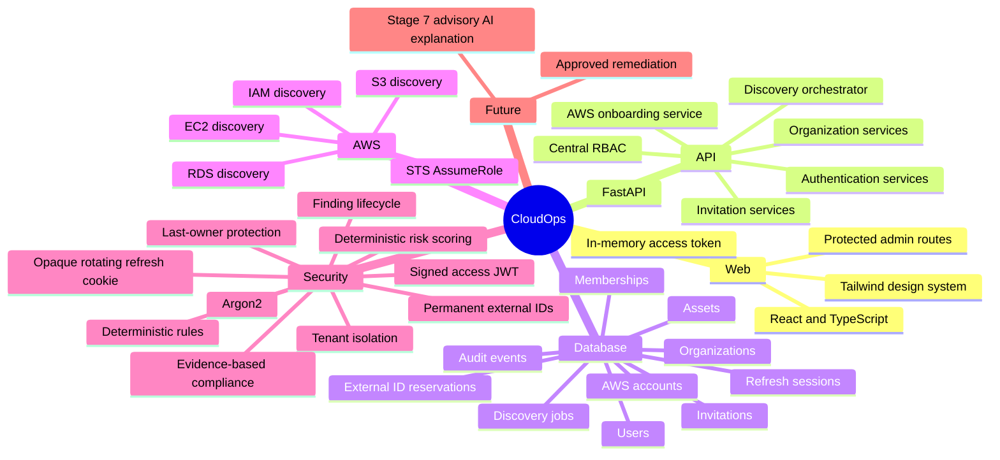
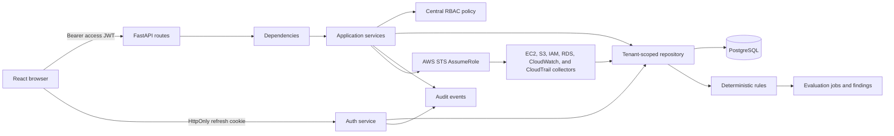

# CloudOps Portable Repository Context

Use this file to resume work in a fresh AI chat. Detailed documents remain authoritative. Update this file after architectural changes and `docs/planning/project-memory.md` after each substantial coding session.

## Purpose and current status

CloudOps is an AWS-focused multi-tenant SaaS for secure AWS onboarding, normalized inventory,
deterministic findings, evidence-based compliance snapshots, deterministic risk scoring, and
advisory AI explanations. Stages 1-7 are independently verified, merged, and regression-tested.
Stage 7 product and documentation are synchronized in `main` through
`01c3eb4bf9ed2d1770da697c158c5d08742430bd`. The current migration head is
`0009_stage7_ai_assistant`. Stage 8A Dashboard read-model work has started on
`feature/8-dashboard`; Stage 8 is not complete.

- Repository: `D:\learn\cdac\cloudfix`
- Remote: `https://github.com/cloudops-project/CloudOps.git`
- Active feature branch: `feature/8-dashboard`

## Stage 6 deterministic risk boundary

The trusted Python scoring engine has a fixed versioned policy and evaluates only persisted
Stage 4 findings plus explicit tenant risk context. It writes immutable finding, account, and
organization snapshots. Every finding snapshot records source lifecycle version, component
points, reason codes, unknown inputs, policy key/version, and evaluation timestamp. Suppressed
findings remain in scope. Authorized compensating controls are separate bounded records and
never rewrite the source finding. The API and React dashboard expose sanitized scores,
priorities, filters, component explanations, and history without live AWS calls. Stage 7 may
explain those persisted deterministic results but cannot change them.

- Documentation release branch: `docs/stage6-merge-sync`
- Documentation release: draft PR #7 is open for review and must not be treated as merged.
- Stage 6 release evidence: 199 backend tests passed with 0 failures and 0 skips at 95.11%
  coverage; Mypy checked 101 source files; 64 frontend tests passed with 0 failures.
- Current warnings: Starlette TestClient/httpx deprecation; use supported Node 20 LTS or Node
  22 LTS or a compatible 24+ release; Node can emit an experimental type-stripping warning.
  The unpublished local API package cannot be resolved from PyPI by pip-audit. GitHub reported
  no automated check rollup for PR #6.

## Source-of-truth documents

- `PRD.md`: current product scope and user journey
- `architecture.md`: current executable architecture and schema
- `design.md`: current frontend and design-system behavior
- `rules.md`: development, security, database, and testing rules
- `phases.md`: stage status and future sequence
- `memory.md`: current working state and next task

Detailed documents under `docs/` provide supporting depth. Resolve any contradiction before
changing code.

## Repository map

```text
apps/api/        FastAPI application, migration, tests
apps/web/        React administration application and tests
apps/worker/     Later-stage placeholder
docs/            Product, architecture, engineering, design, planning, operations, ADRs
infrastructure/  Later-stage infrastructure placeholders
packages/        Shared-package placeholders
tests/           Cross-application test placeholders
```

## System mind map



## Application flow



Routes contain validation and HTTP mapping only. Services own transactions and invariants. Repositories own persistence and always include organization scope for tenant data.

## Main files

- `apps/api/app/main.py`: middleware, errors, CORS, trusted hosts, routes.
- `apps/api/app/services/`: authentication, tenant, onboarding, discovery, evaluation, and
  finding-lifecycle workflows.
- `apps/api/app/security_rules/`: trusted typed rules and the static registry; no boto3 calls.
- `apps/api/app/security/`: Argon2, JWT/opaque-token helpers, RBAC and rate-limit abstraction.
- `apps/api/app/models/`: identity, AWS onboarding/reservations, assets, and discovery jobs.
- `apps/api/alembic/versions/0008_stage6_risk_scoring.py`: current migration head; policies,
  risk contexts, assessments, immutable snapshots, and compensating controls.
- `apps/web/src/auth/AuthProvider.tsx`: session restoration and memory-only access token.
- `apps/web/src/api/client.ts`: credentialed API client and single-flight refresh.
- `apps/web/src/pages/`: administration, onboarding, inventory, findings, rules, and evaluations.
- `docs/architecture/decisions/ADR-007...ADR-011`: active Stage 1/Stage 2 decisions.

## Data and relationships

Users have globally unique normalized email addresses. Organizations have unique slugs.
Memberships, invitations, refresh families, and audit events retain the Stage 1 design. Every
issued AWS external ID is permanently retained in `aws_external_id_reservations`. Composite
foreign keys ensure every asset and discovery job has the same organization as its AWS account.
Database checks protect asset seen-time ordering and discovery-job counters and timestamps.

## API

- Auth: register, login, refresh, logout, me, change-password.
- Organizations: create, list, get, update.
- Members: list, change role/status, remove.
- Invitations: create, list, cancel, accept.
- Audit: organization-scoped recent events.
- AWS onboarding: create, list, get, update, validate, disconnect, and delete accounts.
- Discovery: start connected-account inventory; list/detail jobs; list/filter/detail/summarize
  normalized assets.
- Security: list rules; start/list/detail evaluations; list/filter/summarize/detail findings;
  suppress and unsuppress findings.
- Compliance: list frameworks and controls; inspect mappings and mapped findings; start, list,
  and inspect immutable assessments and summaries.
- Risk: list policies; start/list/detail assessments; view organization/account/asset summaries
  and ranked findings; read/update bounded context; add/remove authorized compensating controls.
- Process: `/health` and database-backed `/ready`.

All application APIs are under `/api/v1`; health probes are root paths.

## Authentication and authorization

The API returns a short-lived signed access JWT. The web app stores it only in memory. The opaque refresh token is stored in an HttpOnly cookie scoped to `/api/v1/auth`; only SHA-256 hashes are persisted. Rotation locks the old session through replacement and commit, then revokes it and links its replacement. Reuse revokes the family. Password changes revoke all sessions. Failed browser refresh clears both the memory token and authenticated-user state.

Organization operations validate active membership and a centralized capability map. Admins cannot assign owner or govern an existing owner. The final active owner cannot be demoted, suspended, or removed; PostgreSQL row locks preserve this invariant under concurrency. Platform-admin status never implicitly bypasses tenant checks.

## Environment variable names

`APP_ENV`, `APP_NAME`, `API_V1_PREFIX`, `DATABASE_URL`, `POSTGRES_TEST_DATABASE_URL`,
`JWT_SECRET_KEY`, `JWT_ALGORITHM`, `ACCESS_TOKEN_EXPIRE_MINUTES`,
`REFRESH_TOKEN_EXPIRE_DAYS`, `INVITATION_TOKEN_EXPIRE_HOURS`, `CORS_ALLOWED_ORIGINS`,
`TRUSTED_HOSTS`, `COOKIE_SECURE`, `COOKIE_SAMESITE`, `COOKIE_DOMAIN`, `LOG_LEVEL`,
`FRONTEND_URL`, `AUTH_RATE_LIMIT_PER_MINUTE`, `AWS_TRUSTED_PRINCIPAL_ARN`,
`AWS_ROLE_SESSION_NAME`, `AWS_DISCOVERY_REGIONS`, `AWS_CONNECT_TIMEOUT_SECONDS`,
`AWS_READ_TIMEOUT_SECONDS`, `AWS_MAX_RETRY_ATTEMPTS`, `AWS_RETRY_MODE`,
`VITE_API_BASE_URL`.

Never put values or secrets in this file.

## Commands

See the root `README.md` for the complete teammate run guide, exact environment variables,
PostgreSQL lifecycle, quality gates, troubleshooting, and safe cleanup commands. App READMEs
provide subsystem detail.

## Completed capabilities

Registration; login/logout; access JWT; rotating/revocable refresh sessions; password change; organizations; membership; invitation create/list/cancel/accept; permitted role assignment; suspension/reactivation/removal; final-owner protection; tenant isolation; audit events; health/readiness; Stage 1 administration UI; migration; backend/frontend tests.

Stage 2 adds account lifecycle APIs, permanently reserved external IDs, trust and SecurityAudit
guidance, temporary-credential-only STS validation, serialized lifecycle transitions, audit
events, and owner/admin frontend flows. Stage 3 adds paginated EC2/S3/IAM/RDS collectors,
normalized historical inventory, partial-failure isolation, bounded APIs, PostgreSQL-safe
concurrency, and inventory/job UI.

## Known limitations and deferred work

Email delivery, password reset, email-verification delivery, MFA, OIDC/SSO, distributed rate
limiting, PostgreSQL RLS, production deployment, and live-AWS validation remain deferred.
Discovery and evaluation are synchronous and automated tests use deterministic AWS doubles.
Scheduler, notifications, remediation, raw provider events, customer AWS mutation, and
compliance export are deferred. Stage 7 Jira and email outputs are drafts only; no ticket or
message delivery is implemented. Development/testing returns invitation tokens temporarily;
production does not.

## Architecture decisions

- ADR-007 consolidates the historical authentication phase into authorized Stage 1.
- ADR-008 supersedes Stage 0's undecided OIDC provider for Stage 1 with local JWT plus opaque refresh sessions; OIDC remains future work.
- ADR-009 supersedes Material UI as the active frontend choice with Tailwind CSS.
- ADR-010 establishes CloudOps as the current product name while retaining CloudFix in historical records.
- ADR-011 establishes AWS Account Onboarding as Stage 2 and supersedes only ADR-007's reserved numbering.

## Current migration and worktree

The linear migration chain is `0001_stage1 -> 0002_stage2 -> 0003_stage3 ->
0004_verification_repairs -> 0005_stage4_rule_engine -> 0006_stage4_verification_repairs ->
0007_stage5_compliance_engine -> 0008_stage6_risk_scoring -> 0009_stage7_ai_assistant`. The
current release baseline is `main` at `882ff531af07276c11e0d25664fdca033e09c7c7`.

PR #2 had no recorded GitHub approval. The repository owner explicitly accepted that missing
approval as a governance exception and authorized Stage 4; no approval is fabricated. PR #4
also had zero recorded GitHub reviews/approvals and no automated check rollup. After technical
clean-room verification, the owner recorded an **Owner-authorized governance exception for PR
#4**. Neither exception is an independent GitHub, CODEOWNER, CI, or repository-policy approval.

PR #6 had zero reviews, zero approvals, and no automated check rollup. Its exact SHA passed
technical clean-room verification, and the owner recorded:
**Owner-authorized governance exception for PR #6.**

PR #8 had zero reviews, zero approvals, and no automated check rollup. Its exact SHA passed
technical detached verification, and the owner recorded:
**Owner-authorized governance exception for PR #8.**

## Current priorities

1. Complete Stage 8A dashboard read-model/API verification on `feature/8-dashboard`.
2. Keep dashboard work read-only over existing Stage 2-7 authoritative records.
3. Do not begin Stage 8B UI work until Stage 8A is closed or separately authorized.
4. Do not begin Stage 9 notifications.

## Stage 5 compliance boundary

Compliance never calls boto3 and never detects findings. It consumes persisted Stage 4
evaluations, per-rule outcome summaries, and active findings. Versioned mappings produce
immutable snapshots. Missing or mismatched evidence is `NOT_ASSESSED`, rule/source errors are
`ERROR`, active or suppressed failures are `FAIL`, and `PASS` requires affirmative successful
rule evidence. Catalog prose is CloudOps-authored and links to official references.

The initial catalog contains four controls and twelve mappings. It is not complete framework
coverage or certification, mappings require human compliance review, and compliance export is
not implemented. Stage 6 deterministic risk scoring is implemented. Stage 7 may explain
existing deterministic results, but AI must not perform detection, compliance decisions, or
risk scoring.

## HOW TO START A NEW AI SESSION

Attach these seven root source-of-truth files to the new session:

1. `NEW_CHAT_CONTEXT.md`
2. `PRD.md`
3. `architecture.md`
4. `design.md`
5. `rules.md`
6. `phases.md`
7. `memory.md`

Then send this exact starter prompt:

```text
Read the attached project files and treat them as the source of truth.

First, summarize your understanding of:

- the project goal
- the architecture
- the current implementation state
- known issues
- the next task

Do not modify code yet. Identify contradictions or missing information before proceeding.
```

The new session must resolve any conflict between these files and current repository evidence
before changing code. Never use real customer AWS accounts or credentials for automated tests.
Stages advance sequentially: Stage 8A is now authorized and active, but Stage 8B UI work and
Stage 9 notifications remain blocked until separately directed. Stage 4 detects findings; Stage
5 interprets persisted deterministic evidence for compliance; Stage 6 prioritizes findings
deterministically. AI may explain those outputs only and must not detect findings or calculate
risk. Stage 8 visualizes existing records only.

## Stage 7 handoff

Stage 7 is the bounded AI explanation assistant merged in `main` at
`882ff531af07276c11e0d25664fdca033e09c7c7`. Its verified feature SHA is
`9b5f4372359a32066787060ca839d5a68c5ab490`. Its migration is
`0009_stage7_ai_assistant`. It uses persisted deterministic records only, defaults to a
no-network mock provider, validates structured drafts, preserves source hashes/references,
redacts secrets and prompt injection, and never detects, scores, mutates, remediates, creates
tickets, or sends email. Stage 8A Dashboard work is active as a read-only dashboard contract.
