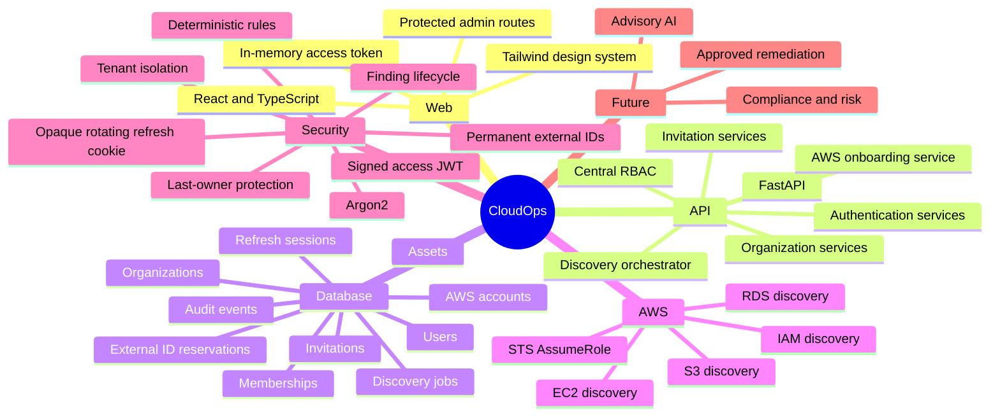
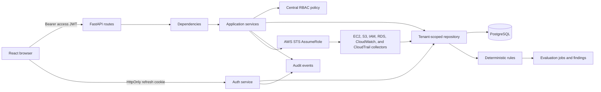

# CloudOps Portable Repository Context

Use this file to resume work in a fresh AI chat. Detailed documents remain authoritative. Update this file after architectural changes and `docs/planning/project-memory.md` after each substantial coding session.

## Purpose and current status

CloudOps is an AWS-focused multi-tenant SaaS for secure AWS onboarding, normalized inventory,
and deterministic security findings. Stages 1–3 are merged in `main` at PR #2 merge SHA
`0849e75d36cac65a4b801dcd9005c079941ad7fa`. Stage 4 is implemented on
`feature/4-rule-engine` and awaits independent verification. Compliance, risk scoring, AI,
notifications, remediation, and raw CloudWatch/CloudTrail event ingestion remain deferred.

## Source-of-truth documents

- `PRD.md`: current product scope and user journey
- `architecture.md`: current executable architecture and schema
- `design.md`: current frontend and design-system behavior
- `rules.md`: development, security, database, and testing rules
- `phases.md`: stage status and future sequence
- `memory.md`: current working state and next task

Detailed documents under `docs/` provide supporting depth. Resolve any contradiction before
changing code.

## Repository map

```text
apps/api/        FastAPI application, migration, tests
apps/web/        React administration application and tests
apps/worker/     Later-stage placeholder
docs/            Product, architecture, engineering, design, planning, operations, ADRs
infrastructure/  Later-stage infrastructure placeholders
packages/        Shared-package placeholders
tests/           Cross-application test placeholders
```

## System mind map



## Application flow



Routes contain validation and HTTP mapping only. Services own transactions and invariants. Repositories own persistence and always include organization scope for tenant data.

## Main files

- `apps/api/app/main.py`: middleware, errors, CORS, trusted hosts, routes.
- `apps/api/app/services/`: authentication, tenant, onboarding, discovery, evaluation, and
  finding-lifecycle workflows.
- `apps/api/app/security_rules/`: trusted typed rules and the static registry; no boto3 calls.
- `apps/api/app/security/`: Argon2, JWT/opaque-token helpers, RBAC and rate-limit abstraction.
- `apps/api/app/models/`: identity, AWS onboarding/reservations, assets, and discovery jobs.
- `apps/api/alembic/versions/0005_stage4_rule_engine.py`: current migration head; evaluation jobs,
  findings, lifecycle constraints, tenant foreign keys, and active-job/finding uniqueness.
- `apps/web/src/auth/AuthProvider.tsx`: session restoration and memory-only access token.
- `apps/web/src/api/client.ts`: credentialed API client and single-flight refresh.
- `apps/web/src/pages/`: administration, onboarding, inventory, findings, rules, and evaluations.
- `docs/architecture/decisions/ADR-007...ADR-011`: active Stage 1/Stage 2 decisions.

## Data and relationships

Users have globally unique normalized email addresses. Organizations have unique slugs.
Memberships, invitations, refresh families, and audit events retain the Stage 1 design. Every
issued AWS external ID is permanently retained in `aws_external_id_reservations`. Composite
foreign keys ensure every asset and discovery job has the same organization as its AWS account.
Database checks protect asset seen-time ordering and discovery-job counters and timestamps.

## API

- Auth: register, login, refresh, logout, me, change-password.
- Organizations: create, list, get, update.
- Members: list, change role/status, remove.
- Invitations: create, list, cancel, accept.
- Audit: organization-scoped recent events.
- AWS onboarding: create, list, get, update, validate, disconnect, and delete accounts.
- Discovery: start connected-account inventory; list/detail jobs; list/filter/detail/summarize
  normalized assets.
- Security: list rules; start/list/detail evaluations; list/filter/summarize/detail findings;
  suppress and unsuppress findings.
- Process: `/health` and database-backed `/ready`.

All application APIs are under `/api/v1`; health probes are root paths.

## Authentication and authorization

The API returns a short-lived signed access JWT. The web app stores it only in memory. The opaque refresh token is stored in an HttpOnly cookie scoped to `/api/v1/auth`; only SHA-256 hashes are persisted. Rotation locks the old session through replacement and commit, then revokes it and links its replacement. Reuse revokes the family. Password changes revoke all sessions. Failed browser refresh clears both the memory token and authenticated-user state.

Organization operations validate active membership and a centralized capability map. Admins cannot assign owner or govern an existing owner. The final active owner cannot be demoted, suspended, or removed; PostgreSQL row locks preserve this invariant under concurrency. Platform-admin status never implicitly bypasses tenant checks.

## Environment variable names

`APP_ENV`, `APP_NAME`, `API_V1_PREFIX`, `DATABASE_URL`, `POSTGRES_TEST_DATABASE_URL`,
`JWT_SECRET_KEY`, `JWT_ALGORITHM`, `ACCESS_TOKEN_EXPIRE_MINUTES`,
`REFRESH_TOKEN_EXPIRE_DAYS`, `INVITATION_TOKEN_EXPIRE_HOURS`, `CORS_ALLOWED_ORIGINS`,
`TRUSTED_HOSTS`, `COOKIE_SECURE`, `COOKIE_SAMESITE`, `COOKIE_DOMAIN`, `LOG_LEVEL`,
`FRONTEND_URL`, `AUTH_RATE_LIMIT_PER_MINUTE`, `AWS_TRUSTED_PRINCIPAL_ARN`,
`AWS_ROLE_SESSION_NAME`, `AWS_DISCOVERY_REGIONS`, `AWS_CONNECT_TIMEOUT_SECONDS`,
`AWS_READ_TIMEOUT_SECONDS`, `AWS_MAX_RETRY_ATTEMPTS`, `AWS_RETRY_MODE`,
`VITE_API_BASE_URL`.

Never put values or secrets in this file.

## Commands

See the root README and app READMEs for install, migration, lint, type-check, test, and build commands.

## Completed capabilities

Registration; login/logout; access JWT; rotating/revocable refresh sessions; password change; organizations; membership; invitation create/list/cancel/accept; permitted role assignment; suspension/reactivation/removal; final-owner protection; tenant isolation; audit events; health/readiness; Stage 1 administration UI; migration; backend/frontend tests.

Stage 2 adds account lifecycle APIs, permanently reserved external IDs, trust and SecurityAudit
guidance, temporary-credential-only STS validation, serialized lifecycle transitions, audit
events, and owner/admin frontend flows. Stage 3 adds paginated EC2/S3/IAM/RDS collectors,
normalized historical inventory, partial-failure isolation, bounded APIs, PostgreSQL-safe
concurrency, and inventory/job UI.

## Known limitations and deferred work

Email delivery, password reset, email-verification delivery, MFA, OIDC/SSO, distributed rate
limiting, PostgreSQL RLS, production deployment, and live-AWS validation remain deferred.
Discovery and evaluation are synchronous and automated tests use deterministic AWS doubles.
Compliance, risk, scheduler, AI, notifications, remediation, raw provider events, and customer
AWS mutation are deferred. Development/testing returns invitation tokens temporarily;
production does not.

## Architecture decisions

- ADR-007 consolidates the historical authentication phase into authorized Stage 1.
- ADR-008 supersedes Stage 0's undecided OIDC provider for Stage 1 with local JWT plus opaque refresh sessions; OIDC remains future work.
- ADR-009 supersedes Material UI as the active frontend choice with Tailwind CSS.
- ADR-010 establishes CloudOps as the current product name while retaining CloudFix in historical records.
- ADR-011 establishes AWS Account Onboarding as Stage 2 and supersedes only ADR-007's reserved numbering.

## Current migration and worktree

The linear migration chain is `0001_stage1 -> 0002_stage2 -> 0003_stage3 ->
0004_verification_repairs -> 0005_stage4_rule_engine`. The current branch is
`feature/4-rule-engine`, based directly on merged `main` at `0849e75d...`.

PR #2 had no recorded GitHub approval. The repository owner explicitly accepted that missing
approval as a governance exception and authorized Stage 4; no approval is fabricated. Stage 4
must remain unmerged until fresh independent verification.

## Current priorities

1. Complete all Stage 4 quality, migration, concurrency, security, and regression gates.
2. Push `feature/4-rule-engine` and open a draft pull request to `main`.
3. Run fresh independent verification.
4. Do not merge Stage 4 or begin Stage 5 until that review succeeds.

## HOW TO START A NEW AI SESSION

Read all attached project documents first and treat them as the source of truth. Before changing
code, summarize:

- the project goal;
- the architecture;
- the current implementation;
- known issues and limitations; and
- the next task.

Identify and resolve contradictions or missing information before proceeding. Do not modify code
until those contradictions are resolved.
