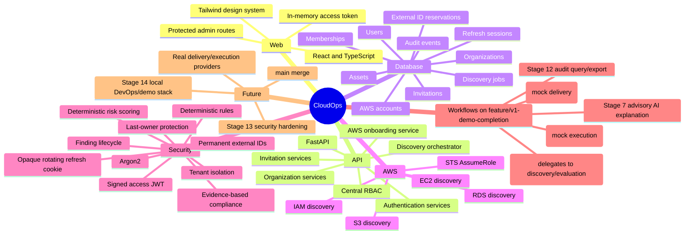
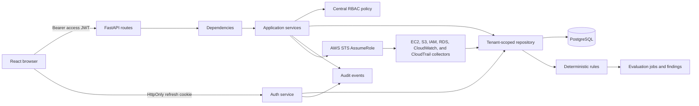

# CloudOps Portable Repository Context

Use this file to resume work in a fresh AI chat. Detailed documents remain authoritative. Update this file after architectural changes and `docs/planning/project-memory.md` after each substantial coding session.

## Purpose and current status

CloudOps is an AWS-focused multi-tenant SaaS for secure AWS onboarding, normalized inventory,
deterministic findings, evidence-based compliance snapshots, deterministic risk scoring,
advisory AI explanations, an approval-gated critical-finding notification workflow, a governed
mock remediation workflow, a scan-scheduling foundation, an audit query/export layer, and a
guarded local Version 1 demo path.
Stages 1-8 are independently verified, merged, and regression-tested in `main` through
`889660ecb8a378d107f6737b4466b70362066793` (migration head `0009_stage7_ai_assistant` on
`main`). Stages 9-12 (notifications, remediation, scheduler, audit query/export) are
implemented and committed on `feature/v1-demo-completion`, not yet merged into `main`. The
current demo-readiness work adds migration head `0013_demo_notification_delivery` for local
notification provider evidence. Stage 12 (audit query/export) is implemented and committed on
that branch at `d0d24cd` and `9314f06`.

- Repository: `D:\learn\cdac\cloudfix`
- Remote: `https://github.com/cloudops-project/CloudOps.git`
- Active feature branch: `feature/v1-demo-completion` (based on `feature/9-notifications`)
- Product name: **CloudOps** (ADR-010 is authoritative; never rename to CloudFix; historical
  CloudFix references may remain only where clearly marked historical)
- Integration-branch policy: `main` is the sole active integration branch; `develop` is
  vestigial and must not be used as a base. Do not touch, push to, or merge into `main` without
  explicit authorization and normal review.

## CODEX HANDOFF — ACTIVE WORK (read this section first)

Development ownership is moving from Claude Code to Codex. This section is the authoritative,
self-contained summary of exactly where the work stands; it supersedes older prose elsewhere in
this file if the two ever disagree, and should be updated in place as work continues.

**Repository:** `D:\learn\cdac\cloudfix`
**Branch:** `feature/v1-demo-completion`
**Committed HEAD before current demo-readiness work:** `5a6b00f docs: reconcile CloudOps demo readiness and Codex handoff`

**Exact commit history for Stages 9-12** (newest first; do not amend or repeat any of these):

```text
9314f06 feat(web): add audit log explorer
d0d24cd feat(api): add audit log query and export endpoints
55c451e feat(web): add scan scheduling workflow
8c14b55 feat(api): add scan schedule endpoints
9fff532 feat(worker): implement scheduled scan orchestration
24227ab feat(api): add scan scheduling persistence
8916be9 test(api): repair remediation lifecycle fixtures
d1c8733 feat(web): add notification and remediation workflows
8ab8c83 feat(api): add remediation workflow endpoints
fc8908d feat(api): implement remediation workflow service
bf29173 feat(api): add remediation persistence model
56ca81b docs: reconcile CloudOps roadmap and V1 architecture
cb42db9 feat(api): add notification workflow endpoints
449e964 feat(api): implement notification service
d0b5676 feat(api): add notification persistence model
```

**Exact Stage 11 verification results** (all independently run and confirmed clean):

- Backend: Ruff passed; Mypy passed (140 source files); scheduler Pytest 22 passed; one
  non-blocking Starlette/httpx deprecation warning
- Migrations: `0010_stage9_notifications -> 0011_stage10_remediation` and
  `0011_stage10_remediation -> 0012_stage11_scheduler` upgraded successfully against the
  disposable PostgreSQL verification database (`compose.verify.yml`, database `cloudops_test`,
  user `cloudops`, host port `5433`); `alembic current` reports `0012_stage11_scheduler`;
  `alembic check` reports no new operations; the chain is linear with a single head
- Frontend: TypeScript passed; ESLint passed; scheduler Vitest 5 passed; production build passed

**Stage 12 (audit query/export) — implemented and committed:**

Reuses the existing `AuditEvent` persistence and `record_audit()` write path. Adds no migration.
Adds `GET /api/v1/audit-events` (filterable, paginated) and `GET /api/v1/audit-events/export`
(same filters, CSV, capped at 5,000 rows, synchronous), both reusing the existing `AUDIT_READ`
capability, plus a frontend audit explorer page (filters, pagination, CSV export via a new
`apiBlob()` helper).

Exact Stage 12 committed file list:

```text
apps/api/app/api/v1/__init__.py
apps/api/app/api/v1/audit.py
apps/api/app/schemas/audit.py
apps/api/app/tests/test_audit_api.py
apps/web/src/App.tsx
apps/web/src/api/client.ts
apps/web/src/components/AppShell.tsx
apps/web/src/pages/AuditPage.tsx
apps/web/src/test/audit.test.tsx
apps/web/src/types.ts
```

`CLAUDE.md` is untracked in the working tree and is unrelated to Stage 12 — it must never
be staged or committed.

Current Stage 12 verification results after Codex repair:

- Backend: Ruff passed; Mypy passed (142 source files); `test_audit_api.py` 8 passed; one
  non-blocking Starlette/httpx deprecation warning
- Frontend: TypeScript passed; ESLint passed; Vitest (`audit.test.tsx`) 4 passed; production
  build passed

**Git-lock warning:** `.git/index.lock` has recurred repeatedly and intermittently during this
effort — sometimes as a stale lock left behind by an interrupted `git add`/`git commit` on a
Windows-mounted checkout. Before any mutating Git command: check
`Test-Path .git\index.lock`. If present, do not delete it blindly and do not hammer retries;
confirm from Windows that no Git process is actually running, then clear it, then retry once.

**Exact next commands to run** (PowerShell, from the repository root unless noted):

```powershell
cd D:\learn\cdac\cloudfix
git branch --show-current
git log -1 --oneline
git status --short
Test-Path .git\index.lock
git diff --check
```

Stage 12 backend verification:

```powershell
cd apps\api
python -m ruff check app
python -m mypy app
python -m pytest app/tests/test_audit_api.py
```

Stage 12 frontend verification:

```powershell
cd ..\web
npx tsc --noEmit -p tsconfig.app.json
npx eslint `
  src/api/client.ts `
  src/App.tsx `
  src/components/AppShell.tsx `
  src/pages/AuditPage.tsx `
  src/test/audit.test.tsx `
  src/types.ts `
  --max-warnings 0
Remove-Item node_modules\.vite -Recurse -Force -ErrorAction SilentlyContinue
npx vitest run src/test/audit.test.tsx `
  --pool=threads `
  --maxWorkers=1 `
  --minWorkers=1 `
  --no-file-parallelism `
  --reporter=verbose
npm run build
```

Do not run Alembic for Stage 12 — it adds no persistence migration.

**Exact Stage 12 commits completed by Codex** (stage explicit paths only; no `git add .` or
`git add -A`; `CLAUDE.md` was not staged):

1. `d0d24cd feat(api): add audit log query and export endpoints`
   — `apps/api/app/api/v1/__init__.py`, `apps/api/app/api/v1/audit.py`,
   `apps/api/app/schemas/audit.py`, `apps/api/app/tests/test_audit_api.py`
2. `9314f06 feat(web): add audit log explorer`
   — `apps/web/src/App.tsx`, `apps/web/src/api/client.ts`,
   `apps/web/src/components/AppShell.tsx`, `apps/web/src/pages/AuditPage.tsx`,
   `apps/web/src/test/audit.test.tsx`, `apps/web/src/types.ts`

**Remaining Version 1 roadmap after Stage 12 is committed:**

1. Stage 13 security hardening — expired/malformed/missing-claim/invalid-signing-key JWT tests,
   tenant-boundary and IDOR checks, oversized-input and invalid-pagination/date-range handling,
   safe API errors, sensitive-metadata redaction, RBAC coverage for every endpoint added in
   Stages 9-12, and confirmation that frontend access-hiding never substitutes for backend
   authorization.
2. Stage 14 local DevOps/demo stack — the current demo-readiness work adds root `.dockerignore`,
   API/web Dockerfiles, `compose.demo.yml` with PostgreSQL/Mailpit/API/web plus a manually
   invokable scheduler tick, and a Mailpit-only SMTP path for the local demo. It is not
   production deployment or infrastructure-as-code.
3. Deterministic demo seed and reset workflow — implemented by `scripts/demo_seed.py`, which
   refuses production mode and refuses databases outside `cloudops_demo*`.
4. Full regression testing.
5. Black-box V1 acceptance flow covering: start local environment; log in; view dashboard; view
   assets; view findings; view compliance; view risk; open an AI explanation; view
   notifications; approve a notification; simulate notification delivery; open remediation;
   request remediation; approve remediation; execute mock remediation; view schedules; trigger
   run-now; view the audit trail; export the audit CSV.
6. Deployment preparation.
7. Final operations, user, and demo documentation.
8. Final repository and GitHub integration through a pull request merging
   `feature/v1-demo-completion` into `main`.

**Suggested Codex next actions:**

1. Commit this documentation reconciliation in a documentation-only commit.
2. Audit the exact tomorrow-demo journey.
3. Finish verification of Mailpit-backed SMTP notification delivery while preserving the mock
   provider as the default.
4. Finish verification of the local demo Compose stack and deterministic demo seed/reset.
5. Keep running the black-box V1 demo acceptance workflow through final exit before release.
6. Continue with Stage 13 security hardening and any remaining Stage 14 local demo
   infrastructure as needed for the tomorrow demo.

**Absolute rules that apply to every future session on this branch:** never stage or commit
`CLAUDE.md`; never use `git add .` or `git add -A`; never amend or repeat any commit listed
above; never rename CloudOps to CloudFix or reverse ADR-010; never claim a verification command
passed unless it was actually run and its output confirms that; never describe demo-stack or
email-delivery gates as passed until they actually run clean.

## Stage 6 deterministic risk boundary

The trusted Python scoring engine has a fixed versioned policy and evaluates only persisted
Stage 4 findings plus explicit tenant risk context. It writes immutable finding, account, and
organization snapshots. Every finding snapshot records source lifecycle version, component
points, reason codes, unknown inputs, policy key/version, and evaluation timestamp. Suppressed
findings remain in scope. Authorized compensating controls are separate bounded records and
never rewrite the source finding. The API and React dashboard expose sanitized scores,
priorities, filters, component explanations, and history without live AWS calls. Stage 7 may
explain those persisted deterministic results but cannot change them.

- Documentation release branch: `docs/stage6-merge-sync`
- Documentation release: draft PR #7 is open for review and must not be treated as merged.
- Stage 6 release evidence: 199 backend tests passed with 0 failures and 0 skips at 95.11%
  coverage; Mypy checked 101 source files; 64 frontend tests passed with 0 failures.
- Current warnings: Starlette TestClient/httpx deprecation; use supported Node 20 LTS or Node
  22 LTS or a compatible 24+ release; Node can emit an experimental type-stripping warning.
  The unpublished local API package cannot be resolved from PyPI by pip-audit. GitHub reported
  no automated check rollup for PR #6.

## Source-of-truth documents

- `PRD.md`: current product scope and user journey
- `architecture.md`: current executable architecture and schema
- `design.md`: current frontend and design-system behavior
- `rules.md`: development, security, database, and testing rules
- `phases.md`: stage status and future sequence
- `memory.md`: current working state and next task

Detailed documents under `docs/` provide supporting depth. Resolve any contradiction before
changing code.

## Repository map

```text
apps/api/        FastAPI application, migration, tests
apps/web/        React administration application and tests
apps/worker/     Later-stage placeholder
docs/            Product, architecture, engineering, design, planning, operations, ADRs
infrastructure/  Later-stage infrastructure placeholders
packages/        Shared-package placeholders
tests/           Cross-application test placeholders
```

## System mind map



## Application flow



Routes contain validation and HTTP mapping only. Services own transactions and invariants. Repositories own persistence and always include organization scope for tenant data.

## Main files

- `apps/api/app/main.py`: middleware, errors, CORS, trusted hosts, routes.
- `apps/api/app/services/`: authentication, tenant, onboarding, discovery, evaluation, and
  finding-lifecycle workflows.
- `apps/api/app/security_rules/`: trusted typed rules and the static registry; no boto3 calls.
- `apps/api/app/security/`: Argon2, JWT/opaque-token helpers, RBAC and rate-limit abstraction.
- `apps/api/app/models/`: identity, AWS onboarding/reservations, assets, and discovery jobs.
- `apps/api/alembic/versions/0008_stage6_risk_scoring.py`: current migration head; policies,
  risk contexts, assessments, immutable snapshots, and compensating controls.
- `apps/web/src/auth/AuthProvider.tsx`: session restoration and memory-only access token.
- `apps/web/src/api/client.ts`: credentialed API client and single-flight refresh.
- `apps/web/src/pages/`: administration, onboarding, inventory, findings, rules, and evaluations.
- `docs/architecture/decisions/ADR-007...ADR-011`: active Stage 1/Stage 2 decisions.

## Data and relationships

Users have globally unique normalized email addresses. Organizations have unique slugs.
Memberships, invitations, refresh families, and audit events retain the Stage 1 design. Every
issued AWS external ID is permanently retained in `aws_external_id_reservations`. Composite
foreign keys ensure every asset and discovery job has the same organization as its AWS account.
Database checks protect asset seen-time ordering and discovery-job counters and timestamps.

## API

- Auth: register, login, refresh, logout, me, change-password.
- Organizations: create, list, get, update.
- Members: list, change role/status, remove.
- Invitations: create, list, cancel, accept.
- Audit: organization-scoped recent events.
- AWS onboarding: create, list, get, update, validate, disconnect, and delete accounts.
- Discovery: start connected-account inventory; list/detail jobs; list/filter/detail/summarize
  normalized assets.
- Security: list rules; start/list/detail evaluations; list/filter/summarize/detail findings;
  suppress and unsuppress findings.
- Compliance: list frameworks and controls; inspect mappings and mapped findings; start, list,
  and inspect immutable assessments and summaries.
- Risk: list policies; start/list/detail assessments; view organization/account/asset summaries
  and ranked findings; read/update bounded context; add/remove authorized compensating controls.
- Notifications (Stage 9): list/detail; approve; deliver.
- Remediation (Stage 10): list/detail; propose; approve; reject; cancel; execute.
- Scheduler (Stage 11): create/list/detail/enable/disable/delete schedules; run-now;
  list/detail scan runs.
- Audit (Stage 12): paginated/filtered query; bounded CSV export.
- Process: `/health` and database-backed `/ready`.

All application APIs are under `/api/v1`; health probes are root paths.

## Authentication and authorization

The API returns a short-lived signed access JWT. The web app stores it only in memory. The opaque refresh token is stored in an HttpOnly cookie scoped to `/api/v1/auth`; only SHA-256 hashes are persisted. Rotation locks the old session through replacement and commit, then revokes it and links its replacement. Reuse revokes the family. Password changes revoke all sessions. Failed browser refresh clears both the memory token and authenticated-user state.

Organization operations validate active membership and a centralized capability map. Admins cannot assign owner or govern an existing owner. The final active owner cannot be demoted, suspended, or removed; PostgreSQL row locks preserve this invariant under concurrency. Platform-admin status never implicitly bypasses tenant checks.

## Environment variable names

`APP_ENV`, `APP_NAME`, `API_V1_PREFIX`, `DATABASE_URL`, `POSTGRES_TEST_DATABASE_URL`,
`JWT_SECRET_KEY`, `JWT_ALGORITHM`, `ACCESS_TOKEN_EXPIRE_MINUTES`,
`REFRESH_TOKEN_EXPIRE_DAYS`, `INVITATION_TOKEN_EXPIRE_HOURS`, `CORS_ALLOWED_ORIGINS`,
`TRUSTED_HOSTS`, `COOKIE_SECURE`, `COOKIE_SAMESITE`, `COOKIE_DOMAIN`, `LOG_LEVEL`,
`FRONTEND_URL`, `AUTH_RATE_LIMIT_PER_MINUTE`, `AWS_TRUSTED_PRINCIPAL_ARN`,
`AWS_ROLE_SESSION_NAME`, `AWS_DISCOVERY_REGIONS`, `AWS_CONNECT_TIMEOUT_SECONDS`,
`AWS_READ_TIMEOUT_SECONDS`, `AWS_MAX_RETRY_ATTEMPTS`, `AWS_RETRY_MODE`,
`VITE_API_BASE_URL`.

Never put values or secrets in this file.

## Commands

See the root `README.md` for the complete teammate run guide, exact environment variables,
PostgreSQL lifecycle, quality gates, troubleshooting, and safe cleanup commands. App READMEs
provide subsystem detail.

## Completed capabilities

Registration; login/logout; access JWT; rotating/revocable refresh sessions; password change; organizations; membership; invitation create/list/cancel/accept; permitted role assignment; suspension/reactivation/removal; final-owner protection; tenant isolation; audit events; health/readiness; Stage 1 administration UI; migration; backend/frontend tests.

Stage 2 adds account lifecycle APIs, permanently reserved external IDs, trust and SecurityAudit
guidance, temporary-credential-only STS validation, serialized lifecycle transitions, audit
events, and owner/admin frontend flows. Stage 3 adds paginated EC2/S3/IAM/RDS collectors,
normalized historical inventory, partial-failure isolation, bounded APIs, PostgreSQL-safe
concurrency, and inventory/job UI.

## Known limitations and deferred work

Real email delivery, password reset, email-verification delivery, MFA, OIDC/SSO, distributed
rate limiting, PostgreSQL RLS, production deployment, and live-AWS validation remain deferred.
Discovery and evaluation are synchronous and automated tests use deterministic AWS doubles.
Production notification delivery, real remediation execution, a distributed-queue scheduler
worker, raw CloudTrail/CloudWatch event ingestion, customer AWS mutation, and compliance export
are deferred. The local Version 1 demo may deliver approved notifications only to Mailpit via
SMTP; production SMTP, AWS SES, Slack, Teams, webhook, Gmail, and Microsoft Graph delivery
remain unimplemented. Stage 7 Jira and email outputs are drafts only; no ticket is created and
AI never sends messages. Development/testing returns invitation tokens temporarily; production
does not. `compose.verify.yml` remains a disposable PostgreSQL verification database; the local
demo stack is `compose.demo.yml`.

## Architecture decisions

- ADR-007 consolidates the historical authentication phase into authorized Stage 1.
- ADR-008 supersedes Stage 0's undecided OIDC provider for Stage 1 with local JWT plus opaque refresh sessions; OIDC remains future work.
- ADR-009 supersedes Material UI as the active frontend choice with Tailwind CSS.
- ADR-010 establishes CloudOps as the current product name while retaining CloudFix in historical records.
- ADR-011 establishes AWS Account Onboarding as Stage 2 and supersedes only ADR-007's reserved numbering.

## Current migration and worktree

The linear migration chain is `0001_stage1 -> 0002_stage2 -> 0003_stage3 ->
0004_verification_repairs -> 0005_stage4_rule_engine -> 0006_stage4_verification_repairs ->
0007_stage5_compliance_engine -> 0008_stage6_risk_scoring -> 0009_stage7_ai_assistant ->
0010_stage9_notifications -> 0011_stage10_remediation -> 0012_stage11_scheduler ->
0013_demo_notification_delivery`.
`0009_stage7_ai_assistant` is the current head on `main`; `0010`-`0013` exist only on
`feature/v1-demo-completion` until that branch merges. Stage 12 (audit query/export) adds no
migration; `0013_demo_notification_delivery` adds provider evidence fields for the guarded
local Mailpit demo path. The current `main` release baseline remains `main` at
`889660ecb8a378d107f6737b4466b70362066793`.

PR #2 had no recorded GitHub approval. The repository owner explicitly accepted that missing
approval as a governance exception and authorized Stage 4; no approval is fabricated. PR #4
also had zero recorded GitHub reviews/approvals and no automated check rollup. After technical
clean-room verification, the owner recorded an **Owner-authorized governance exception for PR
#4**. Neither exception is an independent GitHub, CODEOWNER, CI, or repository-policy approval.

PR #6 had zero reviews, zero approvals, and no automated check rollup. Its exact SHA passed
technical clean-room verification, and the owner recorded:
**Owner-authorized governance exception for PR #6.**

PR #8 had zero reviews, zero approvals, and no automated check rollup. Its exact SHA passed
technical detached verification, and the owner recorded:
**Owner-authorized governance exception for PR #8.**

## Current priorities

See "CODEX HANDOFF — ACTIVE WORK" near the top of this file for the exact, current, actionable
plan. In summary:

1. Complete demo-readiness documentation reconciliation.
2. Audit and close P0 gaps in the tomorrow-demo journey.
3. Continue Version 1 demo completion: Stage 13 security hardening, Stage 14 local DevOps/demo
   stack, deterministic demo seed/reset, full regression testing, the black-box V1 acceptance
   flow, deployment preparation, final documentation, and a pull request merging
   `feature/v1-demo-completion` into `main`.
4. Keep notification delivery approval-gated. The mock provider remains default/no-network;
   Mailpit SMTP is local-demo-only. Keep remediation execution mock-only and keep the scheduler
   delegating to existing discovery/evaluation services.

## Stage 5 compliance boundary

Compliance never calls boto3 and never detects findings. It consumes persisted Stage 4
evaluations, per-rule outcome summaries, and active findings. Versioned mappings produce
immutable snapshots. Missing or mismatched evidence is `NOT_ASSESSED`, rule/source errors are
`ERROR`, active or suppressed failures are `FAIL`, and `PASS` requires affirmative successful
rule evidence. Catalog prose is CloudOps-authored and links to official references.

The initial catalog contains four controls and twelve mappings. It is not complete framework
coverage or certification, mappings require human compliance review, and compliance export is
not implemented. Stage 6 deterministic risk scoring is implemented. Stage 7 may explain
existing deterministic results, but AI must not perform detection, compliance decisions, or
risk scoring.

## HOW TO START A NEW AI SESSION

Attach these seven root source-of-truth files to the new session:

1. `NEW_CHAT_CONTEXT.md`
2. `PRD.md`
3. `architecture.md`
4. `design.md`
5. `rules.md`
6. `phases.md`
7. `memory.md`

Then send this exact starter prompt:

```text
Read the attached project files and treat them as the source of truth.

First, summarize your understanding of:

- the project goal
- the architecture
- the current implementation state
- known issues
- the next task

Do not modify code yet. Identify contradictions or missing information before proceeding.
```

The new session must resolve any conflict between these files and current repository evidence
before changing code. Never use real customer AWS accounts or credentials for automated tests.
Stages advance sequentially: Stage 8 (dashboard, read model and UI) is merged into `main`.
Stages 9-12 (notifications, remediation, scheduler, audit query/export) are complete and
committed on `feature/v1-demo-completion`, not yet merged into `main`. Stage 4 detects findings; Stage 5
interprets persisted deterministic evidence for compliance; Stage 6 prioritizes findings
deterministically. AI may explain those outputs only and must not detect findings or calculate
risk. Stage 8 visualizes existing records only. Stage 9 never delivers a notification without
explicit human approval and uses only a deterministic mock provider. Stage 10 never executes
real remediation and uses only a deterministic mock executor. Stage 11's worker delegates to
existing discovery/evaluation services and is not a distributed queue or daemon.

## Stage 7 handoff

Stage 7 is the bounded AI explanation assistant merged in `main` at
`882ff531af07276c11e0d25664fdca033e09c7c7`. Its verified feature SHA is
`9b5f4372359a32066787060ca839d5a68c5ab490`. Its migration is
`0009_stage7_ai_assistant`. It uses persisted deterministic records only, defaults to a
no-network mock provider, validates structured drafts, preserves source hashes/references,
redacts secrets and prompt injection, and never detects, scores, mutates, remediates, creates
tickets, or sends email.

## Stage 8 handoff

Stage 8 (dashboard read model and UI) is merged in `main` at
`889660ecb8a378d107f6737b4466b70362066793` via PR #10 and a follow-up `feature/8-dashboard-ui`
merge. `GET /api/v1/dashboard/summary` aggregates existing Stage 2-7 records without
recalculating them; the frontend `SecurityDashboardPage` renders that contract.

## Stage 9 handoff

Stage 9 (notifications) is complete — backend and frontend — on `feature/v1-demo-completion`
(`d0b5676` persistence, `449e964` service, `cb42db9` API, `d1c8733` frontend), migration head
`0010_stage9_notifications`, not yet merged into `main`. `NotificationEvent` moves through
`PENDING_APPROVAL -> APPROVED -> DELIVERED`, or `APPROVED -> FAILED` after three failed attempts;
there is no `REJECTED` state. Only newly created `CRITICAL` findings trigger creation, checked
defensively inside the service itself. Delivery always requires explicit approval via
`NOTIFICATIONS_APPROVE` and uses only the deterministic `MockNotificationProvider`, which makes
no network calls. AWS SES is a possible future production provider, not yet implemented. The
frontend `NotificationsPage` implements history, filtering, pagination, and role-gated
approve/deliver controls.

## Stage 10 handoff

Stage 10 (remediation) is complete — backend and frontend — on `feature/v1-demo-completion`
(`bf29173` persistence, `fc8908d` service, `8ab8c83` API, `d1c8733` frontend, `8916be9` later
test fixture repair), migration head `0011_stage10_remediation`, not yet merged into `main`.
`RemediationRequest` moves through `PENDING_APPROVAL -> APPROVED -> SUCCEEDED`,
`APPROVED -> FAILED` after three failed mock execution attempts, or rejection/cancellation from
an active state. Proposal text is generated deterministically from the existing `SecurityRule`
registry. Execution uses only `MockRemediationExecutor` and never mutates real AWS resources.
The frontend adds a "Propose remediation" action on a finding's detail page and a
`RemediationsPage` list/detail workflow with role-gated approve/reject/cancel/execute controls.

## Stage 11 handoff

Stage 11 (scheduler) is complete — backend and frontend — on `feature/v1-demo-completion`
(`24227ab` persistence, `9fff532` service/worker, `8c14b55` API, `55c451e` frontend), migration
head `0012_stage11_scheduler` (current head on this branch), not yet merged into `main`.
`ScanSchedule` records a per-account interval cadence; `ScanRun` records each execution (manual
or scheduled) with database-enforced overlap protection (one active run per account). The
worker (`app/worker/scheduler_worker.py`) is a deterministic, synchronously invokable
single-tick foundation — not Celery, Redis, a distributed queue, or a permanent cron daemon —
that delegates every run to the existing `DiscoveryOrchestrator`/`EvaluationService` rather than
duplicating boto3 or rule-evaluation logic. The frontend `SchedulesPage` implements
enable/disable, run-now, and recent scan-run history.

Stage 11 verification: backend Ruff/Mypy (140 source files)/22 Pytest all passed; migration
chain verified linear with a single head (`0012_stage11_scheduler`) against the disposable
PostgreSQL verification database; frontend TypeScript/ESLint/5 Vitest/production build all
passed. The current demo-readiness work advances the feature-branch head to
`0013_demo_notification_delivery`.

## Stage 12 handoff (implemented and committed)

Stage 12 (audit query/export) reuses the existing `AuditEvent` model and `record_audit()` write
path from earlier stages and adds no migration. It is implemented and committed on
`feature/v1-demo-completion` at `d0d24cd` and `9314f06`. See "CODEX HANDOFF — ACTIVE WORK" near
the top of this file for the exact file list and verification results.
