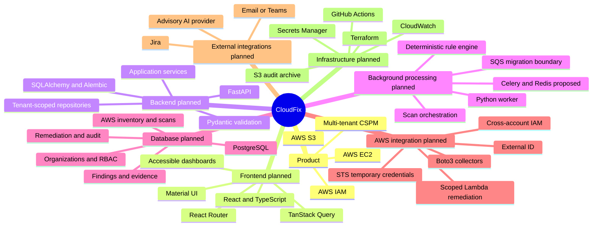
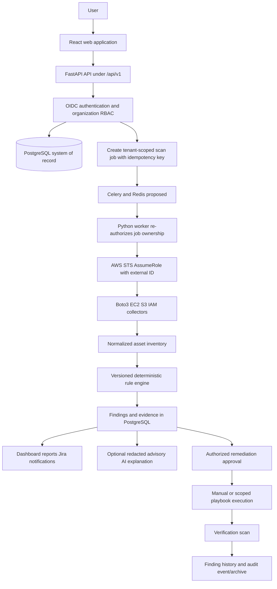

# CloudFix Portable Repository Context

## Purpose and usage

This file gives a fresh AI chat enough context to reason about the CloudFix repository without previous conversation history. Treat linked project documents as the detailed source of truth. Update this file after major architecture or scope changes; update [`project-memory.md`](docs/planning/project-memory.md) after every substantial working session.

**Generated from repository state:** 2026-07-20
**Current stage:** Stage 0 - Planning and research, review pending
**Implementation state:** No application code, database, AWS integration, rules, AI integration, CI/CD, or deployment exists.

## 1. Project purpose and current status

CloudFix is a planned AWS-focused, multi-tenant Cloud Security Posture Management SaaS. Version 1 is limited to Amazon EC2, Amazon S3, and AWS IAM. It will connect to customer AWS accounts using cross-account IAM roles, an external ID, AWS STS, and short-lived credentials; discover normalized configuration metadata; evaluate deterministic security rules; and support auditable investigation, assignment, risk acceptance, remediation approval, remediation, and verification.

AI is an optional advisory layer. It may explain deterministic findings, summarize impact, recommend reviewed remediation options, draft Jira content, and assist with reports. It must not determine findings, receive credentials or unredacted secrets, call AWS, approve or execute remediation, alter mappings without review, or close findings.

The Stage 0 documentation foundation is complete as a draft and has passed structural checks. It still requires stakeholder and team approval. The repository is not initialized as Git. Stage 1 must not begin before approval.

## 2. Repository structure

```text
cloudfix/
|-- README.md, CONTRIBUTING.md, SECURITY.md, CODE_OF_CONDUCT.md
|-- .env.example, .editorconfig, .gitignore, LICENSE
|-- NEW_CHAT_CONTEXT.md
|-- docs/
|   |-- product/        # PRD, scope, personas, stories, metrics, constraints, glossary
|   |-- architecture/   # system, components, flow, AWS onboarding, tenancy, DB, API, threats
|   |   `-- decisions/  # ADR-001 through ADR-006; all currently Proposed
|   |-- design/         # design system, IA, wireframes, flows, accessibility, responsive rules
|   |-- engineering/    # coding, API/DB/security/AI/rules/logging/testing/DoD standards
|   |-- planning/       # phases, roadmap, ownership, backlog, risks, memory, templates
|   `-- operations/     # deployment, environments, monitoring, audit, recovery, incidents, secrets
|-- apps/
|   |-- api/README.md   # documentation-only FastAPI placeholder
|   |-- web/README.md   # documentation-only React placeholder
|   `-- worker/README.md# documentation-only background-worker placeholder
|-- infrastructure/
|   |-- terraform/README.md
|   `-- customer-onboarding/README.md
|-- packages/shared-types/README.md
|-- tests/{end-to-end,performance,security}/README.md
`-- .github/            # CODEOWNERS proposal, PR/issue templates, workflow README only
```

Excluded from analysis and handoff: `.env` files, credentials, API keys, `node_modules`, build output, generated files, binaries, logs, and lock-file contents.

## 3. System mind map



## 4. Main modules and responsibilities

| Planned module | Responsibility | Critical boundary |
|---|---|---|
| Web application | Accessible organization-scoped UI, navigation, query state, reports | UI never decides authorization or calls APIs from visual components |
| Identity and tenancy | OIDC identity, memberships, RBAC, organization context | Deny by default; never trust a client-supplied organization ID alone |
| AWS accounts | Role registration, external ID, STS validation, revocation/rotation | Never request or persist customer AWS access keys or STS credentials |
| Scanning and worker | Manual/scheduled jobs, leases, retries, collectors, coverage | Queue carries opaque IDs; scanning remains read-only |
| Inventory | Normalized EC2/S3/IAM configuration snapshots | Do not collect customer application data or unnecessary sensitive metadata |
| Rules and findings | Versioned deterministic evaluation, evidence, deduplication, lifecycle | AI is not a detection engine; historical rule versions are immutable |
| Compliance | Reviewed rule-to-control mappings and reporting | Mapping does not constitute certification |
| Remediation | Requests, approvals, playbooks, executions, verification | Separate action-specific permissions, idempotency, and prior authorization |
| Integrations | Provider-neutral AI, Jira, email/Teams adapters | Minimize data, store secrets securely, validate callbacks and AI output |
| Audit and reporting | Append-oriented events, reports, tamper-evident archive | No silent history rewrite; never log secrets |

## 5. Planned application and data flow



The API validates input, authenticates the subject, resolves active organization membership and permission, and calls application services. Services enforce lifecycle rules and invoke tenant-scoped repositories. Repositories include organization ownership in predicates and transactions. A background message contains identifiers rather than credentials or asset payloads. The worker re-fetches tenant state before assuming a role and discards temporary credentials after use.

## 6. Important files

| File | Why it matters |
|---|---|
| [`README.md`](README.md) | Repository entry point, principles, documentation index, and Stage 0 checklist |
| [`prd.md`](docs/product/prd.md) | Product vision, users, Version 1 capabilities, exclusions, and success criteria |
| [`scope.md`](docs/product/scope.md) | Explicit EC2/S3/IAM scope and exclusions |
| [`system-overview.md`](docs/architecture/system-overview.md) | Planned logical architecture and technology baseline |
| [`data-flow.md`](docs/architecture/data-flow.md) | End-to-end scan, finding, response, verification, and audit flow |
| [`aws-account-onboarding.md`](docs/architecture/aws-account-onboarding.md) | Secure cross-account role and STS onboarding model |
| [`multi-tenant-design.md`](docs/architecture/multi-tenant-design.md) | Organization isolation across service, repository, worker, cache, and integrations |
| [`database-design.md`](docs/architecture/database-design.md) | Conceptual schema, ER diagram, sensitivity, retention, and index guidance |
| [`threat-model.md`](docs/architecture/threat-model.md) | Threat/control register and residual security questions |
| [`rule-authoring-guidelines.md`](docs/engineering/rule-authoring-guidelines.md) | Proposed 39-rule EC2/S3/IAM catalogue and rule lifecycle |
| [`ai-usage-guidelines.md`](docs/engineering/ai-usage-guidelines.md) | Mandatory AI advisory boundary, redaction, validation, and fallback |
| [`development-rules.md`](docs/engineering/development-rules.md) | Future implementation standards and module boundaries |
| [`phases.md`](docs/planning/phases.md) | Seventeen stages with deliverables, acceptance, risks, owners, and demos |
| [`project-memory.md`](docs/planning/project-memory.md) | Current work state, decisions, blockers, and next task |

## 7. Planned database schema and relationships

PostgreSQL is the intended production database. SQLite is allowed only for isolated experiments or lightweight tests. Use plural snake_case tables, UUID primary keys by default, UTC timestamps, foreign keys, constraints, explicit indexes, transactions, and optimistic locking where concurrent decisions matter.

Tenant root and identity:

- `organizations` owns tenant data.
- `users` join organizations through `organization_members`.
- `organization_members` reference `roles`; roles grant `permissions`.

AWS and scanning:

- An organization owns `aws_accounts` and their versioned/revocable `aws_account_connections`.
- `scan_jobs` have one or more execution attempts in `scan_runs`.
- Scan runs observe normalized `cloud_assets` for EC2, S3, and IAM.

Rules, compliance, and findings:

- `security_rules` have immutable `rule_versions`.
- Frameworks contain `compliance_controls`; `rule_compliance_mappings` connect reviewed rule versions to controls.
- Assets and rule versions produce tenant-owned `findings` with `finding_evidence` and `finding_status_history`.

Response and audit:

- Findings can have `risk_acceptances`, `remediation_recommendations`, `remediation_requests`, `remediation_executions`, and `jira_tickets`.
- Organizations own `notification_events`, `reports`, `audit_events`, and `ai_interactions`.
- `ai_interactions` stores metadata such as purpose, provider/model, prompt-template version, input hash, redaction/output status, token/cost metadata, related record, and timestamp—not secrets.

Every tenant-owned record must carry `organization_id` directly or have one unambiguous mandatory ownership path. Service and repository layers both enforce organization scope. PostgreSQL row-level security remains an open defense-in-depth decision.

## 8. Planned APIs, routes, services, and external integrations

The API prefix is `/api/v1`. Proposed resource routes include:

- `/api/v1/organizations`
- `/api/v1/aws-accounts`
- `/api/v1/assets`
- `/api/v1/scans`
- `/api/v1/findings`
- `/api/v1/remediations`
- `/api/v1/audit-events`
- `POST /findings/{id}/risk-acceptances`
- `POST /remediation-requests/{id}/approvals`
- `POST /findings/{id}/verification-scans`

Routes will call application services rather than Boto3, AI providers, or repositories directly. APIs require Pydantic schemas, correct HTTP semantics, safe structured errors, correlation IDs, bounded cursor pagination, allowlisted filtering/sorting, and idempotency keys for scans, remediation, notifications, and webhooks.

External integrations are AWS STS and EC2/S3/IAM APIs through Boto3; Jira; email or Microsoft Teams; a provider-neutral external AI API; S3 audit archive; CloudWatch; and Secrets Manager or an equivalent store. Terraform will manage CloudFix-owned infrastructure later and is not the scanning engine.

## 9. Planned authentication and authorization flow

1. The user authenticates through an OIDC-compatible identity provider.
2. The backend validates issuer, audience, signature, expiry, and session state.
3. The backend resolves the user and active organization membership from PostgreSQL.
4. RBAC checks an atomic permission for the requested operation.
5. Services confirm the target resource belongs to that organization and is in a valid lifecycle state.
6. Repositories repeat organization scoping in queries; another tenant's identifier must not disclose existence.
7. Sensitive operations require confirmation, fresh authorization where appropriate, separation of duties, and an audit event.
8. Workers and integration callbacks re-establish tenant ownership; they do not trust queue, URL, or webhook tenant claims.

Short-lived sessions, secure cookies where applicable, CSRF protection for cookie-authenticated writes, MFA readiness, rate limits, replay protection, and redacted audit logs are mandatory design requirements. The OIDC provider and exact MFA enforcement remain open.

## 10. Environment variable names

Only variable names are documented. Never add values to this file or commit secret-bearing `.env` files.

| Variable | Intended purpose |
|---|---|
| `APP_ENV` | Environment identifier |
| `DATABASE_URL` | PostgreSQL connection reference; secret-bearing in real environments |
| `OIDC_ISSUER_URL` | Approved identity-provider issuer |
| `OIDC_CLIENT_ID` | OIDC client identifier |
| `AWS_REGION` | CloudFix AWS operating region |
| `CLOUDFIX_AWS_PRINCIPAL_ARN` | Principal trusted by customer onboarding roles |
| `AUDIT_ARCHIVE_BUCKET` | CloudFix-owned audit archive bucket name/reference |
| `SECRETS_PROVIDER` | Selected secure secret store |
| `AI_PROVIDER` | Optional AI provider identifier |
| `AI_MODEL` | Approved model identifier |
| `JIRA_BASE_URL` | Jira tenant base URL |
| `TEAMS_WEBHOOK_SECRET_REFERENCE` | Secret-store reference, never the webhook secret itself |

## 11. Installation, development, testing, and deployment commands

There are currently **no valid commands** for installation, development, testing, database migration, or deployment. No framework, dependency manager, Dockerfile, Terraform configuration, GitHub Actions YAML, or executable application has been initialized. Do not invent commands from the planned stack.

Stage 1 is expected to define setup and basic CI commands after Stage 0 approval. Stage 14 is expected to define deployment commands and operational runbooks. Until then, repository review consists of reading Markdown and performing non-mutating documentation checks.

## 12. Completed work

- All 82 originally required Stage 0 repository files were created; this context file is an additional handoff artifact.
- Product, architecture, database, threat, design, engineering, planning, operations, and GitHub-governance drafts exist.
- Six ADRs document proposed foundational choices.
- The rule catalogue specifies 39 proposed checks: 12 EC2, 13 S3, and 14 IAM.
- The roadmap specifies Stages 0 through 16 and a five-member ownership/review model.
- Documentation validation found substantive Markdown, working local links, Mermaid diagrams, and no executable Stage 1 artifacts.

“Completed” here means drafted and structurally validated, not stakeholder-approved or implemented.

## 13. Incomplete work, known issues, and technical debt

- Stage 0 review and approval are incomplete; every ADR remains Proposed.
- Git is not initialized and no remote/private GitHub repository exists.
- Application, database, AWS integration, rule engine, AI integration, tests, CI/CD, environments, and deployment are not started.
- Actual GitHub handles must replace proposed CODEOWNERS team slugs.
- The current private-rights license placeholder requires owner/legal selection before public distribution.
- OIDC provider, MFA policy, worker choice, PostgreSQL RLS, AWS principal topology, external-ID protection/rotation, retention/residency/RPO/RTO, rule thresholds, compliance licensing, notification priority, initial remediation playbook, and AI provider policy remain open.
- No bugs exist in executable code because no executable code exists. Primary risks are cross-tenant access, IAM/remediation blast radius, incomplete discovery, contextual false signals, AI disclosure, audit gaps, supply chain, cost, and knowledge silos.

## 14. Important architectural decisions

All are currently **Proposed**, not Accepted:

1. Feature-based modular monorepo with minimal shared code and no cross-feature repository access.
2. Python 3.12, FastAPI, Pydantic, SQLAlchemy, and Alembic for the backend.
3. PostgreSQL as the intended production database.
4. Customer AWS access through cross-account read-only IAM roles, per-connection external IDs, and temporary STS credentials.
5. Immutable, versioned, deterministic security rules as the source of findings.
6. Provider-neutral AI as an optional, redacted, validated, untrusted advisory layer.
7. Celery with Redis as the proposed affordable/understandable MVP queue, with an interface-based migration path to Amazon SQS.
8. Remediation uses a separate restricted role or action-specific permission model, approved playbooks, explicit authorization, idempotency, and verification scanning.
9. Terraform manages CloudFix-owned infrastructure; Boto3 performs runtime discovery and approved AWS operations.

## 15. Current task and recommended next steps

**Current task:** Review and approve the Stage 0 foundation; resolve proposals and contradictions before implementation.

Recommended sequence:

1. Stakeholders review the PRD, scope, personas, and success criteria.
2. Architecture/security reviewers examine system design, AWS onboarding, tenancy, database, trust boundaries, and threat model.
3. The engineering team approves development rules, API/database conventions, rule catalogue, test strategy, Git workflow, ownership, risks, and phases.
4. Resolve open questions and update affected documents and ADR statuses.
5. Update `docs/planning/project-memory.md` with decisions and owners.
6. Explicitly authorize Stage 1 before initializing frameworks, package managers, dependencies, Docker, Terraform, CI workflows, or application code.

## Suggested fresh-chat handoff bundle

Upload this file together with the following existing source-of-truth documents:

- [`docs/product/prd.md`](docs/product/prd.md)
- [`docs/architecture/system-overview.md`](docs/architecture/system-overview.md)
- [`docs/architecture/database-design.md`](docs/architecture/database-design.md)
- [`docs/architecture/threat-model.md`](docs/architecture/threat-model.md)
- [`docs/design/design-system.md`](docs/design/design-system.md)
- [`docs/engineering/development-rules.md`](docs/engineering/development-rules.md)
- [`docs/engineering/rule-authoring-guidelines.md`](docs/engineering/rule-authoring-guidelines.md)
- [`docs/planning/phases.md`](docs/planning/phases.md)
- [`docs/planning/project-memory.md`](docs/planning/project-memory.md)

Suggested opening instruction:

> Read the attached project files and treat them as the source of truth. First summarize the project goal, architecture, current implementation state, known issues, and next task. Do not modify code yet. Identify contradictions or missing information before proceeding.
