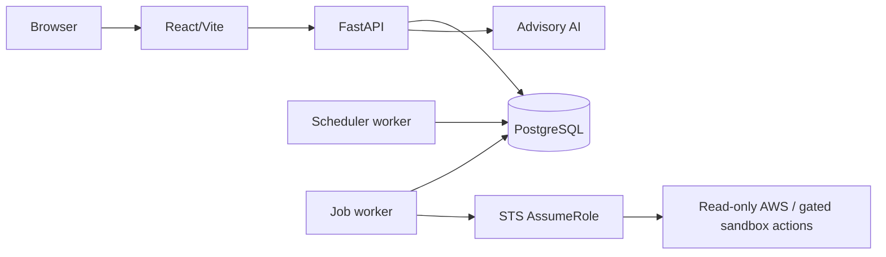

# CloudOps

CloudOps is a multi-tenant AWS security-posture application for teams that need deterministic
inventory, findings, compliance, risk, audit, notifications, and governed remediation without
storing long-lived AWS credentials or delegating security decisions to AI.

## Current status

The application scope through privileged remediation administration is **Implemented and CI
verified** at commit `bec5753ad127d8ed8968d539ee625130c6a2e06f`. The controlled AWS sandbox,
default-disabled S3/EC2 executor, and runbooks exist, but AWS identity preflight, Terraform plan and
apply, EC2 deployment, Cloudflare exposure, live provider tests, live remediation, and rollback are
**Not yet verified**. See the [status matrix](docs/product/current-status.md).

Terraform or workflow source does not prove deployment. CloudOps is not represented as production
ready until external staging, security, provider, restore, rollback, UAT, and deployment evidence
exists.

## What it implements

- JWT/refresh authentication, organizations, invitations, capability RBAC, and tenant isolation.
- STS cross-account onboarding with generated External IDs and in-memory temporary credentials.
- Bounded EC2, S3, IAM, RDS, CloudWatch, and CloudTrail discovery collectors.
- Versioned deterministic security rules, finding lifecycle, compliance mappings, and dashboards.
- `CLOUDOPS_RISK_V1` deterministic 0-100 scoring with immutable snapshots and auditable components.
- Advisory AI finding/impact explanations and remediation, executive, Jira, and email drafts.
- Approval-gated notifications, Jira integration, audit events, scheduler, and PostgreSQL durable jobs.
- Governed remediation preview/approval, mock dry-run, owner-only trust/sandbox administration, and
  default-disabled live actions for S3 Public Access Block and exact EC2 ingress-rule revocation.
- Terraform for managed environments and a separate non-production remediation sandbox.

Supported code does not equal verified compatibility with every live AWS account/service variant.

## Security boundary

- AWS credentials are not stored by the application; the production design uses workload identity
  and temporary STS credentials held in memory.
- CloudOps does not send the full AWS environment to AI. Exactly one compatible persisted source is
  bounded, minimized, sanitized, canonicalized, and hashed.
- AI does not calculate authoritative risk, set finding/compliance status, approve remediation,
  choose an operation, or execute AWS changes.
- Live remediation requires separate same-account role trust and External ID, owner-managed sandbox
  approval, human request approval, two runtime flags, emergency stop cleared, tenant/account/target
  checks, mandatory tags, immutable snapshot and drift checks, lease, idempotency, and exact
  postcondition verification.
- Live actions are restricted to approved synthetic sandbox resources. Arbitrary AWS operations are
  unsupported, and no live action has been operationally verified.

See [security controls](docs/security/security-controls.md),
[tenant isolation](docs/security/tenant-isolation.md), and
[remediation governance](docs/security/remediation-governance.md).

## Architecture



PostgreSQL is the durable job source of truth; Celery/Redis are not implemented. Deterministic rules
detect findings. See [system architecture](docs/architecture/system-architecture.md),
[data flow](docs/architecture/data-flow.md), and [AWS roles](docs/architecture/aws-role-architecture.md).

## Local development

Use synthetic values only. Do not put credentials or real customer data in repository files.

```powershell
Set-Location <repository-root>
docker compose -f compose.yml config --quiet
docker compose -f compose.demo.yml up --build
```

Backend checks run from `apps/api`; frontend checks run from `apps/web`. See
[local development](docs/operations/local-development.md) and
[test strategy](docs/testing/test-strategy.md). Current Alembic head is
`0019_live_remediation_data_model`.

## Deployment

- **Local/demo:** synthetic data and local/mock providers.
- **Organization-managed self-host:** named Cloudflare Tunnel to internal web; API/database ports
  are not published. Operational clean-host/restore evidence remains environment-specific.
- **Managed AWS:** staging/production Terraform and immutable release workflow exist; no deployment
  is proven here.
- **Controlled sandbox:** intended for `ap-south-1`, one Ubuntu `t3a.large` host, encrypted 50 GiB
  gp3, IMDSv2, explicit administrator `/32`, separate roles, and synthetic findings. Plan/apply and
  deployment are pending. See the [EC2 runbook](docs/operations/ec2-deployment-runbook.md).

## Demonstration

Use the [guide demonstration](docs/demo/guide-demonstration.md) with synthetic data. It includes
five-, ten-, and fifteen-minute paths, an offline fallback, evidence checklist, and accurate answers
about AI, credentials, deployment, and live remediation.

## Documentation

The canonical map is [docs/README.md](docs/README.md). Key entry points:

- [Product requirements](PRD.md) and [current status](docs/product/current-status.md)
- [Architecture](docs/architecture/system-architecture.md) and [data model](DATA_MODEL.md)
- [API contracts](API_CONTRACTS.md)
- [Deterministic risk](docs/security/deterministic-risk.md) and
  [AI minimization](docs/security/ai-data-minimization.md)
- [Remediation governance](docs/security/remediation-governance.md)
- [AWS sandbox](docs/operations/aws-remediation-sandbox.md) and
  [live runbook](docs/operations/live-aws-remediation-runbook.md)
- [CI pipeline](docs/testing/ci-pipeline.md) and [release status](docs/release/current-release-status.md)
- [New-chat context](NEW_CHAT_CONTEXT.md), [memory](memory.md), [phases](phases.md), and
  [changelog](CHANGELOG.md)

## Limitations

Live AWS identity, discovery, Bedrock, SES, Jira, remediation, rollback, backup/restore, canary,
Cloudflare, UAT, and production deployment require retained external evidence. Compliance mappings
are not certifications. Risk is CVSS-inspired but not CVSS. AI output is untrusted advisory text.

Contributors must follow [rules.md](rules.md) and stage reviewed paths explicitly; never commit
secrets or weaken tenant/remediation boundaries.
