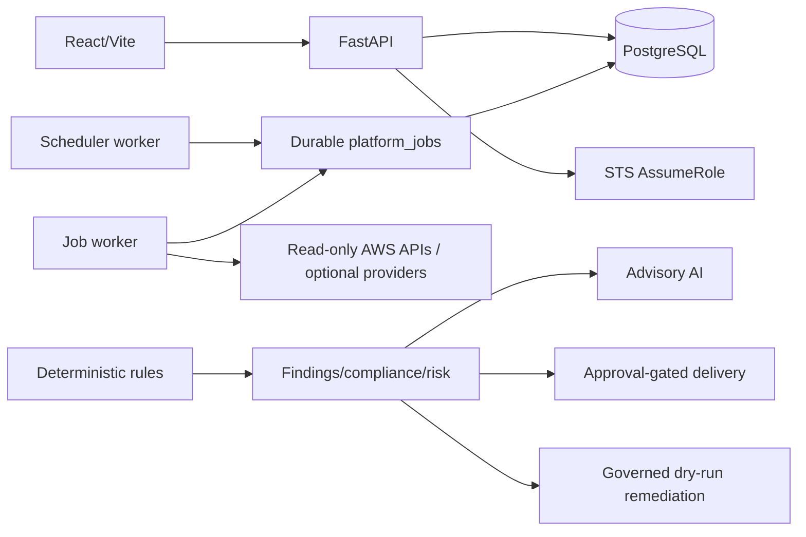

# CloudFix / CloudOps

CloudFix is the repository/project name. The implemented application, package names, Terraform
resources, and current UI use **CloudOps**. It is a multi-tenant AWS security-posture application
with cross-account onboarding, read-only discovery, deterministic findings, compliance/risk,
advisory AI, approved notifications, durable PostgreSQL jobs, scheduling, audit, and governed
dry-run remediation.

## Truthful status

- **Implemented and locally verified:** core V1 features, tenant/RBAC controls, deterministic
  analysis, durable jobs, scheduler, audit, provider adapters, dry-run remediation, Terraform
  validation, CI/release definitions, and local container/security gates.
- **Implemented; live validation pending:** AWS onboarding/discovery, Bedrock, SES, Jira, GitHub
  OIDC, ECR publishing, Terraform apply, ECS/RDS/ALB/WAF/CloudWatch operation, and release workflow.
- **User-reported, not independently verified in this environment:** the `infra/bootstrap` Terraform
  root may have already been applied to AWS (state bucket, lock table, KMS key, OIDC provider,
  publish/staging-deploy roles). This has not been confirmed with AWS CLI access, live account/region
  identity, or Terraform state inspection — see [KNOWN_ISSUES.md](KNOWN_ISSUES.md).
- **Deferred or not proven:** live AWS mutation, weighted canary, cross-region backup, live
  restore/rollback, UAT, load baseline, staging deployment, and production deployment.

Terraform/workflow existence does not mean deployed. Current test/scan summaries are **reported
verification evidence; external log retention required** unless retained CI artifacts are
provided.

## Architecture at a glance



No Celery/Redis broker is implemented. AI does not detect findings or authorize remediation. No
live AWS mutation executor exists.

## Source-of-truth context package

1. [NEW_CHAT_CONTEXT.md](NEW_CHAT_CONTEXT.md) — compact handoff.
2. [PRD.md](PRD.md) — product and release requirements.
3. [architecture.md](architecture.md) — components, flows, trust boundaries, repository map.
4. [design.md](design.md) — implemented frontend design.
5. [rules.md](rules.md) — coding, security, Git, AWS, and release rules.
6. [phases.md](phases.md) — stages 0–17 status.
7. [memory.md](memory.md) — current worktree, evidence, risks, and next task.
8. [KNOWN_ISSUES.md](KNOWN_ISSUES.md) — open, unresolved, verified issues only.
9. [DECISIONS.md](DECISIONS.md) — ADR index, including demo-hardening `ADR-Dxx` records.
10. [DEMO_RUNBOOK.md](DEMO_RUNBOOK.md) — two-day demo commands, credentials, and limitations.
11. [SECURITY_MODEL.md](SECURITY_MODEL.md) — authN/authZ, tenancy, secrets, and demo exceptions.
12. [CHANGELOG.md](CHANGELOG.md) — unreleased changes; no tagged release exists.

## Documentation index

### Platform and APIs

- [API README](apps/api/README.md)
- [Web README](apps/web/README.md)
- [Worker entry points](apps/worker/README.md)
- [API design](docs/architecture/api-design.md)
- [Database design](docs/architecture/database-design.md)
- [AWS onboarding](docs/architecture/aws-account-onboarding.md)
- [Distributed jobs](docs/architecture/distributed-jobs.md)
- OpenAPI UI at `http://localhost:8000/docs` when the local API is running

### Infrastructure and providers

- [Terraform](infra/README.md)
- [Deployment strategy](docs/operations/deployment-strategy.md)
- [Bedrock and SES setup](docs/operations/aws-provider-setup.md)
- [Secrets strategy](docs/operations/secrets-management.md)
- [Monitoring](docs/operations/monitoring-strategy.md)
- [Backup and restore](docs/operations/backup-and-recovery.md)
- [Canary and rollback](docs/operations/canary-and-rollback.md)
- [Migration safety](docs/operations/migration-safety.md)

### Security and governance

- [Security policy](SECURITY.md)
- [Phase 1 hardening evidence](docs/security/phase-1-production-hardening.md)
- [Threat model](docs/architecture/threat-model.md)
- [Trust boundaries](docs/architecture/trust-boundaries.md)
- [Tenant design](docs/architecture/multi-tenant-design.md)
- [Notification controls](docs/security/notification-delivery-controls.md)
- [Remediation governance](docs/operations/remediation-governance.md)
- [Audit strategy](docs/operations/audit-log-strategy.md)

### Release, testing, and handover

- [CI/release workflow guide](.github/workflows/README.md)
- [V1 handover](docs/release/v1-handover.md)
- [UAT checklist](docs/testing/uat-checklist.md)
- [Local demo runbook](demo_v1.md)
- [End-to-end verification](tests/end-to-end/README.md)
- [Testing strategy](docs/engineering/testing-strategy.md)

## Repository layout

```text
apps/api/       Backend, workers, tests, migrations
apps/web/       Frontend and tests
infra/          Authoritative Terraform
docs/           Architecture, engineering, operations, product, security, release, UAT
scripts/        Migration, smoke, seed, and load helpers
tests/          Cross-cutting verification documentation
.github/        CI/release workflows and templates
```

## Local development

Use synthetic/local configuration only. Never paste or commit credentials.

```powershell
Set-Location D:\learn\cdac\cloudfix-main-release
docker compose -f compose.yml config --quiet
docker compose -f compose.demo.yml up --build
```

For the two-day demo specifically (synthetic data, same-origin proxy, optional temporary public
tunnel), use `.\scripts\demo_bootstrap.ps1 -Reset` instead — see
[DEMO_RUNBOOK.md](DEMO_RUNBOOK.md).

Backend checks run from `apps/api`; frontend checks run from `apps/web`. Automated AWS tests must
remain mocked or Stubber-based.

## Current migration and infrastructure facts

- Alembic head: `0018_jira_integration`.
- Terraform roots: `infra/bootstrap`, `infra/environments/staging`,
  `infra/environments/production`.
- Workflows: `.github/workflows/ci.yml` and `.github/workflows/release.yml`.
- Target containers run non-root; API and web Dockerfiles use pinned Alpine variants.
- Release design builds once, records digests/SBOMs, validates staging, and has a protected
  explicit production gate.

None of these statements prove a live apply or release.

## Contributing safely

Read [rules.md](rules.md) and [CONTRIBUTING.md](CONTRIBUTING.md). If staging is explicitly
authorized, stage reviewed files by exact path:

```powershell
git add -- docs/path-one.md docs/path-two.md
```

Do not stage broadly, force-push shared branches, expose secrets, apply Terraform, or run live AWS
tests without explicit authorization.
