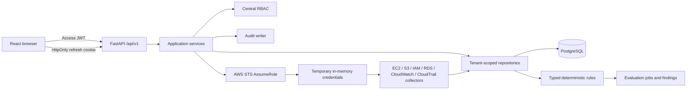
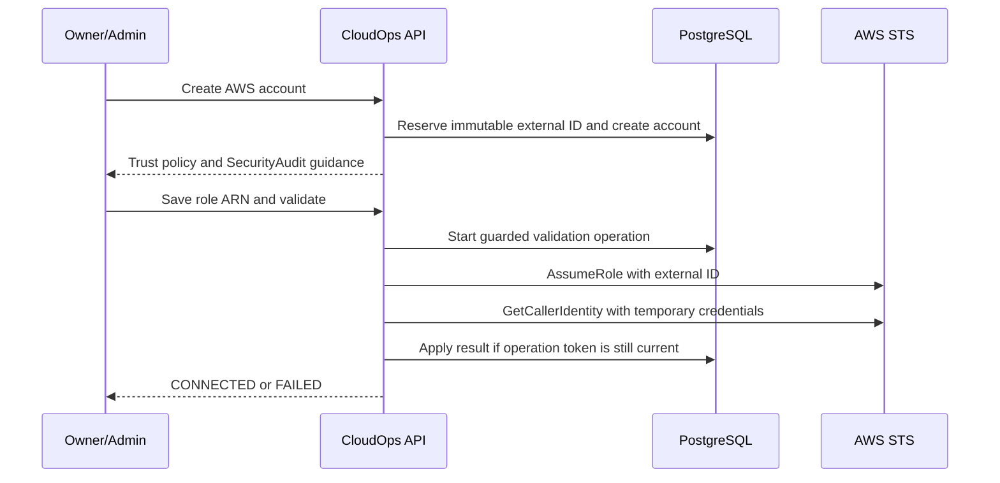

# CloudOps Current Architecture

## Document role

This document is the concise implementation architecture for future coding sessions. Detailed
designs remain under `docs/architecture/`.

## Repository structure

```text
apps/
  api/                 FastAPI application, Alembic migrations, backend tests
  web/                 React/Vite application and frontend tests
  worker/              Placeholder; no executable worker implementation
docs/                  Product, architecture, engineering, design, planning, operations, ADRs
infrastructure/        Placeholders; no deployed Stage 1–3 infrastructure
packages/              Shared-package placeholders
tests/                 Cross-application test placeholders
compose.verify.yml     Disposable PostgreSQL 16 verification service
```

The implemented system is a Python/TypeScript monorepo. Discovery currently runs synchronously
inside the API process; Celery/Redis and production deployment topology are future work.

## Runtime architecture



Route handlers perform HTTP mapping and schema validation. Services own workflows, transaction
boundaries, invariants, and audit events. Repositories own persistence and tenant-scoped lookup.

## Backend architecture

- **API:** FastAPI routers in `apps/api/app/api/v1/`
- **Configuration:** Pydantic Settings in `app/core/config.py`
- **Database:** synchronous SQLAlchemy 2 sessions with PostgreSQL as the production target
- **Migrations:** Alembic in `apps/api/alembic/`
- **Models:** identity, tenancy, tokens, audit, AWS onboarding, assets, discovery jobs,
  evaluation jobs, and findings
- **Schemas:** explicit Pydantic v2 request/response models
- **Services:** authentication, organizations, invitations, onboarding, discovery, evaluations,
  and finding lifecycle
- **Rules:** static typed registry under `app/security_rules`; no boto3, network, or filesystem
- **Security:** Argon2, JWT validation, token hashing, centralized RBAC
- **Logging:** request correlation and structured JSON-compatible events

## Frontend architecture

The web application uses React, TypeScript, Vite, Tailwind CSS, React Router, TanStack Query,
React Hook Form, Zod, and Lucide React.

- `AuthProvider` restores the session through the refresh cookie and owns user state.
- The access token remains in memory and is supplied by the API client.
- Refresh requests use credentials and are single-flight.
- Failed refresh invalidates the in-memory token and user state.
- `ProtectedRoute` controls authenticated navigation; backend authorization remains authoritative.
- Page modules cover administration, AWS onboarding, inventory, findings, rules, and evaluations.

## Authentication flow

1. Login verifies normalized email and Argon2 password hash.
2. The API returns a short-lived signed access JWT.
3. The web app keeps the access token only in memory.
4. An opaque refresh token is placed in an HttpOnly cookie; only its SHA-256 hash is stored.
5. Refresh locks the stored session, rotates the token, links the replacement, and revokes the
   old session.
6. Reuse detection revokes the token family.
7. Logout revokes the verified database session; password change revokes refresh sessions.

## AWS onboarding flow



Long-lived access keys are never accepted. Temporary STS credentials are used only to construct
in-memory service clients and are never stored.

## Discovery flow

1. Validate active membership, discovery capability, and `CONNECTED` account state.
2. Prevent overlapping active jobs for the account.
3. Assume the stored cross-account role through Stage 2.
4. Run EC2 and RDS collectors across configured regions.
5. Run S3 and IAM collectors as global services.
6. Normalize assets to a shared structure.
7. Lock by account, upsert discovered assets, and preserve `first_seen_at`.
8. Mark missing assets inactive only for a collector that completed successfully.
9. Commit each successful service boundary independently.
10. Finish the job as `completed`, `partially_completed`, or `failed` and record audit metadata.

## Evaluation flow

Authorize and lock a connected account, allocate a monotonic job sequence, read persisted active
assets, and run static typed rules. Passed results resolve existing findings, failures
create/update/reopen them, and errors preserve prior state. Stale sequences cannot overwrite
newer lifecycle state. Terminal counters, structured logs, and audit events are committed.

## Current PostgreSQL schema

| Model/table | Purpose |
|---|---|
| `User` / `users` | Global user identity and authentication status |
| `Organization` / `organizations` | Tenant root |
| `OrganizationMembership` / `organization_members` | User role/status in an organization |
| `OrganizationInvitation` / `organization_invitations` | Hashed, expiring invitation |
| `RefreshTokenSession` / `refresh_token_sessions` | Hashed rotating refresh session |
| `AuditEvent` / `audit_events` | Authentication, governance, onboarding, and discovery history |
| `AWSAccount` / `aws_accounts` | Organization-owned AWS connection metadata |
| `AWSExternalIDReservation` / `aws_external_id_reservations` | Permanent global external-ID reservation |
| `Asset` / `assets` | Normalized historical AWS resource inventory |
| `DiscoveryJob` / `discovery_jobs` | Discovery execution state and counters |
| `EvaluationJob` / `evaluation_jobs` | Evaluation sequence, status, and counters |
| `Finding` / `findings` | Stable rule result, evidence, resolution, and suppression |

## Database constraints and concurrency

- User normalized email and organization slug are unique.
- Membership is unique by organization/user.
- Pending invitation uniqueness is enforced with a PostgreSQL partial index.
- AWS account ID and role ARN uniqueness are organization scoped.
- External-ID reservations are globally unique and retained after account deletion.
- `aws_accounts(id, organization_id)` is a composite candidate key.
- Assets and discovery jobs use composite foreign keys to enforce account/organization agreement.
- Asset identity is unique by account/type/resource ID.
- Asset seen timestamps and discovery-job counters/status timestamps have check constraints.
- A partial unique index prevents more than one pending/running discovery job per account.
- A partial unique index prevents more than one pending/running evaluation per account.
- Partial unique indexes provide one asset/rule or account/rule finding identity.
- Composite foreign keys enforce finding organization/account/asset agreement.
- PostgreSQL row locks serialize refresh rotation, invitation acceptance, final-owner changes,
  AWS account lifecycle mutations, and account-level asset lifecycle work.
- Validation operation tokens stop stale STS results from overwriting newer account changes.

## Tenant isolation

Every organization-owned lookup includes organization scope or derives it through an authorized
membership/account relation. Suspended and removed members are denied. Cross-tenant detail
lookups return non-disclosing not-found responses. Platform-admin status is not an automatic
tenant bypass. Composite database foreign keys provide defense against inconsistent asset/job
ownership.

## Audit architecture

Audit events include organization, actor, event type, resource, result, safe metadata, request
context, and timestamp. Covered families include authentication, invitations, membership,
organization creation, AWS account lifecycle, and discovery lifecycle. Passwords, hashes, raw
tokens, authorization/cookie headers, and AWS credentials are excluded.

## API routers

- `auth`: identity and token lifecycle
- `organizations`: organizations, members, invitations, audit events
- `invitations`: invitation acceptance
- `aws_accounts`: account onboarding and lifecycle
- `discovery`: discovery start, jobs, assets, summary
- `security_findings`: rules, evaluations, findings, summary, suppression
- `health`: liveness and readiness

## Migration chain

```text
0001_stage1
  -> 0002_stage2
  -> 0003_stage3
  -> 0004_verification_repairs
  -> 0005_stage4_rule_engine (current head)
```

`0004_verification_repairs` backfills permanent external-ID reservations and adds the composite
tenant keys, lifecycle constraints, and AWS-account validation coordination fields. Existing
valid Stage 2/3 data is preserved.

## Future work

Stage 5 has not started. Compliance, risk scoring, AI, notifications, raw event ingestion,
scheduling, remediation, and production infrastructure are not part of the executable
architecture.
