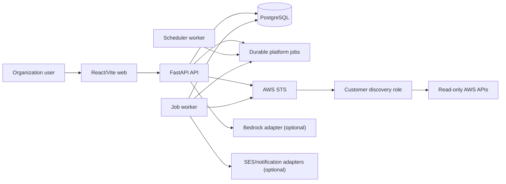
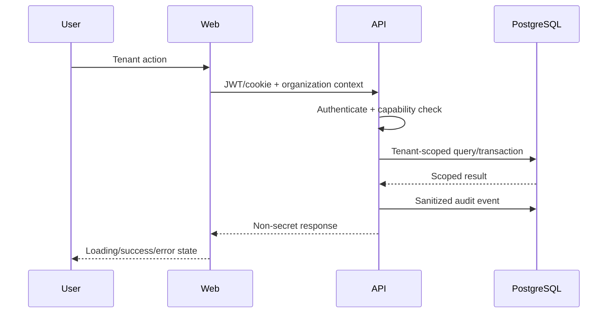
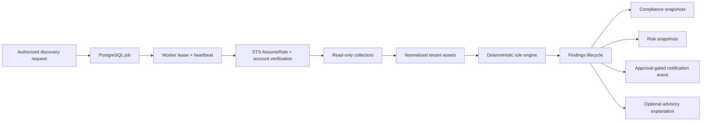
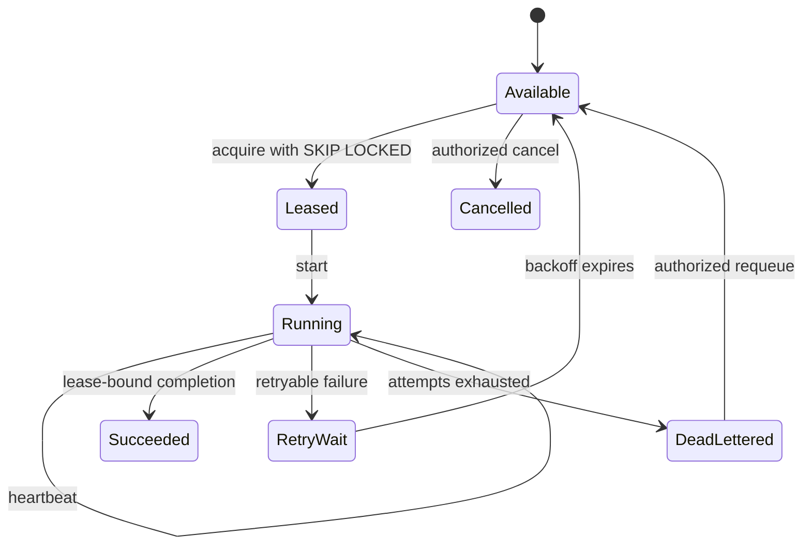
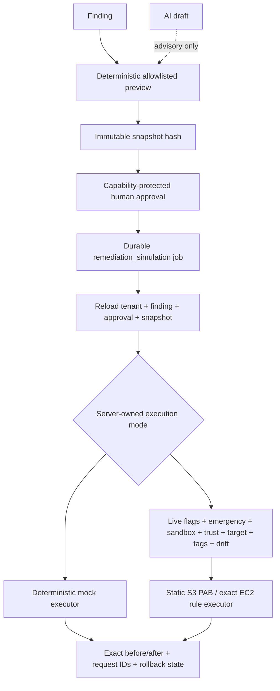
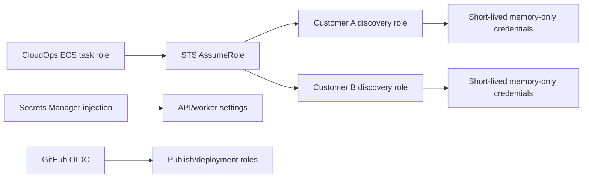
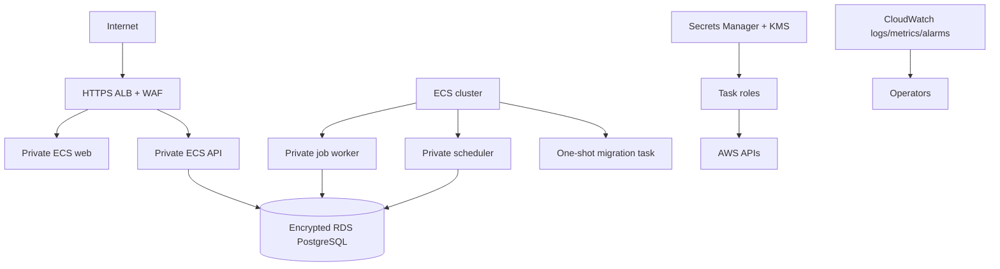
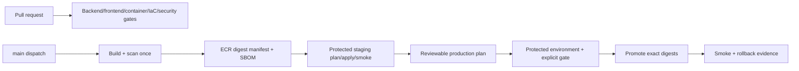

# CloudOps Current Architecture

> Per [ADR-010](docs/architecture/decisions/ADR-010-cloudops-product-name.md), **CloudOps** is the
> active product name; CloudFix remains only the repository/directory name. This document describes
> implemented code and locally validated configuration, not a deployed environment.

Related sources: [PRD.md](PRD.md), [design.md](design.md), [rules.md](rules.md),
[phases.md](phases.md), and [memory.md](memory.md). The local two-day demo's additional same-origin
proxy, synthetic-discovery, and Quick Tunnel architecture is documented separately in
[DEMO_RUNBOOK.md](DEMO_RUNBOOK.md) and decisions `ADR-D01`–`ADR-D08` in [DECISIONS.md](DECISIONS.md)
— it layers on top of, and does not replace, the architecture below.

## System context

### Organization-managed self-hosting

`compose.selfhost.yml` implements a production-mode single-host path. Thin PowerShell/Bash
wrappers share a Python control plane for configuration, migration-gated startup, health checks,
lifecycle commands, and local backup/restore. A named Cloudflare Tunnel reaches only Nginx;
FastAPI and PostgreSQL publish no host ports. Durable jobs remain PostgreSQL-backed and
worker/scheduler health uses bounded heartbeat freshness. This does not replace or prove the
Terraform-managed AWS path. See the
[self-hosting guide](docs/operations/self-hosted-cloudflare-deployment.md).



Live Bedrock, SES, and customer-account calls are external validation boundaries. Automated tests
use mocks, fakes, or Botocore Stubber.

## Component inventory

| Component | Implementation | Responsibility |
|---|---|---|
| Web | React, TypeScript, Vite, Tailwind, TanStack Query | Authenticated tenant UI |
| API | FastAPI, Pydantic Settings, SQLAlchemy | HTTP/RBAC/orchestration |
| PostgreSQL | Models plus Alembic through `0017` | Tenant data, jobs, audit, constraints |
| API service | ECS/Fargate task definition | Requests, health, readiness |
| Scheduler worker | `app.worker.scheduler_worker` | Claim due schedules and enqueue |
| Job worker | `app.worker.job_worker` | Lease, heartbeat, dispatch, retry |
| Migration task | One-shot ECS task | Alembic upgrade before service movement |
| Providers | Mock/external/Bedrock; mock/SMTP/SES/Slack/Teams | Advisory AI and approved delivery |
| Terraform | `infra/bootstrap`, staging, production | AWS platform definitions |
| CI/release | `ci.yml`, `release.yml` | Verify, build once, promote digests |

No separate Celery/Redis worker application is implemented. `apps/worker/README.md` points to the
API package worker modules.

## Request and data flow



The server derives authorization from authenticated membership. Request bodies are not trusted as
authorization. Cross-tenant detail probes use non-disclosing behavior.

## Discovery to finding flow



Deterministic rules are the only detection boundary. AI cannot create authoritative findings,
scores, approvals, or executable actions.

## Background-job lifecycle



`platform_jobs` contains bounded reference payloads, tenant idempotency, lease token/generation,
attempt counters, correlation/parent identifiers, sanitized errors, and result references.
Lease-bound writes reject stale workers. Scheduler occurrence claiming prevents duplicate enqueue
across replicas.

## Notification flow

```mermaid
sequenceDiagram
  participant E as Evaluation
  participant N as Notification event
  participant H as Human approver
  participant J as Job worker
  participant P as Provider
  E->>N: New eligible critical finding
  H->>N: Approve
  N->>J: Enqueue delivery reference
  J->>N: Reload tenant, event, approval
  alt approval still valid
    J->>P: Sanitized bounded request
    P-->>J: Sanitized outcome
    J->>N: Attempt evidence/status
  else revoked or changed
    J->>N: Fail closed; no delivery
  end
```

SES, SMTP, Slack, Teams, and mock adapters exist. Production settings reject SMTP. SES live delivery
has not been validated.

## AI and Bedrock

`AIService` accepts persisted deterministic sources and task types for explanation, impact,
remediation drafting, executive summary, Jira drafting, and email drafting. Provider controls bound
size, retries, timeouts, quota, structured output, and persisted evidence. Bedrock uses the default
AWS credential chain and a configured model. Stubber tests exist; live model invocation is pending.

## Remediation governance



Execution is disabled by default; mock/dry-run remains the normal path. The live executor supports
only two static sandbox actions and remains blocked by default feature flags plus an active
emergency stop. It has no live AWS validation evidence and automatic rollback is not implemented.

## Tenant isolation and RBAC

- Tenant-owned models use `organization_id` directly or organization-consistent composite
  constraints.
- Repositories/routes apply tenant predicates before returning data.
- Capabilities separate read, manage, approve, execute, and export operations.
- Database constraints defend parent/child organization consistency.
- Background jobs reload referenced records with tenant scope.
- Platform-admin state is not an implicit tenant bypass.
- PostgreSQL RLS is not documented here as broadly enabled; application predicates, RBAC, and
  constraints remain primary.

## AWS identity and secret boundaries



- Production rejects static AWS credential environment variables.
- Pydantic `SecretStr` covers database, JWT, provider, webhook, and related secret settings.
- ECS injects a named runtime secret; business services do not implement a custom secret store.
- STS credentials are tenant-keyed, bounded, refreshed, and never persisted.
- External IDs are sensitive trust material, not customer access credentials.
- Frontend build variables must remain non-secret.

## Data classification

| Class | Examples | Boundary |
|---|---|---|
| Public | Product documentation | Repository |
| Internal | Rule catalog, non-secret configuration | Authenticated/service config |
| Tenant confidential | Assets, findings, risk, audit, account metadata | Organization scope |
| Sensitive trust material | External IDs | Privileged onboarding only |
| Secret | JWT/database/provider material | Managed secret injection/redaction |
| Ephemeral credential | STS session credentials | Process memory only |

## Failure, retry, and audit paths

- AWS/provider calls use bounded timeouts/retries and sanitized failures.
- Discovery records partial failure without discarding successful collectors.
- Worker crashes recover after lease expiry; heartbeats extend owned leases.
- Retry exhaustion dead-letters instead of looping indefinitely.
- Notification approval is rechecked immediately before delivery.
- Readiness verifies database dependency; liveness does not require it.
- Structured logs include request/job context but exclude secret values.
- Audit events retain state transitions and safe metadata.

## AWS deployment topology



Terraform defines VPC networking, default-deny group, flow logs, RDS, ECS, ALB/WAF, ECR, KMS,
Secrets Manager, access logs, metrics, alarms, dashboards, and environment separation. Definition
and local validation do not prove an AWS apply.

## CI/CD promotion



The workflow uses GitHub OIDC and separates publish, staging, and production roles. It exists but
has not been proven against a live AWS environment. Actions use version tags rather than immutable
action commit SHAs; pinning policy remains a supply-chain gap.

## Canary, rollback, backup, and restore

- ECS deployment circuit breakers and previous task-definition restoration are implemented in the
  release workflow.
- Weighted 5/25/50/100 traffic canary is not implemented.
- Migrations follow additive/expand-contract intent; rollback must not blindly downgrade schema.
- RDS backup retention, final snapshots, and operational restore procedures are defined.
- No live canary, rollback, or backup-restore rehearsal is proven.

## Repository map

```text
apps/api/          FastAPI code, models, services, workers, tests, Alembic
apps/web/          React/Vite UI and tests
apps/worker/       Pointer documentation for worker entry points
infra/             Terraform bootstrap, modules, staging, production
docs/              Architecture, engineering, operations, product, security, release, UAT
scripts/           Migration, smoke, seed, and load helpers
infrastructure/    Legacy/placeholding paths; authoritative Terraform is infra/
tests/             Cross-cutting verification documentation
.github/           CI/release workflows and contribution templates
```

**The repository map explains how the codebase is organized; [memory.md](memory.md) explains where
work stopped.**

## Observed limitations

- No live staging/production deployment evidence.
- No live Bedrock or SES validation.
- No completed UAT, load baseline, alarm-routing exercise, restore, or rollback rehearsal.
- No weighted canary.
- Current code/UI branding remains CloudOps.
- Reported local verification evidence requires retained external logs or CI artifacts.
