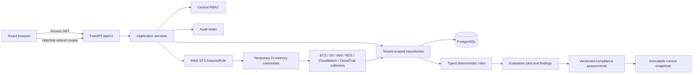
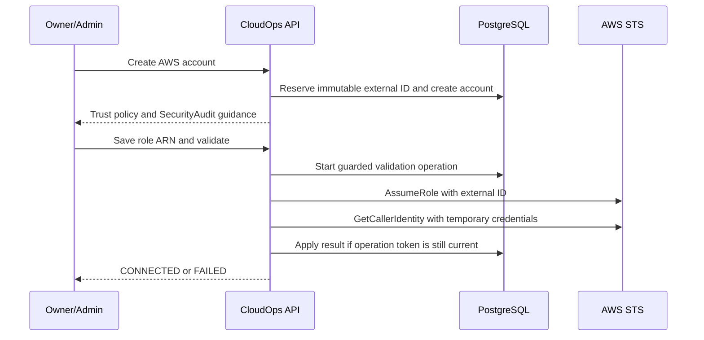

# CloudOps Current Architecture

Stages 1-8 are independently clean-room verified, merged, and regression-tested in `main` at
`889660ecb8a378d107f6737b4466b70362066793`. Stage 7 AI explanations are implemented with
migration head `0009_stage7_ai_assistant` on `main`. Stages 9-11 (notifications, remediation,
scheduler) are implemented, independently verified, and committed on
`feature/v1-demo-completion` (migration head `0012_stage11_scheduler`), not yet merged into
`main`. Stage 12 (audit query/export) is implemented and committed on that branch at `d0d24cd`
and `9314f06`; it reuses the existing `AuditEvent` model and adds no migration.

## Document role

This document is the concise implementation architecture for future coding sessions. Detailed
designs remain under `docs/architecture/`.

## Repository structure

```text
apps/
  api/                 FastAPI application, Alembic migrations, backend tests
  api/app/worker/      Stage 11 deterministic scheduler-tick entry point (scheduler_worker.py)
  web/                 React/Vite application and frontend tests
  worker/              Placeholder; no Celery/Redis or distributed-queue implementation
docs/                  Product, architecture, engineering, design, planning, operations, ADRs
infrastructure/        Placeholders; no deployed Stage 1–3 infrastructure
packages/              Shared-package placeholders
tests/                 Cross-application test placeholders
compose.verify.yml     Disposable PostgreSQL 16 verification database only, not a full demo stack
```

The implemented system is a Python/TypeScript monorepo. Discovery, evaluation, and the Stage 11
scheduler's synchronous "tick" all run inside the API process's own dependencies; a distributed
queue/worker framework and production deployment topology remain future work. `apps/worker/` is
still the reserved placeholder for that future distributed-worker choice; the Stage 11 worker
foundation lives under `apps/api/app/worker/` because it reuses the API's own database/service
wiring directly.

## Runtime architecture



Route handlers perform HTTP mapping and schema validation. Services own workflows, transaction
boundaries, invariants, and audit events. Repositories own persistence and tenant-scoped lookup.

## Backend architecture

- **API:** FastAPI routers in `apps/api/app/api/v1/`
- **Configuration:** Pydantic Settings in `app/core/config.py`
- **Database:** synchronous SQLAlchemy 2 sessions with PostgreSQL as the production target
- **Migrations:** Alembic in `apps/api/alembic/`
- **Models:** identity, tenancy, tokens, audit, AWS onboarding, assets, discovery jobs,
  evaluation jobs, per-rule results, findings, compliance catalog, mappings, assessments,
  immutable snapshots, `NotificationEvent`, `RemediationRequest`, `ScanSchedule`, and `ScanRun`
- **Schemas:** explicit Pydantic v2 request/response models
- **Services:** authentication, organizations, invitations, onboarding, discovery, evaluations,
  finding lifecycle, compliance assessment, notifications, remediation, and scheduling
- **Rules:** static typed registry under `app/security_rules`; no boto3, network, or filesystem
- **Security:** Argon2, JWT validation, token hashing, centralized RBAC
- **Logging:** request correlation and structured JSON-compatible events

## Frontend architecture

The web application uses React, TypeScript, Vite, Tailwind CSS, React Router, TanStack Query,
React Hook Form, Zod, and Lucide React.

- `AuthProvider` restores the session through the refresh cookie and owns user state.
- The access token remains in memory and is supplied by the API client.
- Refresh requests use credentials and are single-flight.
- Failed refresh invalidates the in-memory token and user state.
- `ProtectedRoute` controls authenticated navigation; backend authorization remains authoritative.
- Page modules cover administration, AWS onboarding, inventory, findings, rules, evaluations,
  notifications, remediation, scan schedules, and (pending commit) an audit explorer.
- Compliance pages expose framework summaries, historical assessments, and a role-gated
  accessible assessment confirmation workflow.
- `apiBlob()` in `api/client.ts` reuses the existing authenticated request/refresh-retry flow to
  fetch binary responses (the Stage 12 CSV export) instead of JSON.

## Compliance flow

1. Lock and tenant-authorize the AWS account.
2. Select a versioned framework and latest applicable completed Stage 4 evaluation.
3. Match persisted per-rule results to version-bounded control mappings.
4. Preserve direct active or suppressed failure evidence.
5. Produce PASS, FAIL, NOT_ASSESSED, or ERROR without inferring success from absence.
6. Persist immutable control snapshots and aggregate counters in one transaction.
7. Emit bounded structured logs and durable assessment lifecycle audit events.

PostgreSQL composite foreign keys enforce account/evaluation/organization and
control/framework consistency. Partial unique indexes prevent duplicate active assessments and
open-ended mappings. Finalized per-rule summaries and assessment snapshots cannot be updated.

## Stage 6 deterministic risk flow

`CLOUDOPS_RISK_V1` reads committed Stage 4 findings and bounded tenant context only. It records
explicit component points, reason codes, finding age, business impact, data sensitivity,
environment, unknown-input indicators, policy version, and source lifecycle versions. Scores
are CloudOps-specific and CVSS-inspired—not CVSS—and are clamped to 0–100:

- LOW 0–29; MEDIUM 30–59; HIGH 60–79; CRITICAL 80–100.
- Account score = 50% highest finding + 30% mean top ten + 20% mean all active findings.
- Organization score = 60% highest account + 40% mean account score.

Suppressed findings remain in scope. Only an authorized, reasoned compensating control bounded
from -15 through -1 may adjust a subsequent assessment. It does not alter finding severity or
compliance status. Finding, account, and organization snapshots are immutable, so later context
or control changes never recalculate history. Tenant-scoped transactions, deterministic lock
ordering, partial indexes, and optimistic versions prevent duplicate or stale writes. Scoring
makes no AWS, network, filesystem, plugin, dynamic-code, or AI call.

## Authentication flow

1. Login verifies normalized email and Argon2 password hash.
2. The API returns a short-lived signed access JWT.
3. The web app keeps the access token only in memory.
4. An opaque refresh token is placed in an HttpOnly cookie; only its SHA-256 hash is stored.
5. Refresh locks the stored session, rotates the token, links the replacement, and revokes the
   old session.
6. Reuse detection revokes the token family.
7. Logout revokes the verified database session; password change revokes refresh sessions.

## AWS onboarding flow



Long-lived access keys are never accepted. Temporary STS credentials are used only to construct
in-memory service clients and are never stored.

## Discovery flow

1. Validate active membership, discovery capability, and `CONNECTED` account state.
2. Prevent overlapping active jobs for the account.
3. Assume the stored cross-account role through Stage 2.
4. Run EC2 and RDS collectors across configured regions.
5. Run S3 and IAM collectors as global services.
6. Normalize assets to a shared structure.
7. Lock by account, upsert discovered assets, and preserve `first_seen_at`.
8. Mark missing assets inactive only for a collector that completed successfully.
9. Commit each successful service boundary independently.
10. Finish the job as `completed`, `partially_completed`, or `failed` and record audit metadata.

## Evaluation flow

Authorize and lock a connected account, allocate a monotonic job sequence, read persisted active
assets, and run static typed rules. Passed results resolve existing findings, failures
create/update/reopen them, and errors preserve prior state. Stale sequences cannot overwrite
newer lifecycle state. Terminal counters, structured logs, and audit events are committed.

## Current PostgreSQL schema

| Model/table                                                      | Purpose                                                       |
| ---------------------------------------------------------------- | ------------------------------------------------------------- |
| `User` / `users`                                                 | Global user identity and authentication status                |
| `Organization` / `organizations`                                 | Tenant root                                                   |
| `OrganizationMembership` / `organization_members`                | User role/status in an organization                           |
| `OrganizationInvitation` / `organization_invitations`            | Hashed, expiring invitation                                   |
| `RefreshTokenSession` / `refresh_token_sessions`                 | Hashed rotating refresh session                               |
| `AuditEvent` / `audit_events`                                    | Authentication, governance, onboarding, and discovery history |
| `AWSAccount` / `aws_accounts`                                    | Organization-owned AWS connection metadata                    |
| `AWSExternalIDReservation` / `aws_external_id_reservations`      | Permanent global external-ID reservation                      |
| `Asset` / `assets`                                               | Normalized historical AWS resource inventory                  |
| `DiscoveryJob` / `discovery_jobs`                                | Discovery execution state and counters                        |
| `EvaluationJob` / `evaluation_jobs`                              | Evaluation sequence, status, and counters                     |
| `EvaluationRuleResult` / `evaluation_rule_results`               | Immutable per-rule outcome counts for compliance evidence     |
| `Finding` / `findings`                                           | Stable rule result, evidence, resolution, and suppression     |
| `ComplianceFramework` / `compliance_frameworks`                  | Versioned framework catalog                                   |
| `ComplianceControl` / `compliance_controls`                      | Version-scoped CloudOps control summaries                     |
| `RuleControlMapping` / `rule_control_mappings`                   | Rule-version ranges mapped to controls                        |
| `ComplianceAssessment` / `compliance_assessments`                | Account/framework assessment lifecycle and counters           |
| `ComplianceAssessmentControl` / `compliance_assessment_controls` | Immutable historical control result snapshot                  |
| `RiskScoringPolicy` / `risk_scoring_policies`                    | Immutable versioned deterministic scoring policy              |
| `AssetRiskContext` / `asset_risk_contexts`                       | Bounded account-default or asset-specific context             |
| `RiskAssessment` / `risk_assessments`                            | Tenant-scoped deterministic assessment lifecycle              |
| `FindingRiskSnapshot` / `finding_risk_snapshots`                 | Immutable finding score, components, reasons, and inputs      |
| `AccountRiskSnapshot` / `account_risk_snapshots`                 | Immutable deterministic account aggregate                     |
| `OrganizationRiskSnapshot` / `organization_risk_snapshots`       | Immutable deterministic organization aggregate                |
| `CompensatingControl` / `compensating_controls`                  | Authorized bounded adjustment with reason and lifecycle       |
| `NotificationEvent` / `notification_events`                      | Approval-gated critical-finding notification lifecycle (Stage 9) |
| `RemediationRequest` / `remediation_requests`                    | Approval-gated mock remediation lifecycle for one finding (Stage 10) |
| `ScanSchedule` / `scan_schedules`                                 | Interval cadence, enable/disable, next/last-run tracking for one AWS account (Stage 11) |
| `ScanRun` / `scan_runs`                                           | One scheduled or manual scan execution, with overlap protection (Stage 11) |

`AuditEvent` already existed before Stage 12 (see Audit architecture below); Stage 12 adds a
read/query/export layer over it and introduces no new table.

## Database constraints and concurrency

- User normalized email and organization slug are unique.
- Membership is unique by organization/user.
- Pending invitation uniqueness is enforced with a PostgreSQL partial index.
- AWS account ID and role ARN uniqueness are organization scoped.
- External-ID reservations are globally unique and retained after account deletion.
- `aws_accounts(id, organization_id)` is a composite candidate key.
- Assets and discovery jobs use composite foreign keys to enforce account/organization agreement.
- Asset identity is unique by account/type/resource ID.
- Asset seen timestamps and discovery-job counters/status timestamps have check constraints.
- A partial unique index prevents more than one pending/running discovery job per account.
- A partial unique index prevents more than one pending/running evaluation per account.
- Partial unique indexes provide one asset/rule or account/rule finding identity.
- Composite foreign keys enforce finding organization/account/asset agreement.
- Compliance assessment/account/evaluation and snapshot/control/framework relationships use
  composite tenant and framework constraints.
- Finalized evaluation-rule summaries and compliance snapshots are immutable.
- Partial indexes prevent duplicate active assessments and duplicate open-ended mappings.
- Stage 6 composite keys enforce tenant agreement across risk context, findings, assessments,
  snapshots, accounts, and assets.
- Score/counter/version/lifecycle checks, partial active-assessment/context/control indexes, and
  PostgreSQL triggers enforce bounded state and immutable finalized snapshots.
- PostgreSQL row locks serialize refresh rotation, invitation acceptance, final-owner changes,
  AWS account lifecycle mutations, and account-level asset lifecycle work.
- Validation operation tokens stop stale STS results from overwriting newer account changes.
- `NotificationEvent` idempotency uses a five-column unique constraint
  (`organization_id, source_event_type, source_resource_id, channel, template_key`).
- `RemediationRequest` uses a composite foreign key to `findings` (finding/account/organization
  agreement) and a partial unique index allowing only one active (`pending_approval`/`approved`)
  request per finding; a full lifecycle `CheckConstraint` enforces valid status/timestamp
  combinations.
- `ScanSchedule`/`ScanRun` use a composite foreign key to `aws_accounts`; `ScanRun` has a partial
  unique index allowing only one active (`pending`/`running`) run per AWS account (overlap
  protection) and a lifecycle `CheckConstraint` on status/timestamp combinations.

## Tenant isolation

Every organization-owned lookup includes organization scope or derives it through an authorized
membership/account relation. Suspended and removed members are denied. Cross-tenant detail
lookups return non-disclosing not-found responses. Platform-admin status is not an automatic
tenant bypass. Composite database foreign keys provide defense against inconsistent asset/job
ownership.

## Audit architecture

Audit events include organization, actor, event type, resource, result, safe metadata, request
context, and timestamp. Covered families include authentication, invitations, membership,
organization creation, AWS account lifecycle, discovery, evaluation/finding, compliance
assessment, notification, remediation, and scheduler lifecycles. Operational logs use
correlation IDs and bounded structured fields; durable audit events remain separate. Passwords,
hashes, raw tokens, authorization/cookie headers, AWS credentials, full policies, and unbounded
evidence are excluded.

CloudOps distinguishes four separate things that must not be conflated:

- **Application logs** — bounded structured operational logs with correlation IDs, not a durable
  security record.
- **`AuditEvent` (this table)** — the durable, queryable, exportable record of accepted
  user-visible lifecycle transitions inside CloudOps itself (who did what, to what, with what
  result). Stage 12 adds the read/query/export layer over this existing table.
- **AWS CloudTrail** — the customer's own AWS API call history. CloudOps does not ingest
  CloudTrail events; Stage 3/4 only discover CloudTrail *trail configuration* (whether logging is
  enabled, not its log content).
- **AWS CloudWatch** — similarly, CloudOps discovers CloudWatch *alarm/log-group configuration*
  metadata only, never raw metric or log-event content.

Raw CloudTrail/CloudWatch log or event ingestion remains explicitly out of scope and future work;
see PRD.md's "Out of scope" list. `AuditEvent` records are durable but must not be described as
absolutely immutable; database controls and retention/archive guarantees must be stated
precisely rather than assumed.

### Stage 12 audit query/export read path

`GET /api/v1/audit-events` and `GET /api/v1/audit-events/export` (`apps/api/app/api/v1/audit.py`)
query the existing `AuditEvent` table directly with organization-scoped, RBAC-gated
(`AUDIT_READ`) filters: event type, resource type, resource ID, actor user ID, result, and a
start/end time range. The list endpoint is paginated identically to every other list endpoint in
the API. The export endpoint reuses the same filters and streams a CSV response capped at 5,000
rows, returned synchronously — a background export job is future work, not part of this read
path. Neither endpoint writes to `AuditEvent`; `record_audit()` (`app/services/common.py`)
remains the sole write path, unchanged by Stage 12. No migration is required.

## API routers

- `auth`: identity and token lifecycle
- `organizations`: organizations, members, invitations, audit events
- `invitations`: invitation acceptance
- `aws_accounts`: account onboarding and lifecycle
- `discovery`: discovery start, jobs, assets, summary
- `security_findings`: rules, evaluations, findings, summary, suppression
- `compliance`: frameworks, controls, mappings/findings, summaries, assessments, snapshots
- `risk`: policies, assessments, summaries, ranked findings, contexts, compensating controls,
  and immutable history
- `notifications` (Stage 9, committed on `feature/v1-demo-completion`, not yet merged):
  list/detail, approve, deliver
- `remediation` (Stage 10, committed on `feature/v1-demo-completion`, not yet merged):
  list/detail, propose, approve, reject, cancel, execute
- `scheduler` (Stage 11, committed on `feature/v1-demo-completion`, not yet merged):
  create/list/detail/enable/disable/delete schedules, run-now, list/detail scan runs
- `audit` (Stage 12, committed on `feature/v1-demo-completion`, not yet merged): paginated/filtered
  query and bounded CSV export
- `health`: liveness and readiness

## Migration chain

```text
0001_stage1
  -> 0002_stage2
  -> 0003_stage3
  -> 0004_verification_repairs
  -> 0005_stage4_rule_engine
  -> 0006_stage4_verification_repairs
  -> 0007_stage5_compliance_engine
  -> 0008_stage6_risk_scoring -> 0009_stage7_ai_assistant (current head on `main`)
  -> 0010_stage9_notifications
  -> 0011_stage10_remediation
  -> 0012_stage11_scheduler (current head on `feature/v1-demo-completion`)
```

`0004_verification_repairs` backfills permanent external-ID reservations and adds the composite
tenant keys, lifecycle constraints, and AWS-account validation coordination fields. Existing
valid Stage 2/3 data is preserved.

`0009_stage7_ai_assistant` is the current head on `main`; `main` has not been advanced past
Stage 8. `0010`-`0012` exist only on `feature/v1-demo-completion` until that branch merges.
Stage 12 (audit query/export) adds no migration — it reuses the `AuditEvent` table that already
existed at `0001_stage1`.

## Stage 9 notification flow

`NotificationService.create_for_critical_finding` is invoked only when `EvaluationService`
creates a new `CRITICAL` finding; it re-checks severity itself as a defensive second layer and
is idempotent via a five-column database uniqueness constraint
(`organization_id, source_event_type, source_resource_id, channel, template_key`). Events start
`PENDING_APPROVAL`. `approve()` requires the `NOTIFICATIONS_APPROVE` capability and is
idempotent for an already-approved event. `deliver()` invokes the configured provider (the
deterministic `MockNotificationProvider` by default; no real provider exists) at most once per
call, increments `attempt_count`, and transitions to `DELIVERED` on success or, after a third
failed attempt, to `FAILED`. There is no `REJECTED` state and no automatic delivery without
approval. All routes are organization-scoped and RBAC-gated identically to `risk`/`compliance`.
The workflow is: finding/risk event -> pending-approval notification -> authorized human
approval -> simulated delivery -> delivered or failed state. Rules detect, risk scoring
prioritizes, AI may draft explanatory wording only, humans approve, and the provider delivers
(currently only a no-op mock). `NotificationsPage` implements the frontend history/approval
view; both layers are committed on `feature/v1-demo-completion`.

## Stage 10 remediation flow

`RemediationService.propose_for_finding` requires the finding to be `OPEN` and is idempotent for
an already-active (`pending_approval`/`approved`) request on the same finding, using
`begin_nested()` plus the partial unique index to resolve races deterministically rather than
create duplicates. Proposal `title`/`summary`/`remediation_steps_json` are generated from the
matching entry in the existing `SecurityRule` registry (`app/security_rules/`); no new detection
logic is introduced. `approve()`/`reject()`/`cancel()` are capability-gated
(`REMEDIATION_APPROVE`/`REMEDIATION_REJECT`/`REMEDIATION_REQUEST`) and idempotent for an
already-terminal target state. `execute()` requires `APPROVED` status and
`execution_mode == MOCK_AUTOMATION`; it delegates to `MockRemediationExecutor`
(`app/services/remediation_executor.py`), increments `attempt_count`, and transitions to
`SUCCEEDED` on success or, after a third failed attempt, to `FAILED` (otherwise remains
`APPROVED` for retry). No AWS mutation occurs in any code path. `RemediationsPage` and a
finding-detail "Propose remediation" action implement the frontend; both layers are committed on
`feature/v1-demo-completion`.

## Stage 11 scheduler flow

`SchedulerService.create_schedule` computes `next_run_at = now + interval_minutes` (minimum 15
minutes) for a tenant-scoped AWS account and is capability-gated (`SCHEDULE_MANAGE`).
`run_schedule()` — called either by the manual "run now" API action or by the worker tick with
`trigger=SCHEDULED` — inserts a `ScanRun` inside `begin_nested()`; the partial unique index on
`scan_runs(aws_account_id)` for `pending`/`running` status raises a conflict if a scan is already
active for that account (overlap protection), which becomes a `409` for a manual call or a
silent skip for the worker (the next tick retries). A successful run delegates to
`DiscoveryOrchestrator.start()` then `EvaluationService.start()` — the same services the manual
"Run evaluation" button already calls — and records their job IDs on the `ScanRun`. Any
`ConflictError`/`NotFoundError` from that delegation (for example, an unconnected account) marks
the run `FAILED` with a sanitized `error_summary` rather than raising past the scheduler.
`app/worker/scheduler_worker.py:tick()` finds enabled schedules whose `next_run_at` has elapsed
and calls `run_schedule()` for each, acting as the schedule's creator. It is a deterministic,
synchronously invokable single-tick entry point, not a queue consumer or daemon process.
`SchedulesPage` implements the frontend; both layers are committed on
`feature/v1-demo-completion`.

## Future work

Stage 4 detects findings; Stage 5 interprets persisted evidence for compliance; Stage 6 uses
`CLOUDOPS_RISK_V1` to prioritize those findings without network calls or AI. Stage 7 may explain
existing deterministic results but must never detect, score, or mutate them. Stage 8 visualizes
existing Stage 2-7 records through a read-only dashboard summary API and UI, and does not add
dashboard-owned persistence or recalculate authoritative posture. Stages 9-11 are complete,
verified, and committed on `feature/v1-demo-completion`; merging that branch into `main`, real
delivery/execution providers, raw CloudTrail/CloudWatch event ingestion, a distributed
queue/worker framework, and production infrastructure remain future work. Stage 12 completes the
read-side audit layer. Tomorrow-demo readiness, Stage 13 security hardening, and Stage 14 local
DevOps/demo stack work are the next priorities after Stage 12.

## Stage 8A dashboard read model

`GET /api/v1/dashboard/summary` is organization scoped and guarded by the existing active
membership/RBAC dependency. The service aggregates AWS account state, asset inventory,
finding posture, latest completed compliance assessment, latest completed risk assessment,
account-risk heatmap data, immutable risk trend points, and operational freshness timestamps
from existing tables. It returns explicit empty/partial-state metadata instead of fabricated
scores, percentages, trend points, or compliance posture.

Stage 8A is read-only: it performs no writes, imports no AWS or AI provider, invokes no
notification/Jira/remediation path, and stores no derived dashboard copies of Stage 1-7 data.
Bounded arrays use deterministic count-descending/stable-key ordering or chronological ordering
where documented by the response contract.

## Stage 7 AI trust boundary

The AI explanation assistant consumes only bounded persisted findings, risk
assessments, and compliance assessments. A central context builder applies
redaction, size limits, canonical serialization, source hashing, and explicit
source references before invoking a provider. The rule, compliance, and risk
engines remain authoritative and deterministic. Provider output must validate
against the task response schema before it is persisted or returned.

Prompt templates are versioned. Requests are tenant scoped and idempotent;
source snapshots and responses are immutable in PostgreSQL. Organization-hour
usage windows and advisory transaction locks enforce bounded quotas. The
default provider is an offline deterministic mock.
