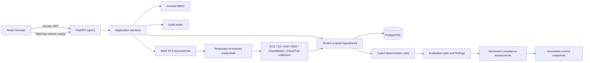
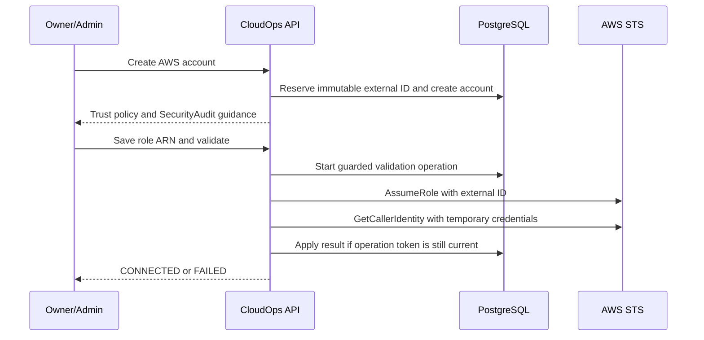

# CloudOps Current Architecture

Stages 1-7 are independently clean-room verified, merged, and regression-tested in `main` at
`01c3eb4bf9ed2d1770da697c158c5d08742430bd`. Stage 7 AI explanations are implemented with
migration head `0009_stage7_ai_assistant`. Stage 8A Dashboard read-model work has started on
`feature/8-dashboard`.

## Document role

This document is the concise implementation architecture for future coding sessions. Detailed
designs remain under `docs/architecture/`.

## Repository structure

```text
apps/
  api/                 FastAPI application, Alembic migrations, backend tests
  web/                 React/Vite application and frontend tests
  worker/              Placeholder; no executable worker implementation
docs/                  Product, architecture, engineering, design, planning, operations, ADRs
infrastructure/        Placeholders; no deployed Stage 1–3 infrastructure
packages/              Shared-package placeholders
tests/                 Cross-application test placeholders
compose.verify.yml     Disposable PostgreSQL 16 verification service
```

The implemented system is a Python/TypeScript monorepo. Discovery currently runs synchronously
inside the API process; Celery/Redis and production deployment topology are future work.

## Runtime architecture



Route handlers perform HTTP mapping and schema validation. Services own workflows, transaction
boundaries, invariants, and audit events. Repositories own persistence and tenant-scoped lookup.

## Backend architecture

- **API:** FastAPI routers in `apps/api/app/api/v1/`
- **Configuration:** Pydantic Settings in `app/core/config.py`
- **Database:** synchronous SQLAlchemy 2 sessions with PostgreSQL as the production target
- **Migrations:** Alembic in `apps/api/alembic/`
- **Models:** identity, tenancy, tokens, audit, AWS onboarding, assets, discovery jobs,
  evaluation jobs, per-rule results, findings, compliance catalog, mappings, assessments, and
  immutable snapshots
- **Schemas:** explicit Pydantic v2 request/response models
- **Services:** authentication, organizations, invitations, onboarding, discovery, evaluations,
  finding lifecycle, and compliance assessment
- **Rules:** static typed registry under `app/security_rules`; no boto3, network, or filesystem
- **Security:** Argon2, JWT validation, token hashing, centralized RBAC
- **Logging:** request correlation and structured JSON-compatible events

## Frontend architecture

The web application uses React, TypeScript, Vite, Tailwind CSS, React Router, TanStack Query,
React Hook Form, Zod, and Lucide React.

- `AuthProvider` restores the session through the refresh cookie and owns user state.
- The access token remains in memory and is supplied by the API client.
- Refresh requests use credentials and are single-flight.
- Failed refresh invalidates the in-memory token and user state.
- `ProtectedRoute` controls authenticated navigation; backend authorization remains authoritative.
- Page modules cover administration, AWS onboarding, inventory, findings, rules, and evaluations.
- Compliance pages expose framework summaries, historical assessments, and a role-gated
  accessible assessment confirmation workflow.

## Compliance flow

1. Lock and tenant-authorize the AWS account.
2. Select a versioned framework and latest applicable completed Stage 4 evaluation.
3. Match persisted per-rule results to version-bounded control mappings.
4. Preserve direct active or suppressed failure evidence.
5. Produce PASS, FAIL, NOT_ASSESSED, or ERROR without inferring success from absence.
6. Persist immutable control snapshots and aggregate counters in one transaction.
7. Emit bounded structured logs and durable assessment lifecycle audit events.

PostgreSQL composite foreign keys enforce account/evaluation/organization and
control/framework consistency. Partial unique indexes prevent duplicate active assessments and
open-ended mappings. Finalized per-rule summaries and assessment snapshots cannot be updated.

## Stage 6 deterministic risk flow

`CLOUDOPS_RISK_V1` reads committed Stage 4 findings and bounded tenant context only. It records
explicit component points, reason codes, finding age, business impact, data sensitivity,
environment, unknown-input indicators, policy version, and source lifecycle versions. Scores
are CloudOps-specific and CVSS-inspired—not CVSS—and are clamped to 0–100:

- LOW 0–29; MEDIUM 30–59; HIGH 60–79; CRITICAL 80–100.
- Account score = 50% highest finding + 30% mean top ten + 20% mean all active findings.
- Organization score = 60% highest account + 40% mean account score.

Suppressed findings remain in scope. Only an authorized, reasoned compensating control bounded
from -15 through -1 may adjust a subsequent assessment. It does not alter finding severity or
compliance status. Finding, account, and organization snapshots are immutable, so later context
or control changes never recalculate history. Tenant-scoped transactions, deterministic lock
ordering, partial indexes, and optimistic versions prevent duplicate or stale writes. Scoring
makes no AWS, network, filesystem, plugin, dynamic-code, or AI call.

## Authentication flow

1. Login verifies normalized email and Argon2 password hash.
2. The API returns a short-lived signed access JWT.
3. The web app keeps the access token only in memory.
4. An opaque refresh token is placed in an HttpOnly cookie; only its SHA-256 hash is stored.
5. Refresh locks the stored session, rotates the token, links the replacement, and revokes the
   old session.
6. Reuse detection revokes the token family.
7. Logout revokes the verified database session; password change revokes refresh sessions.

## AWS onboarding flow



Long-lived access keys are never accepted. Temporary STS credentials are used only to construct
in-memory service clients and are never stored.

## Discovery flow

1. Validate active membership, discovery capability, and `CONNECTED` account state.
2. Prevent overlapping active jobs for the account.
3. Assume the stored cross-account role through Stage 2.
4. Run EC2 and RDS collectors across configured regions.
5. Run S3 and IAM collectors as global services.
6. Normalize assets to a shared structure.
7. Lock by account, upsert discovered assets, and preserve `first_seen_at`.
8. Mark missing assets inactive only for a collector that completed successfully.
9. Commit each successful service boundary independently.
10. Finish the job as `completed`, `partially_completed`, or `failed` and record audit metadata.

## Evaluation flow

Authorize and lock a connected account, allocate a monotonic job sequence, read persisted active
assets, and run static typed rules. Passed results resolve existing findings, failures
create/update/reopen them, and errors preserve prior state. Stale sequences cannot overwrite
newer lifecycle state. Terminal counters, structured logs, and audit events are committed.

## Current PostgreSQL schema

| Model/table                                                      | Purpose                                                       |
| ---------------------------------------------------------------- | ------------------------------------------------------------- |
| `User` / `users`                                                 | Global user identity and authentication status                |
| `Organization` / `organizations`                                 | Tenant root                                                   |
| `OrganizationMembership` / `organization_members`                | User role/status in an organization                           |
| `OrganizationInvitation` / `organization_invitations`            | Hashed, expiring invitation                                   |
| `RefreshTokenSession` / `refresh_token_sessions`                 | Hashed rotating refresh session                               |
| `AuditEvent` / `audit_events`                                    | Authentication, governance, onboarding, and discovery history |
| `AWSAccount` / `aws_accounts`                                    | Organization-owned AWS connection metadata                    |
| `AWSExternalIDReservation` / `aws_external_id_reservations`      | Permanent global external-ID reservation                      |
| `Asset` / `assets`                                               | Normalized historical AWS resource inventory                  |
| `DiscoveryJob` / `discovery_jobs`                                | Discovery execution state and counters                        |
| `EvaluationJob` / `evaluation_jobs`                              | Evaluation sequence, status, and counters                     |
| `EvaluationRuleResult` / `evaluation_rule_results`               | Immutable per-rule outcome counts for compliance evidence     |
| `Finding` / `findings`                                           | Stable rule result, evidence, resolution, and suppression     |
| `ComplianceFramework` / `compliance_frameworks`                  | Versioned framework catalog                                   |
| `ComplianceControl` / `compliance_controls`                      | Version-scoped CloudOps control summaries                     |
| `RuleControlMapping` / `rule_control_mappings`                   | Rule-version ranges mapped to controls                        |
| `ComplianceAssessment` / `compliance_assessments`                | Account/framework assessment lifecycle and counters           |
| `ComplianceAssessmentControl` / `compliance_assessment_controls` | Immutable historical control result snapshot                  |
| `RiskScoringPolicy` / `risk_scoring_policies`                    | Immutable versioned deterministic scoring policy              |
| `AssetRiskContext` / `asset_risk_contexts`                       | Bounded account-default or asset-specific context             |
| `RiskAssessment` / `risk_assessments`                            | Tenant-scoped deterministic assessment lifecycle              |
| `FindingRiskSnapshot` / `finding_risk_snapshots`                 | Immutable finding score, components, reasons, and inputs      |
| `AccountRiskSnapshot` / `account_risk_snapshots`                 | Immutable deterministic account aggregate                     |
| `OrganizationRiskSnapshot` / `organization_risk_snapshots`       | Immutable deterministic organization aggregate                |
| `CompensatingControl` / `compensating_controls`                  | Authorized bounded adjustment with reason and lifecycle       |

## Database constraints and concurrency

- User normalized email and organization slug are unique.
- Membership is unique by organization/user.
- Pending invitation uniqueness is enforced with a PostgreSQL partial index.
- AWS account ID and role ARN uniqueness are organization scoped.
- External-ID reservations are globally unique and retained after account deletion.
- `aws_accounts(id, organization_id)` is a composite candidate key.
- Assets and discovery jobs use composite foreign keys to enforce account/organization agreement.
- Asset identity is unique by account/type/resource ID.
- Asset seen timestamps and discovery-job counters/status timestamps have check constraints.
- A partial unique index prevents more than one pending/running discovery job per account.
- A partial unique index prevents more than one pending/running evaluation per account.
- Partial unique indexes provide one asset/rule or account/rule finding identity.
- Composite foreign keys enforce finding organization/account/asset agreement.
- Compliance assessment/account/evaluation and snapshot/control/framework relationships use
  composite tenant and framework constraints.
- Finalized evaluation-rule summaries and compliance snapshots are immutable.
- Partial indexes prevent duplicate active assessments and duplicate open-ended mappings.
- Stage 6 composite keys enforce tenant agreement across risk context, findings, assessments,
  snapshots, accounts, and assets.
- Score/counter/version/lifecycle checks, partial active-assessment/context/control indexes, and
  PostgreSQL triggers enforce bounded state and immutable finalized snapshots.
- PostgreSQL row locks serialize refresh rotation, invitation acceptance, final-owner changes,
  AWS account lifecycle mutations, and account-level asset lifecycle work.
- Validation operation tokens stop stale STS results from overwriting newer account changes.

## Tenant isolation

Every organization-owned lookup includes organization scope or derives it through an authorized
membership/account relation. Suspended and removed members are denied. Cross-tenant detail
lookups return non-disclosing not-found responses. Platform-admin status is not an automatic
tenant bypass. Composite database foreign keys provide defense against inconsistent asset/job
ownership.

## Audit architecture

Audit events include organization, actor, event type, resource, result, safe metadata, request
context, and timestamp. Covered families include authentication, invitations, membership,
organization creation, AWS account lifecycle, discovery, evaluation/finding, and compliance
assessment lifecycles. Operational logs use correlation IDs and bounded structured fields;
durable audit events remain separate. Passwords, hashes, raw tokens, authorization/cookie
headers, AWS credentials, full policies, and unbounded evidence are excluded.

## API routers

- `auth`: identity and token lifecycle
- `organizations`: organizations, members, invitations, audit events
- `invitations`: invitation acceptance
- `aws_accounts`: account onboarding and lifecycle
- `discovery`: discovery start, jobs, assets, summary
- `security_findings`: rules, evaluations, findings, summary, suppression
- `compliance`: frameworks, controls, mappings/findings, summaries, assessments, snapshots
- `risk`: policies, assessments, summaries, ranked findings, contexts, compensating controls,
  and immutable history
- `health`: liveness and readiness

## Migration chain

```text
0001_stage1
  -> 0002_stage2
  -> 0003_stage3
  -> 0004_verification_repairs
  -> 0005_stage4_rule_engine
  -> 0006_stage4_verification_repairs
  -> 0007_stage5_compliance_engine
  -> 0008_stage6_risk_scoring -> 0009_stage7_ai_assistant (current head)
```

`0004_verification_repairs` backfills permanent external-ID reservations and adds the composite
tenant keys, lifecycle constraints, and AWS-account validation coordination fields. Existing
valid Stage 2/3 data is preserved.

## Future work

Stage 4 detects findings; Stage 5 interprets persisted evidence for compliance; Stage 6 uses
`CLOUDOPS_RISK_V1` to prioritize those findings without network calls or AI. Stage 7 may explain
existing deterministic results but must never detect, score, or mutate them. Stage 8A visualizes
existing Stage 2-7 records through a read-only dashboard summary API and does not add dashboard
persistence or recalculate authoritative posture. Notifications, raw event ingestion,
scheduling, remediation, and production infrastructure remain future work.

## Stage 8A dashboard read model

`GET /api/v1/dashboard/summary` is organization scoped and guarded by the existing active
membership/RBAC dependency. The service aggregates AWS account state, asset inventory,
finding posture, latest completed compliance assessment, latest completed risk assessment,
account-risk heatmap data, immutable risk trend points, and operational freshness timestamps
from existing tables. It returns explicit empty/partial-state metadata instead of fabricated
scores, percentages, trend points, or compliance posture.

Stage 8A is read-only: it performs no writes, imports no AWS or AI provider, invokes no
notification/Jira/remediation path, and stores no derived dashboard copies of Stage 1-7 data.
Bounded arrays use deterministic count-descending/stable-key ordering or chronological ordering
where documented by the response contract.

## Stage 7 AI trust boundary

The AI explanation assistant consumes only bounded persisted findings, risk
assessments, and compliance assessments. A central context builder applies
redaction, size limits, canonical serialization, source hashing, and explicit
source references before invoking a provider. The rule, compliance, and risk
engines remain authoritative and deterministic. Provider output must validate
against the task response schema before it is persisted or returned.

Prompt templates are versioned. Requests are tenant scoped and idempotent;
source snapshots and responses are immutable in PostgreSQL. Organization-hour
usage windows and advisory transaction locks enforce bounded quotas. The
default provider is an offline deterministic mock.
