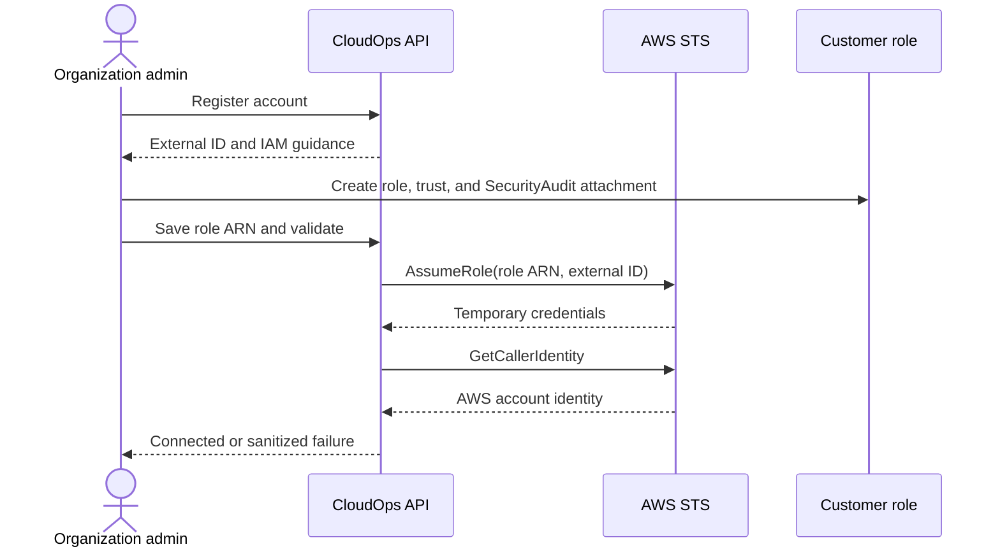

# AWS Account Onboarding

## Purpose and scope

Stage 2 lets organization owners and admins connect AWS accounts without long-lived customer access keys. It validates the connection only; resource discovery and scanning begin no earlier than Stage 3.

## Implemented flow

1. An owner or admin registers an account name and 12-digit AWS account ID.
2. CloudOps generates a cryptographically strong external ID, reserves it permanently in immutable database history, and renders a trust policy plus setup instructions.
3. The customer manually creates `CloudOpsReadOnlyRole`, attaches AWS managed `SecurityAudit`, and applies the trust policy.
4. The trust permits only `AWS_TRUSTED_PRINCIPAL_ARN` to call `sts:AssumeRole` when the exact external ID is supplied.
5. The customer enters the role ARN. CloudOps verifies its partition, account component, and organization-local uniqueness.
6. CloudOps calls `AssumeRole`, keeps the returned temporary credentials in local memory only, and immediately calls `GetCallerIdentity` through an assumed-role STS client.
7. The connection becomes `connected` only when the returned account matches the expected account ID. Otherwise it becomes `failed` with a sanitized reason.

## Persistence and tenant isolation

CloudOps stores only the account ID, role ARN, external ID, connection status, safe failure reason, validation timestamp, organization/creator references, and audit history. Access keys, secret keys, session tokens, and temporary credentials are never stored. Every issued external ID has a globally unique reservation that survives account deletion; creation reserves it in the same transaction and retries a database uniqueness collision. Every record lookup joins an active organization membership and requires the centralized owner/admin AWS-account-management capability.

Persisted states are `pending`, `connected`, `failed`, and `disconnected`. Disconnect changes CloudOps state and does not modify customer IAM. Customers can independently revoke access by deleting the role or trust.

Lifecycle update, disconnect, and delete operations lock the tenant-scoped account row. Validation uses a short locked transaction to install an operation token, performs STS outside the database lock, then locks again and applies the result only if that token is still current. This prevents a stale validation result from overwriting a newer role update, disconnect, or delete, while idempotent disconnect avoids duplicate terminal audit transitions.

## IAM and deferred work

The generated permission guidance recommends AWS managed `SecurityAudit`. CloudOps does not
automatically create IAM resources or deploy Terraform. Asset discovery and deterministic
configuration findings are implemented in Stages 3 and 4. Compliance, risk, remediation, raw
CloudWatch/CloudTrail event ingestion, and EventBridge automation remain deferred.

Production deployment must select and configure the CloudOps trusted principal. External-ID rotation, automated IAM templates, and delegated onboarding remain open decisions.

## Stage 3 discovery reuse

Stage 3 uses the verified role only for read-only EC2, S3, IAM, and RDS inventory calls.
Temporary AssumeRole values are passed directly to boto3 clients in memory and never assigned
to database models, responses, audit metadata, or logs. AWS account identity/status is readable
by all active members for inventory navigation; onboarding mutation remains owner/admin-only.
STS and discovery clients share environment-driven bounded connect/read timeouts and bounded
standard or adaptive botocore retries.
