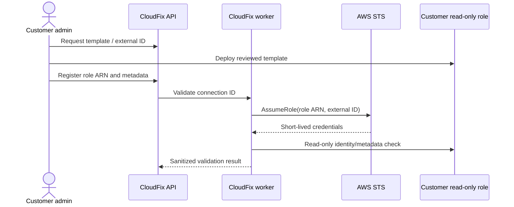

# AWS Account Onboarding

## Purpose and audience

Customer administrators, AWS engineers, and security reviewers use this proposed flow to connect accounts without long-lived customer access keys.

## Planned flow

1. An Organization Administrator signs in and chooses **Connect AWS account**.
2. CloudFix generates a cryptographically strong per-connection external ID and offers a reviewed CloudFormation or Terraform onboarding template.
3. The customer deploys the template in their AWS account. It creates a read-only cross-account IAM role covering only EC2, S3, IAM configuration APIs required by approved collectors.
4. Its trust policy permits only the designated CloudFix AWS principal to call `sts:AssumeRole`, conditioned on the exact external ID; organization/account identifiers are not substitutes for that secret value.
5. The customer enters the role ARN and non-sensitive account metadata. CloudFix validates ARN/account consistency and calls STS from the worker/security integration boundary.
6. STS returns short-lived credentials in memory. Boto3 uses them for a minimal identity check and permitted metadata retrieval; CloudFix never requests or stores long-lived customer AWS access keys.
7. CloudFix records validation time, status, safe error class, template version, principal identity, and an audit event—not credentials.

## Failure, revocation, and rotation

States include pending, validating, connected, degraded, invalid, and revoked. Handle access denied, external-ID mismatch, deleted role, permission gaps, throttling, partition/region mismatch, and account-ID mismatch with actionable but non-secret errors. Retries are bounded. Customers revoke by deleting/disabling trust or the role; CloudFix disables schedules and rejects new scans. Rotation creates/validates a replacement connection before retiring the old role/external ID, with all transitions audited.

## Remediation separation

Never expand or reuse a broad scanning role. Automated remediation requires a separate role or action-specific permission model, a versioned allowlisted playbook, explicit approval, constrained resources/conditions, idempotency, and verification. Customer-managed CloudFormation/Terraform template design remains a Stage 3 deliverable, not an artifact in Stage 0.

## Open questions

Approve CloudFix principal topology, external-ID storage mechanism and rotation period, AWS partitions, delegated onboarding, exact collector permissions, and whether customers choose CloudFormation, Terraform, or both.
