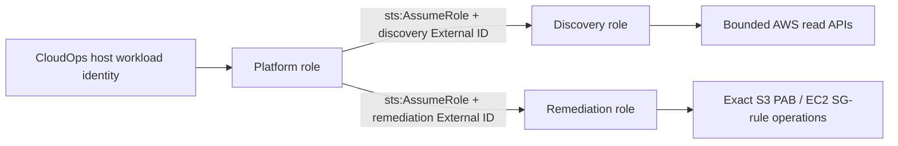

# AWS role architecture

CloudOps separates platform identity, discovery trust, and remediation trust. Static AWS access
keys are neither required nor accepted as the production identity model.

- The platform role has no direct customer-resource mutation permissions.
- Discovery and remediation role ARNs are separate database fields.
- Discovery and remediation External IDs are separate protected values.
- `sts:GetCallerIdentity` verifies the assumed caller account.
- Temporary credentials are cached only in memory and isolated by account/role/session context.
- Remediation requires owner-managed trust, complete sandbox approval, required tags, and runtime
  gates; role configuration alone enables nothing.

The controlled sandbox Terraform defines an EC2 instance profile for the platform role and narrow
discovery/remediation roles. The source is **Implemented** and **CI verified**; the roles are not
known to be deployed through this sandbox workflow.
