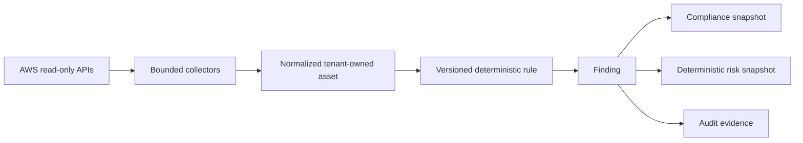
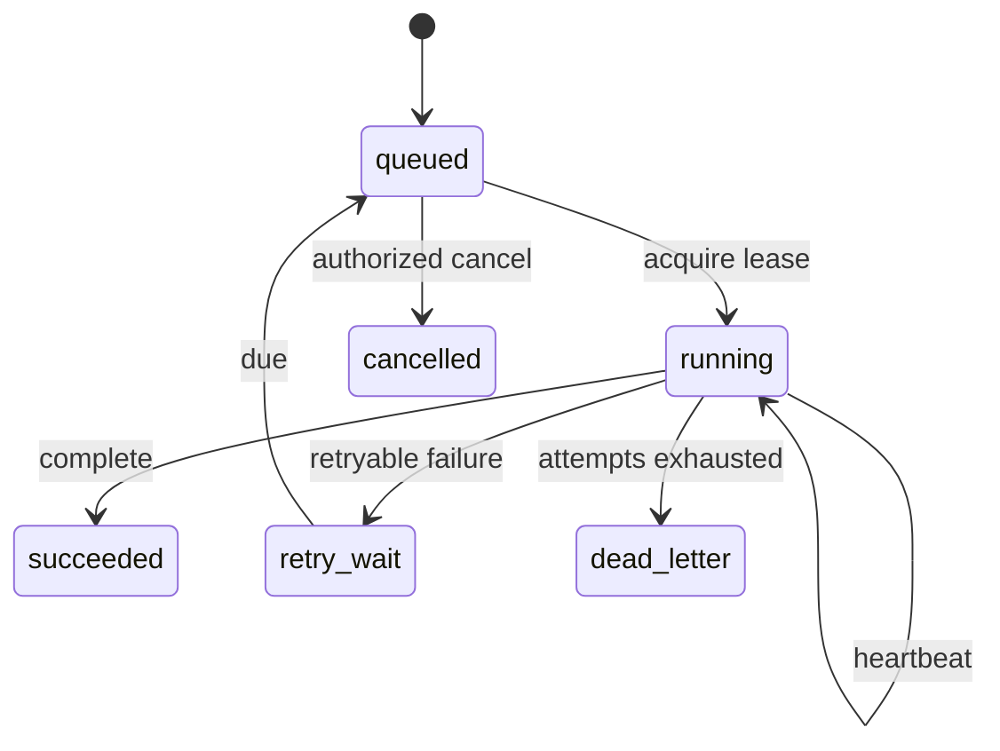
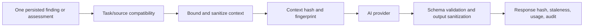

# CloudOps data flows

## Discovery to finding

Collectors use paginators where needed, bounded retry/timeout configuration, role-scoped temporary
credentials, deterministic normalization, and sanitized provider errors. Exact S3 Public Access
Block state and EC2 `SecurityGroupRuleId` evidence are retained for later drift-safe remediation.
No AWS credentials are persisted.

## Durable job lifecycle

Job payloads carry bounded identifiers and safe references, not credentials or provider bodies.
Lease token and generation checks reject stale workers.

## AI request

Authoritative finding severity, compliance status, risk, remediation eligibility, approval, and AWS
execution stay local and deterministic.

## Remediation lifecycle

```mermaid
flowchart LR
  Finding --> Preview --> Proposal --> Approval["Human approval"]
  Approval --> Prepare["Owner prepares live request"]
  Prepare --> Snapshot["Immutable snapshot and drift checks"]
  Snapshot --> Lease["Valid execution lease and idempotency"]
  Lease --> Action["Exact allowlisted AWS API"]
  Action --> Verify["Exact postcondition verification"]
  Verify --> Evidence["Before/after/request IDs/rollback/audit"]
```

Preparation does not enqueue or execute automatically. Live execution also requires runtime flags,
emergency stop cleared, sandbox approval, matching role/account/tenant/target, mandatory tags, and
caller verification.
