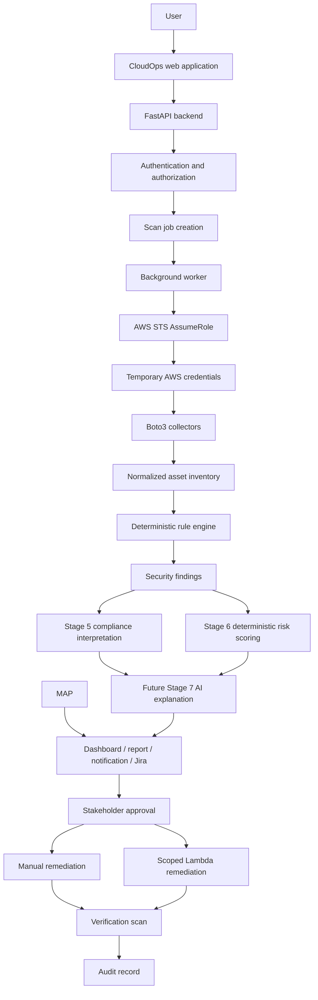

# End-to-End Data Flow

## Purpose and audience

Security reviewers and implementers use this document to understand intended data movement, provenance, and decision boundaries.

## Current Stage 4 execution boundary

Discovery obtains temporary STS credentials and stores only normalized configuration metadata.
Credentials never cross into rule inputs. Rules read persisted assets and make no provider
calls. Failed rules create or refresh findings, passing rules resolve them, and errors preserve
previous state. Evidence is bounded and redacted. Raw CloudWatch logs and CloudTrail events are
not ingested.

## Processing rules

Authentication establishes a user; authorization resolves an active organization membership and permission for each resource. Job creation uses an idempotency key and writes requester/organization/rule-set scope. The worker receives only identifiers, obtains STS credentials at execution time, and discards them after use. Collectors retrieve configuration metadata for EC2, S3, and IAM, redact disallowed fields, and normalize source provenance.

The deterministic engine evaluates an explicitly pinned rule version. Findings retain evidence
and input/run linkage. Implemented Stage 5 compliance maps persisted per-rule results and
findings to versioned controls, producing immutable PASS, FAIL, NOT_ASSESSED, or ERROR snapshots.
Missing evidence never becomes PASS, and suppression remains failure evidence. Stage 6 risk
scoring consumes persisted findings separately; Stage 7 AI remains future work. No compliance
or risk calculation calls boto3 or customer AWS APIs.

Remediation requires a separate request, current evidence, authorized approval, playbook/version, idempotency key, and separate permissions. Execution outcome never alone closes a finding: a verification scan evaluates it. Every state transition emits an audit event.

## Data minimization and retention

Do not collect customer application content, AWS credentials, session tokens, complete IAM policies for AI submission, or unnecessary tags. Exact retention and regional residency are open decisions; deletion must preserve required audit/security records under approved policy.

## Stage 6 risk-scoring flow

Stage 6 reads committed Stage 4 finding lifecycle state and bounded risk context in one
tenant-scoped transaction. The versioned pure scoring function produces component points and
reason codes, after which the service persists immutable finding snapshots and deterministic
account/organization aggregates. Rules make no boto3 calls; scoring makes no network calls.
Suppression remains evidence, while an authorized compensating-control record supplies the only
bounded adjustment.

Stage 7 may later explain the already-persisted deterministic finding, compliance, and risk
results. It must not become a detection, scoring, mutation, tool-execution, Jira-delivery, or
email-delivery path.
