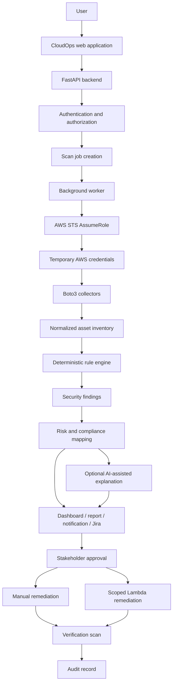

# End-to-End Data Flow

## Purpose and audience

Security reviewers and implementers use this document to understand intended data movement, provenance, and decision boundaries.

## Processing rules

Authentication establishes a user; authorization resolves an active organization membership and permission for each resource. Job creation uses an idempotency key and writes requester/organization/rule-set scope. The worker receives only identifiers, obtains STS credentials at execution time, and discards them after use. Collectors retrieve configuration metadata for EC2, S3, and IAM, redact disallowed fields, and normalize source provenance.

The deterministic engine evaluates an explicitly pinned rule version. Findings retain evidence and input/run linkage. Risk and compliance are reviewed deterministic mappings with contextual qualifiers. AI receives the smallest redacted projection and can add an explanation only; invalid or unavailable output is omitted. Notifications and Jira receive allowlisted fields.

Remediation requires a separate request, current evidence, authorized approval, playbook/version, idempotency key, and separate permissions. Execution outcome never alone closes a finding: a verification scan evaluates it. Every state transition emits an audit event.

## Data minimization and retention

Do not collect customer application content, AWS credentials, session tokens, complete IAM policies for AI submission, or unnecessary tags. Exact retention and regional residency are open decisions; deletion must preserve required audit/security records under approved policy.
