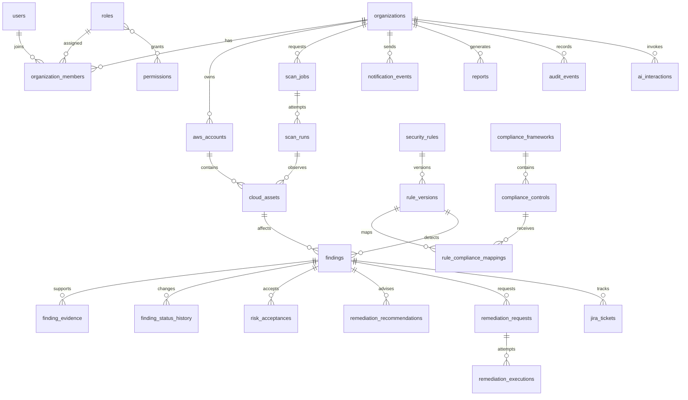

# Conceptual Database Design

## Stage 1 implemented schema

Alembic revision `0001_stage1` creates `users`, `organizations`, `organization_members`, `organization_invitations`, `refresh_token_sessions`, and `audit_events`. PostgreSQL is production; SQLite is limited to isolated tests.

- Normalized user email and organization slug are unique and indexed.
- Membership is unique by organization/user and indexed for organization/status and user/status lookup.
- A partial unique index prevents duplicate pending invitations for an organization/normalized email.
- Invitation and refresh tokens are stored only as unique indexed SHA-256 hashes.
- Refresh families use `family_id` and replacement links; audit events are indexed by timestamp, organization/timestamp, and actor/timestamp.
- Foreign keys cascade tenant data where appropriate and use nullable `SET NULL` audit references to preserve history.
- Constrained string enums use explicit check constraints and 32-character storage consistently in models and migrations.
- Important statuses, platform-admin state, audit JSON, and creation/update timestamps have database defaults where applicable. `updated_at` changes are application-managed through SQLAlchemy, not a PostgreSQL trigger.
- PostgreSQL row locks serialize refresh rotation, invitation acceptance, and final-owner changes.

Services own critical transactions; repositories include `organization_id` in tenant queries. PostgreSQL RLS remains deferred defense-in-depth and is not a claimed Stage 1 control.

## Purpose and audience

Backend, database, security, and analytics engineers use this document for the implemented
Stage 1–3 schemas plus the proposed later cloud-security schema. Revisions `0001_stage1`
through `0004_verification_repairs` are executable.

## Stage 2 implemented schema

`aws_accounts` belongs to one organization and records name, 12-digit account ID, nullable role
ARN, external ID, connection state, validation operation token/timestamp, lifecycle version,
creator, and timestamps. `aws_external_id_reservations` is immutable, globally unique,
backfilled for existing accounts, and retained after account deletion. Lifecycle mutations lock
the tenant-authorized account row; STS executes outside the lock and its result applies only when
its operation token remains current. No AWS credentials are stored.

## Ownership and isolation

`organizations` is the tenant root. Tenant records carry `organization_id` directly wherever practical; dependent records have an unambiguous foreign-key path to it. Services establish membership and permission before calling repositories. Repository methods require organization scope and include it in predicates, joins, uniqueness constraints, and cache keys. Workers re-resolve ownership rather than trusting queue data. PostgreSQL row-level security is under evaluation as defense-in-depth.

## Identity, tenancy, and AWS

| Entity | Purpose, important fields, relationships | Retention, sensitivity, indexes, deletion |
|---|---|---|
| `organizations` | Tenant root: `id`, name, status, settings version, timestamps | Sensitive business identity; unique normalized name as policy allows; deactivate/soft-delete, retain governed audit references |
| `users` | Identity subject: `id`, issuer, subject, display/email, status, last_login | PII; unique `(issuer, subject)`, email lookup if needed; soft-delete/anonymize under policy |
| `organization_members` | User membership and role: organization/user/role, status, version | Tenant-sensitive; unique `(organization_id,user_id)`, indexes by user and active org; soft-delete/history |
| `roles` / `permissions` | Named organization/system role and atomic permission codes; join table implied | Permission-sensitive; unique names/codes; version/deactivate rather than destructive delete |
| `aws_accounts` | Implemented Stage 2 account and connection: organization, name, 12-digit account ID, role ARN, unique external ID, status/connection status, safe failure reason, validation/creator timestamps | Account metadata sensitive; unique `(organization_id,account_id)`, `(organization_id,role_arn)`, and `external_id`; organization/status indexes; never credentials |
| `cloud_assets` | Normalized asset snapshot: organization, account, scan run, service/type, provider ID/ARN, region, config hash, sanitized metadata | Configuration-sensitive; indexes `(org,service,type)`, `(org,account,provider_id)`, run; retention/partitioning TBD; soft-delete current projection, retain snapshots per policy |

## Scanning, rules, and findings

| Entity | Purpose, important fields, relationships | Retention, sensitivity, indexes, deletion |
|---|---|---|
| `scan_jobs` | User/schedule request: organization, account scope, services, status, idempotency key, requester | Operational/sensitive; unique `(org,idempotency_key)`, status/created index; retain and cancel, no hard delete during audit term |
| `scan_runs` | Execution attempt: job, attempt, lease, start/end, coverage, error class | Operational; unique `(job,attempt)`, status/lease indexes; retention aligned with evidence |
| `security_rules` | Stable ID (`EC2-001`), service, title, lifecycle | Global curated content; unique rule ID; deactivate, never reuse ID |
| `rule_versions` | Immutable version, detection spec/hash, severity, guidance, activation | Integrity-sensitive; unique `(rule_id,version)`, active index; never update semantics or delete referenced versions |
| `findings` | Organization, asset, rule version, fingerprint, severity, status, first/last seen, version | Tenant security data; unique active fingerprint by org; indexes `(org,status,severity)`, asset/rule; soft-delete inappropriate—close/suppress with history |
| `finding_evidence` | Finding/run, schema version, minimized evidence JSON/hash, observed time | Highly sensitive; finding/run indexes; immutable, redact, retention policy; no secrets |
| `finding_status_history` | From/to status, actor, reason, timestamp, version | Audit-relevant; index finding/time; append-only |
| `risk_acceptances` | Finding, organization, owner/approver, justification, expiry, status | Sensitive governance record; expiry/status indexes; never erase during required retention |

## Compliance, response, integrations, and audit

| Entity | Purpose, important fields, relationships | Retention, sensitivity, indexes, deletion |
|---|---|---|
| `compliance_frameworks` / `compliance_controls` | Framework version/source and hierarchical control identifiers/text | Licensing-sensitive; unique `(framework,version)` and control code; retire/version, do not rewrite mappings historically |
| `rule_compliance_mappings` | Rule version ↔ control with rationale/coverage qualifier/reviewer | Governance-sensitive; composite unique pair, control/rule indexes; version/deactivate |
| `remediation_recommendations` | Finding, source (deterministic/AI), playbook candidate, text/schema, review state | Tenant-sensitive; finding/source index; retain with finding, sanitize AI output |
| `remediation_requests` | Finding, requested playbook/version, requester, scope, approval state, idempotency key, evidence version | High impact; unique `(org,idempotency_key)`, approval/status indexes; immutable intent plus state history |
| `remediation_executions` | Request attempt, executor, target, preconditions, outcome, timestamps, verification run | Highly sensitive; unique request/attempt, outcome/time indexes; retain; never store credentials |
| `jira_tickets` | Finding, external project/key/URL, sync state, last event | Integration/customer-sensitive; unique external identity per org; redact tokens; unlink/retain audit history |
| `notification_events` | Organization, channel, template, destination reference, payload hash, state/attempts | Recipient-sensitive; status/schedule indexes; minimized retention, never raw webhook secrets |
| `reports` | Organization, type, parameters, generated artifact reference/hash, status | May contain sensitive posture data; `(org,status,created)` index; expire artifact per policy, keep audit metadata |
| `audit_events` | Organization, actor/service, action, target, outcome, time, correlation/idempotency IDs, previous/event hash | Security record; organization/time, target/time, correlation indexes; append-only, archived/tamper-evident, never soft-delete ordinarily |
| `ai_interactions` | Organization, purpose, provider/model, prompt template/version, input hash, redaction status, output status, token/cost metadata, related finding/report, timestamp | Sensitive metadata; indexes org/time, purpose, related IDs; raw secrets prohibited; raw prompts/outputs avoided or tightly governed/expired |

## Current Stage 5 physical schema

The integrated Alembic head is `0007_stage5_compliance_engine`; Stage 6 feature migration
`0008_stage6_risk_scoring` follows it. `evaluation_jobs` carries tenant/account
references, a monotonic sequence, nonnegative counters, constrained lifecycle timestamps, and a
partial unique index allowing one pending/running evaluation per account.

`findings` carries tenant/account and optional asset references, stable rule key/version,
severity/category, bounded evidence, first/last seen, resolution/suppression fields, last
evaluation, and lifecycle version. Composite foreign keys enforce tenant and asset/account
agreement. Partial unique indexes provide one asset/rule or account/rule finding.

`evaluation_rule_results` stores immutable per-rule/version invocation counts for a completed
evaluation. `compliance_frameworks` and `compliance_controls` version catalog metadata without
copying restricted standards prose. `rule_control_mappings` supports inclusive version ranges;
overlapping ranges use deterministic union semantics. `compliance_assessments` references the
tenant/account and source evaluation, while `compliance_assessment_controls` stores immutable
point-in-time status snapshots. Composite foreign keys enforce tenant and framework agreement,
partial indexes prevent duplicate active assessments and duplicate open-ended mappings, and
triggers protect finalized summaries and snapshots.

## Stage 6 risk schema

`risk_scoring_policies` stores immutable positive policy versions and bounded weights/bands.
`asset_risk_contexts` stores one account default or one asset override with tenant-composite
foreign keys and an optimistic version. `risk_assessments` enforces nonnegative matching
counters, valid lifecycle timestamps, and one active assessment per scope and policy.
`finding_risk_snapshots`, `account_risk_snapshots`, and
`organization_risk_snapshots` are immutable through PostgreSQL triggers and retain point-in-time
source identifiers and aggregates. `compensating_controls` requires a bounded negative
adjustment and permits only one active record per finding. Composite foreign keys prevent
cross-tenant account, asset, finding, assessment, and snapshot relationships.

## Relational rules

UUID primary keys and UTC timestamps are the default. Use foreign keys, check constraints for states, composite uniqueness with `organization_id`, and optimistic `version` columns where approvals/status can race. Multi-step lifecycle changes and their audit/outbox events share a transaction. JSON is schema-versioned and limited to variable evidence/metadata, not ownership or core relationships.

## Retention and open questions

## Stage 3 inventory tables

`assets` stores organization/account ownership, normalized type and provider identity,
ARN/name/region/status, tags, sanitized service metadata, first/last-seen timestamps, and an
active flag. `(aws_account_id, asset_type, resource_id)` is unique; organization, account,
type, region, status, active, and last-seen columns are indexed. Discovery never hard-deletes
missing inventory.

`discovery_jobs` stores account scope, actor, lifecycle timestamps, result counts, and a
sanitized error summary. A PostgreSQL partial unique index on account ID for `pending` and
`running` rows prevents overlapping jobs. Organization, account, and status are indexed.

`aws_accounts` exposes a composite unique `(id, organization_id)` key. Both `assets` and
`discovery_jobs` use composite foreign keys to it, so PostgreSQL rejects an organization that
does not own the referenced account. Asset timestamps require `last_seen_at >= first_seen_at`.
Job counters are nonnegative, and status checks enforce valid started/finished timestamp
combinations.

Retention classes must be approved for identities, inventory snapshots, evidence, reports, AI content, operational logs, and audit archives. Legal holds and deletion propagation need design. Open decisions include RLS, partitioning thresholds, exact external-ID encryption/reference design, outbox tables, evidence normalization, and whether raw AI output is ever retained (default proposal: no).
