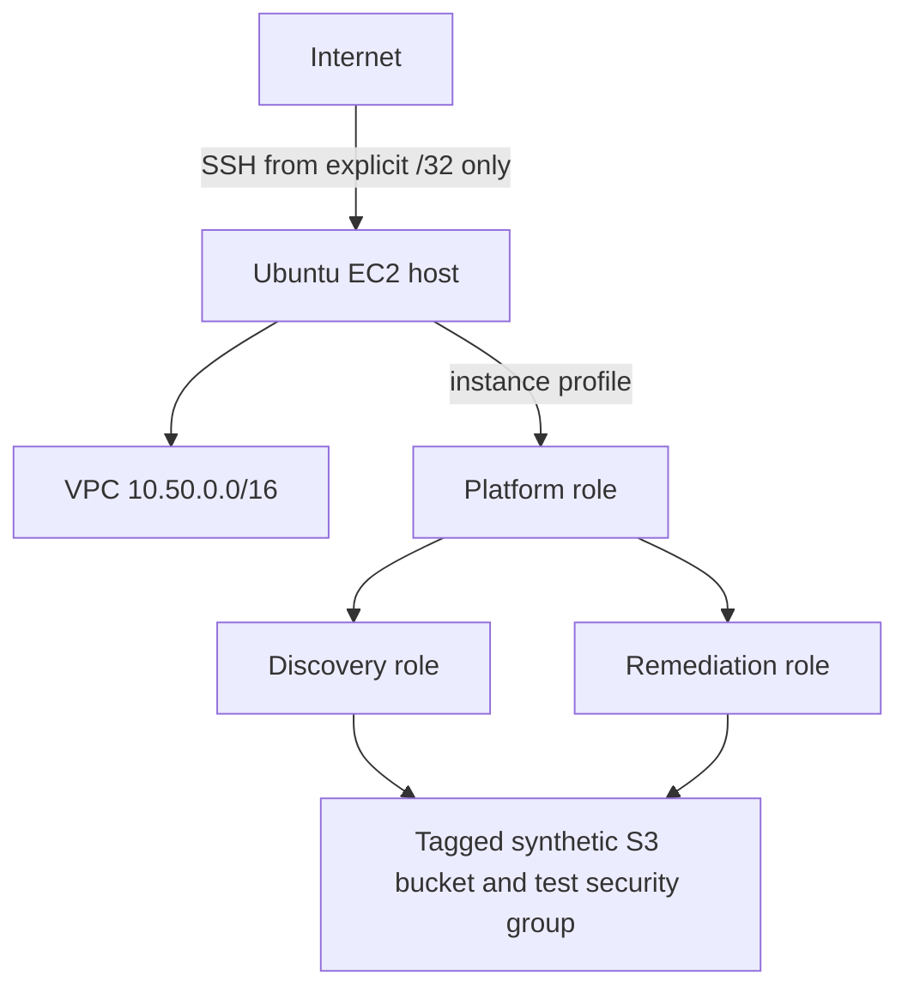

# Deployment topology

CloudOps has three distinct deployment designs. None proves a live deployment by its existence.

## Local and self-hosted

Local Compose provides PostgreSQL, API, web, scheduler, job worker, and local provider tooling.
Organization-managed self-hosting uses Nginx as the only application ingress and a pre-created
named Cloudflare Tunnel; API and PostgreSQL ports are not published. See
[self-hosted deployment](../operations/self-hosted-deployment.md).

## Managed AWS environments

Terraform under `infra/environments/staging` and `infra/environments/production` defines separate
ECS/RDS/ALB/WAF/Secrets Manager/CloudWatch environments. The release workflow builds once,
publishes immutable digests, gates staging, creates a reviewable production plan, and requires a
protected production approval. This path is implemented configuration, not operational evidence.

## Controlled remediation sandbox

The host receives an ephemeral public IPv4 address in a public subnet, but only SSH from the
explicit administrator `/32` is allowed. No public application ports, NAT Gateway, Application
Load Balancer, managed database, or Elastic IP are created. Session Manager is preferred. The
optional test instance is disabled by default and has no public address.

See [AWS sandbox](../operations/aws-remediation-sandbox.md) and
[EC2 deployment runbook](../operations/ec2-deployment-runbook.md).
