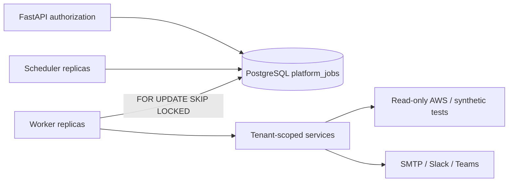
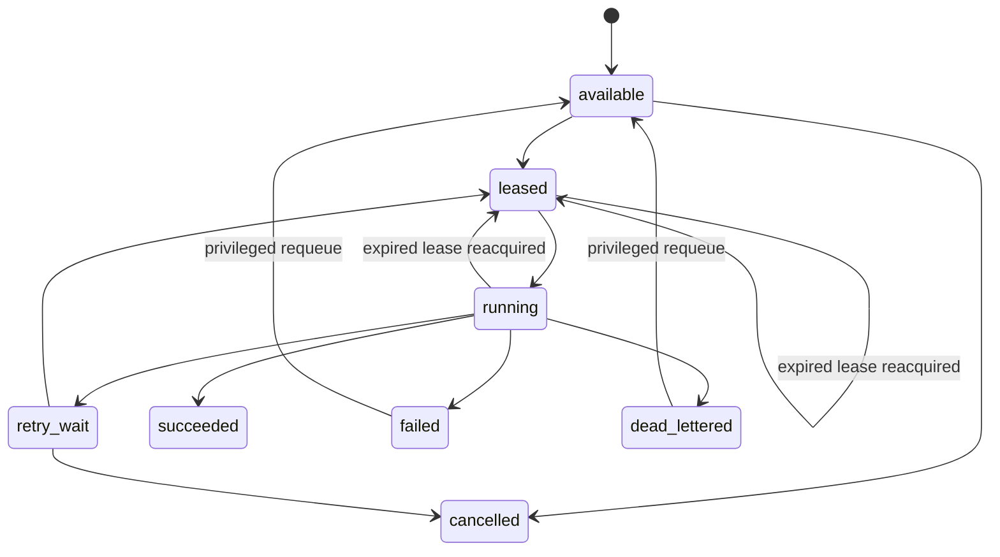

# Distributed jobs architecture

Status: implemented locally; production infrastructure is not deployed.

## Decision

CloudOps uses PostgreSQL as both the durable job record and V1 acquisition
queue. This avoids a second consistency domain and dependency while retaining
a future path to SQS: a future wake-up message may contain only `platform_job.id`;
PostgreSQL remains authoritative.

| Option | Delivery/retry | Operations | V1 decision |
|---|---|---|---|
| Celery + Redis | Mature; broker persistence must be configured | Medium | Rejected: second state store |
| Celery + RabbitMQ | Mature | High | Rejected for current scale |
| Dramatiq | Good retry middleware | Medium | Rejected: second job system |
| RQ | Simple, Redis-backed | Medium | Rejected: weaker workflow model |
| PostgreSQL queue | At-least-once, transactional enqueue, SKIP LOCKED | Low | Selected |
| SQS | Managed visibility/DLQ | Medium | Deferred wake-up adapter |

Queue payloads are bounded to 4096 bytes, reject sensitive field names, and
carry UUID references rather than credentials, rendered bodies, or webhook
URLs. Workers reload authoritative rows and downstream services reauthorize
the accountable actor.

## State and lease model

Acquisition, start, heartbeat, completion, and failure are short transactions.
Each acquisition gets a new random lease token and increments a generation.
Stale tokens cannot complete work. Retry delay is bounded exponential backoff,
with bounded provider `Retry-After`; authorization and validation errors are
terminal. Unique tenant/job-type/idempotency constraints and a partial active
reference index prevent duplicate active jobs.

## Workflow and isolation

Scheduled scan orchestration creates discovery, then evaluation, as separate
correlated jobs. Notification delivery and simulated remediation are focused
jobs. Organization ownership is explicit on every job, parent relationships
use a composite tenant foreign key, monitoring queries require RBAC, and
cross-tenant identifiers return the established non-disclosing response.

PostgreSQL provides at-least-once execution. SMTP cannot provide transactional
exactly-once delivery across a crash after provider acceptance; CloudOps limits
the window with leases, persisted attempts, stable content hashes, and terminal
notification state. Production providers should support an idempotency key
before this residual risk is treated as closed.

## Scaling and telemetry

Scale workers from queue depth, oldest available age, job duration, retry rate,
and dead-letter count. Alert on any dead-letter, repeated lease expiry, growing
schedule delay, provider rejection spikes, or unavailable jobs older than the
job SLO. Logs contain job/correlation/type/attempt/worker/error code only.
Transactions are deliberately not held across provider or AWS I/O.
