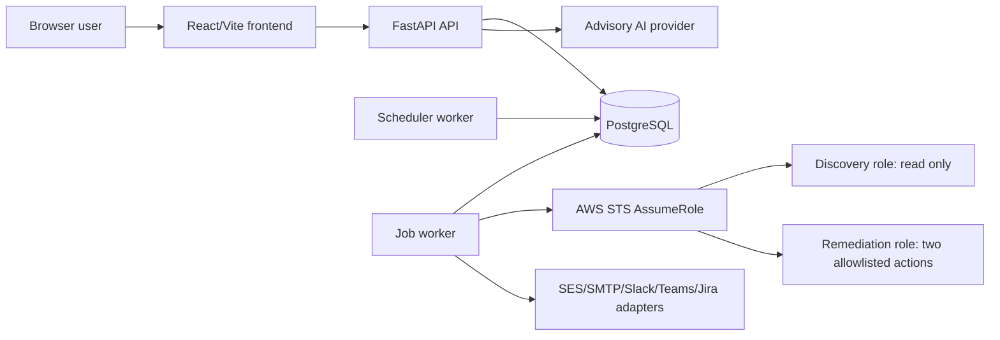

# CloudOps system architecture

This document describes implemented components, not a live deployment. CloudOps uses a React/Vite
frontend, FastAPI services, PostgreSQL, deterministic analysis, and AWS clients created through the
default credential provider chain. PostgreSQL, not Redis or Celery, is the durable job source of
truth.



## Components

- **Frontend:** organization-aware navigation and pages for assets, findings, compliance, risk,
  AI requests, jobs, schedules, notifications, remediation, audit, and administration.
- **API:** typed authentication, tenant-scoped repositories, RBAC, request validation, audit, and
  orchestration endpoints.
- **PostgreSQL:** application records, immutable snapshots, durable jobs, leases, idempotency,
  delivery evidence, and audit events. Current Alembic head is
  `0019_live_remediation_data_model`.
- **Scheduler worker:** transactionally claims due scan occurrences and enqueues orchestration.
- **Job worker:** acquires leased jobs with `FOR UPDATE SKIP LOCKED`, heartbeats, retries, and
  dead-letter handling, then reloads tenant-owned records rather than trusting queue payloads.
- **Deterministic analysis:** versioned rules produce findings; compliance and risk consume
  persisted deterministic state.
- **AI service:** accepts exactly one compatible persisted source, minimizes and sanitizes context,
  calls the configured provider, validates output, and stores hashes and audit evidence.
- **Provider adapters:** mock/local adapters and AWS Bedrock/SES adapters are automated-test
  verified; live provider behavior is not yet verified.
- **Remediation:** preview and approval are separate from execution. Mock/dry-run is default. The
  live executor is default-disabled and statically dispatches only two actions.

## Repository map

```text
apps/api/       FastAPI, workers, models, Alembic, backend tests
apps/web/       React/Vite frontend and tests
infra/          bootstrap, managed environments, modules, and sandbox Terraform
scripts/        validation, deployment, smoke, migration, and sandbox helpers
tests/          cross-cutting self-host and end-to-end verification
docs/           maintained product, architecture, security, operations, testing, release, demo
.github/        CI and gated immutable release workflows
```

The repository map explains organization; [memory.md](../../memory.md) explains where work stopped.

See [data flow](data-flow.md), [trust boundaries](trust-boundaries.md),
[AWS roles](aws-role-architecture.md), and [deployment topology](deployment-topology.md).
