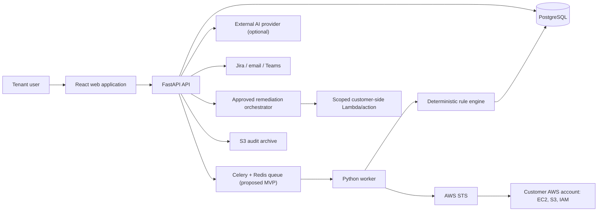

# Intended System Architecture

## Purpose and audience

Architects, engineers, security reviewers, and operators use this logical design to guide later implementation. Components shown are planned, not deployed.

## Context

## Component responsibilities

The web client presents organization-scoped resources but is never an authorization authority. FastAPI authenticates, authorizes, validates, applies lifecycle policy, and emits audit events. PostgreSQL is the system of record. A worker executes bounded discovery and evaluation jobs. Boto3 collectors normalize supported metadata; immutable rule versions produce findings. Integration adapters isolate AI, Jira, notification, and AWS-provider concerns. CloudWatch provides operational signals; a tamper-evident S3 archive retains audit exports.

## Primary decisions

The baseline stack is React/TypeScript/Vite, Material UI, TanStack Query and React Router; Python 3.12, FastAPI, Pydantic, SQLAlchemy and Alembic; PostgreSQL; Boto3/STS; and Terraform for later CloudFix-owned infrastructure. Celery with Redis is the proposed MVP queue because it is approachable and locally operable; job/queue interfaces and portable payloads preserve a migration path to Amazon SQS. Team approval remains open.

## Security and availability posture

Organization scope is required in service and repository calls. AWS credentials are short-lived and worker-local. Scan and remediation permissions are separate. Provider failures degrade their feature, not deterministic scanning. Idempotency, bounded retries, leases, and state machines control duplicate work. See [trust boundaries](trust-boundaries.md), [threat model](threat-model.md), and [failure scenarios](failure-scenarios.md).

## Future work

Physical topology, sizing, regions, recovery targets, OIDC vendor, managed Redis versus SQS, and production service choices require Stage 0 approval and later benchmarking.
