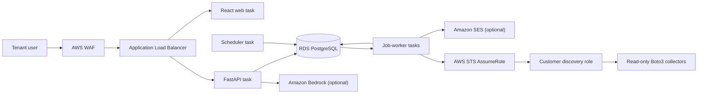
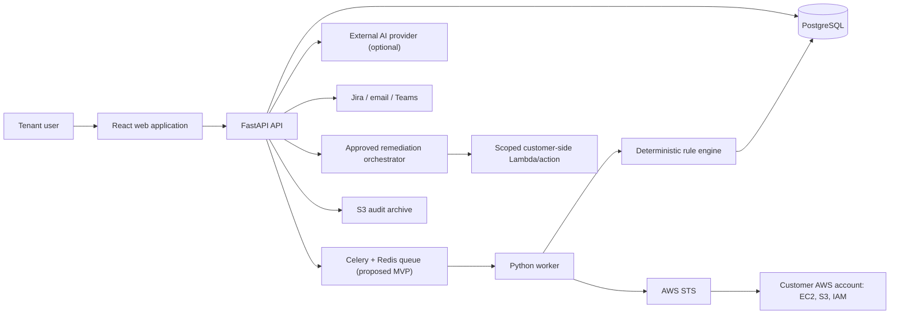

# Historical Architecture Narrative

> This document retains early design context. For the current source-of-truth architecture, use [../../architecture.md](../../architecture.md). Any future-tense or alternative design below is historical unless the authoritative architecture confirms it.

## Current implementation (authoritative)

CloudOps V1 implements a React/Vite web client, FastAPI API, PostgreSQL system of record, durable PostgreSQL job queue, replica-safe scheduler, job workers, cross-account STS discovery, deterministic security/compliance/risk analysis, advisory AI, governed notifications, remediation with mock/dry-run default and a default-disabled two-action executor, and audit history.

Bedrock and SES adapters use the Boto3 default credential provider chain and have synthetic Stubber coverage. Terraform defines the AWS deployment, but no AWS environment has been applied or live-validated by this repository.

Queue payloads are references, never authorization; workers reload tenant-owned records and reauthorize. STS credentials remain memory-only. Deterministic rules are authoritative. Remediation uses a fixed action registry, immutable approved snapshot, lease, precondition checks, dry run, and kill switch. A default-disabled live executor is limited to exact S3 Public Access Block and EC2 ingress-rule operations and has not been operationally verified.

Terraform places ALB/WAF in public subnets and all tasks/RDS in private subnets. Runtime identities are separate ECS task roles; CI uses GitHub OIDC. No production IAM-user key path is supported.

## Historical planning context

The text below records the earlier intended architecture. References to Celery, Redis, external AI, deferred Terraform, or customer-side mutation are superseded by the authoritative implementation above.

## Purpose and audience

Architects, engineers, security reviewers, and operators use this logical design to distinguish
the implemented and independently verified Stage 1–3 foundation from later planned components.

## Context

## Component responsibilities

The web client presents organization-scoped resources but is never an authorization authority. FastAPI authenticates, authorizes, validates, applies lifecycle policy, and emits audit events. PostgreSQL is the system of record. A worker executes bounded discovery and evaluation jobs. Boto3 collectors normalize supported metadata; immutable rule versions produce findings. Integration adapters isolate AI, Jira, notification, and AWS-provider concerns. CloudWatch provides operational signals; a tamper-evident S3 archive retains audit exports.

## Primary decisions

The implemented Stage 1–3 stack is React/TypeScript/Vite, Tailwind CSS, Lucide React, TanStack Query and React Router; Python 3.12, FastAPI, Pydantic, SQLAlchemy, Alembic and Boto3/STS; and PostgreSQL. Terraform for later CloudOps-owned infrastructure remains deferred. Celery with Redis is the proposed later worker queue; portable interfaces preserve a possible Amazon SQS migration.

## Security and availability posture

Organization scope is required in service and repository calls. AWS credentials are short-lived and worker-local. Scan and remediation permissions are separate. Provider failures degrade their feature, not deterministic scanning. Idempotency, bounded retries, leases, and state machines control duplicate work. See [trust boundaries](trust-boundaries.md), [threat model](threat-model.md), and [failure scenarios](failure-scenarios.md).

## Future work

Physical topology, sizing, regions, recovery targets, a future OIDC vendor, managed Redis versus SQS, and production service choices require later approval and benchmarking.
