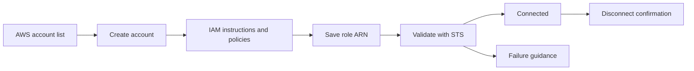
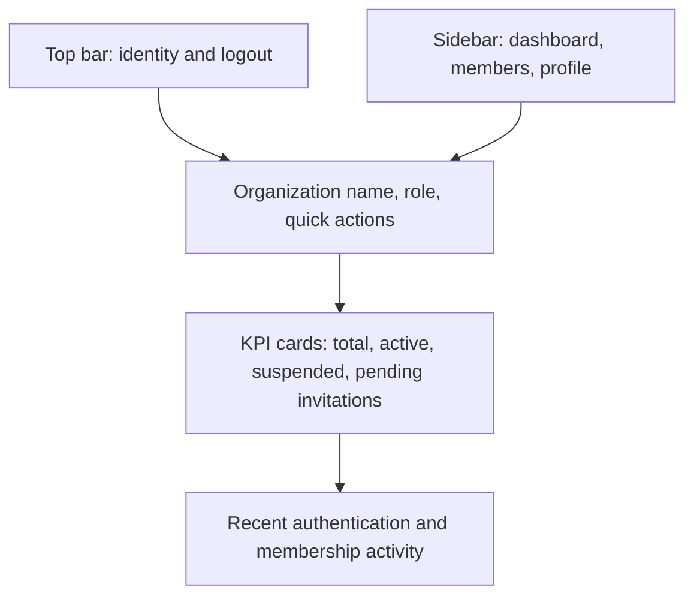
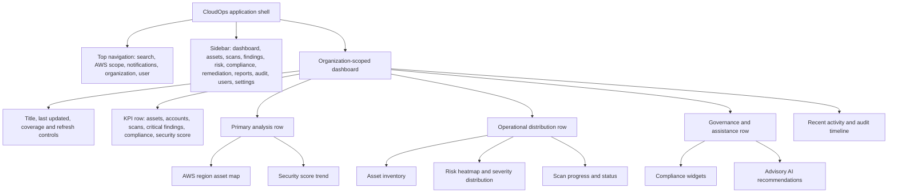
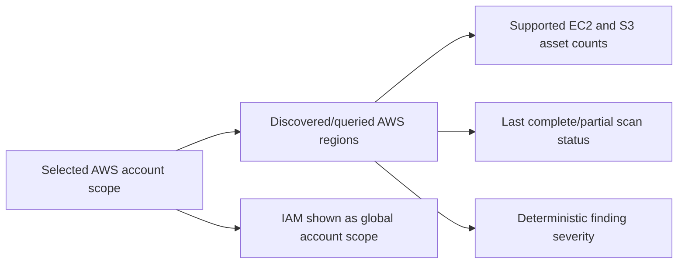
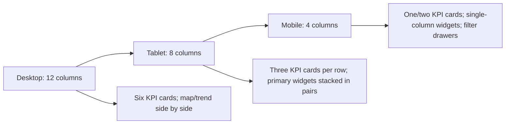

# Official CloudOps Dashboard Wireframes

## Official status, purpose, and audience

This document defines the official CloudOps dashboard layout. Stage 1 implements the administration dashboard and Stage 2 adds only AWS onboarding administration. Executive CSPM, risk, compliance, asset, regional, AI, scan, and remediation areas later in this document are future-stage specifications and must not appear in Stage 1 or Stage 2 code.

## Stage 1 administration dashboard

### Stage 2 AWS onboarding administration

Stage 2 extends the official administration shell with an owner/admin-only **AWS Accounts** navigation item. The account list uses responsive cards with account name, 12-digit ID, and connection status. Creation collects only account name and account ID. Details present the external ID, ordered IAM instructions, trust/permission JSON, role ARN form, validation action/result, and disconnect confirmation. Viewer, auditor, security analyst, and cloud engineer roles receive the standard unauthorized state.



No asset, scan, finding, compliance, risk, AI, or remediation widgets appear in Stage 2.

### Stage 1 dashboard layout



At narrow widths the sidebar becomes a top section and cards collapse to a single column. Every action is keyboard reachable, has a visible focus indicator, and maintains a practical 44px target.

These are low-fidelity specifications and not evidence of real customer metrics. CloudOps is the current product name under ADR-010. Stage 1 administration screens are implemented; later security views remain specifications. All dashboard work follows [`design-system.md`](design-system.md).

## Dashboard objectives

The dashboard provides a SOC/CSPM executive overview without replacing analyst evidence views. At a glance, an authorized user should understand:

- Current organization, AWS account scope, scan coverage, and data freshness.
- Supported EC2, S3, and IAM asset coverage.
- Critical and high-risk deterministic findings.
- Security and compliance posture with calculation/source caveats.
- Active scans, recent security activity, remediation verification, and audit events.
- Optional AI recommendations that are explicitly advisory and derived from current deterministic findings.

## Application shell

```text
┌──────────────────────────────────────────────────────────────────────────────┐
│ CloudOps*   Search   Current AWS scope   Notifications   Organization   User │
├────────────────┬─────────────────────────────────────────────────────────────┤
│ Dashboard      │ Dashboard                    Scope / Last updated / Refresh │
│ Assets         │                                                             │
│ Scans          │ KPI cards                                                   │
│ Findings       │                                                             │
│ Risk           │ Region map                    Security score trend          │
│ Compliance     │                                                             │
│ Remediation    │ Asset inventory  Risk distribution  Scan status            │
│ Reports        │                                                             │
│ Audit Logs     │ Compliance widgets            AI recommendations            │
│ Users          │                                                             │
│ Settings       │ Recent activity and audit timeline                          │
└────────────────┴─────────────────────────────────────────────────────────────┘
* Visual-system name; final product naming remains a repository-wide decision.
```

The left sidebar uses `#0B1220`; the main canvas uses `#0F172A`; cards use `#1E293B`. The top navigation keeps the organization and current AWS account/scope continuously visible. Changing organizations clears tenant-scoped client state and requires the backend to reauthorize every resource.

## Executive dashboard layout



## Desktop grid specification

Use a 12-column grid with 24px gutters. Widget span is a starting layout requirement and may adapt after usability testing without changing information priority.

| Region | Desktop span | Contents |
|---|---:|---|
| KPI cards | Six cards × 2 columns | Total Assets, Connected AWS Accounts, Active Scans, Critical Findings, Compliance Score, Security Score |
| AWS region map | 7 columns | Active/scanned regions, supported-resource counts, freshness, contextual risk |
| Security trend | 5 columns | Versioned score trend or finding trend with scope and time range |
| Asset inventory | 4 columns | EC2, S3, IAM Users, IAM Roles, Security Groups |
| Risk distribution | 4 columns | Severity donut/bar plus heatmap |
| Scan status | 4 columns | Discovery, rule engine, compliance mapping progress and failures |
| Compliance | 7 columns | Reviewed framework/control coverage with caveats |
| AI recommendations | 5 columns | Advisory, evidence-linked recommendations |
| Activity/audit | 12 columns | Chronological system and user events with filters |

## KPI cards

```text
┌────────────────┐ ┌────────────────┐ ┌────────────────┐
│ Total Assets   │ │ AWS Accounts   │ │ Active Scans   │
│ —              │ │ —              │ │ —              │
│ EC2/S3/IAM     │ │ Connected only │ │ Running/queued │
└────────────────┘ └────────────────┘ └────────────────┘
┌────────────────┐ ┌────────────────┐ ┌────────────────┐
│ Critical       │ │ Compliance     │ │ Security Score │
│ Findings —     │ │ Score —        │ │ —              │
│ Current scope  │ │ Method/version │ │ Method/version │
└────────────────┘ └────────────────┘ └────────────────┘
```

Each card shows scope, last update or comparison period, and whether data is complete, partial, stale, or unavailable. Compliance and Security Scores may display real values only after their calculation methods, denominators, weighting, and versions are approved. They are posture indicators—not certifications or guarantees of security.

## AWS region asset map

```text
┌─ AWS Region Coverage ──────────────────────────────────────────────────┐
│ Filters: [Account ▾] [Service ▾] [Risk ▾]   Last complete scan: —     │
│                                                                       │
│  Region map / accessible regional grid                                │
│  ● scanned region    ○ active but not scanned    ! elevated risk      │
│                                                                       │
│  us-east-1   Assets —   Critical —   Freshness —                      │
│  eu-west-1   Assets —   Critical —   Freshness —                      │
│                                                                       │
│  [Open accessible region table]                                       │
└───────────────────────────────────────────────────────────────────────┘
```

This is an AWS region view, not a generic traffic/world map. It shows only regions evidenced by connected accounts and supported collectors. IAM global-resource behavior must be distinguished from regional EC2/S3 assets. The map has an equivalent keyboard-accessible table and never uses color alone.



## Security score and trend

```text
┌─ Security Score Trend ────────────────────────────────────────────────┐
│ Score — / 100    [30 days ▾]   Method v—   Coverage: EC2/S3/IAM      │
│                                                                     │
│ 100 ┤                           ╭────                                │
│  75 ┤                 ╭─────────╯                                    │
│  50 ┤──────╮──────────╯                                              │
│     └──────────────────────────────────────────────────────────────  │
│ Summary: trend unavailable until approved calculation and data exist │
└─────────────────────────────────────────────────────────────────────┘
```

The score is optional until a versioned formula is approved. The trend must disclose weighting, scope, exclusions, data freshness, and changes to the formula. A finding-count trend may be used instead if it is more honest and actionable.

## Asset inventory

```text
┌─ Asset Inventory ───────────────────────┐
│ EC2 instances             —            │
│ S3 buckets                —            │
│ IAM users                 —            │
│ IAM roles                 —            │
│ Security groups           —            │
│                                        │
│ [View organization-scoped inventory]   │
└────────────────────────────────────────┘
```

Counts come only from supported, successfully completed collection scope. The widget marks partial or permission-limited scans and links to the filtered inventory instead of implying complete AWS coverage.

## Risk heatmap and distribution

```text
┌─ Risk Heatmap ──────────────────────────┐
│             EC2       S3       IAM      │
│ Critical    [ — ]     [ — ]    [ — ]   │
│ High        [ — ]     [ — ]    [ — ]   │
│ Medium      [ — ]     [ — ]    [ — ]   │
│ Low         [ — ]     [ — ]    [ — ]   │
│ Info        [ — ]     [ — ]    [ — ]   │
│                                        │
│ Findings by Severity [Donut / Table]    │
└────────────────────────────────────────┘
```

Cells combine text/count, risk label, and semantic color. Selecting a cell opens a tenant-scoped findings filter. Context-dependent policy findings remain distinguishable from universal high-confidence issues.

## Scan progress and status

```text
┌─ Current Scan ──────────────────────────┐
│ Discovery          [progress or state]  │
│ Rule Engine        [progress or state]  │
│ Compliance Mapping [progress or state]  │
│                                        │
│ Coverage: EC2 / S3 / IAM                │
│ State: queued/running/partial/failed/—  │
│ [Open scan details]                     │
└────────────────────────────────────────┘
```

Progress is derived from known bounded work, never decorative percentages. Partial, cancelled, throttled, permission-limited, and failed states are explicit and cannot be mistaken for completion.

## Compliance widgets

```text
┌─ Compliance Overview ─────────────────────────────────────────────────┐
│ Framework / version       Control coverage       Status / caveat      │
│ CIS AWS (candidate)       —                      Review pending       │
│ AWS FSBP (candidate)      —                      Review pending       │
│ ISO 27001 (future)        —                      Not approved         │
│ PCI DSS (future)          —                      Not approved         │
│                                                                      │
│ Mapping indicates assessed rule coverage; it is not certification.   │
└──────────────────────────────────────────────────────────────────────┘
```

Only licensed, versioned, and security-reviewed mappings may appear as active frameworks. Percentages require a defined denominator and disclose unsupported/not-assessed controls. CloudOps does not claim certification.

## Recent activity

```text
┌─ Recent Activity ─────────────────────────────────────────────────────┐
│ Time   Type          Summary                         Outcome           │
│ —      Scan          EC2/S3/IAM scan                completed/partial │
│ —      Finding       Deterministic rule matched     open              │
│ —      Remediation   Approved playbook attempt      verified/failed   │
│ —      Administration Membership or setting change recorded          │
│                                                                      │
│ [Filter activity] [Open audit log]                                   │
└──────────────────────────────────────────────────────────────────────┘
```

Activity uses redacted summaries, correlation links, and explicit actor/outcome. A remediation execution never appears “successful” as equivalent to finding resolution until a verification scan confirms the deterministic rule no longer matches.

## AI recommendation panel

```text
┌─ CloudOps AI Recommendations ─────────────────────────────────────────┐
│ ADVISORY • Generated from current deterministic findings • v—        │
│                                                                      │
│ Recommendation summary                                               │
│ Evidence links: [Finding] [Rule] [Affected resources]                 │
│                                                                      │
│ [Review recommendation] [Draft Jira ticket]                          │
│ AI cannot approve, execute, or verify remediation.                    │
└──────────────────────────────────────────────────────────────────────┘
```

The panel must never invent findings such as “four critical buckets” or “twelve users without MFA” unless current tenant-scoped deterministic findings support those counts. Input is minimized/redacted; output is schema-validated, sanitized, labeled untrusted/advisory, and absent when the provider is unavailable. Deterministic remediation guidance remains available as fallback.

## Audit timeline

```text
┌─ Audit Timeline ──────────────────────────────────────────────────────┐
│ Filters: [Actor ▾] [Action ▾] [Outcome ▾] [Time range ▾]             │
│                                                                      │
│ ● — User requested scan                 correlation: —               │
│ │                                                                    │
│ ● — Worker completed/partially completed scan                        │
│ │                                                                    │
│ ● — Approver approved/rejected remediation request                   │
│ │                                                                    │
│ ● — Verification scan recorded outcome                               │
│                                                                      │
│ [View immutable-history details] [Authorized export]                  │
└──────────────────────────────────────────────────────────────────────┘
```

Audit entries expose authorized, redacted metadata only. The UI must not claim immutability until the archive controls and reconciliation tests prove it.

## Responsive behavior



- **Desktop:** persistent sidebar, six KPI cards in one row where width permits, map and trend side by side.
- **Tablet:** collapsible sidebar, KPI cards in two or three columns, map followed by trend, panels grouped by priority.
- **Mobile:** compact top bar, navigation drawer, one or two KPI cards per row, single-column widgets, accessible filter drawers, and table-to-card reflow.
- Organization, AWS scope, data freshness, critical risk, and scan completeness remain visible before secondary charts.
- Approval/remediation controls appear on narrow screens only when target, evidence, consequences, and confirmation remain fully understandable and accessible.

## Interaction and state requirements

All dashboard widgets support loading skeleton, empty, stale, partial, permission-denied, provider-unavailable, and error states. Interactive cards use subtle hover elevation and `150–200ms` transitions; no flashy effects are permitted. Keyboard order follows visual order, focus is visible/restored, touch targets are at least 44px, charts have summaries/tables, and reduced motion is respected.

Search, filters, map regions, chart segments, KPI cards, notifications, organization selection, and user menus require accessible names and predictable focus behavior. The dashboard must never use frontend visibility as authorization.

## Governance and future implementation

This dashboard specification and [`design-system.md`](design-system.md) are the official CloudOps UI standard. All future frontend work must follow them. Material departures require a documented, reviewed exception; changes to scores, compliance language, tenant context, evidence, remediation, AI, or audit behavior require product/security review.

Stage 1 administration is implemented with React, TypeScript, Vite, Tailwind CSS, TanStack Query, React Router, and Lucide React under ADR-009. Security analytics, AWS maps, findings, compliance, AI, and remediation dashboard areas remain deferred to their approved later stages.
