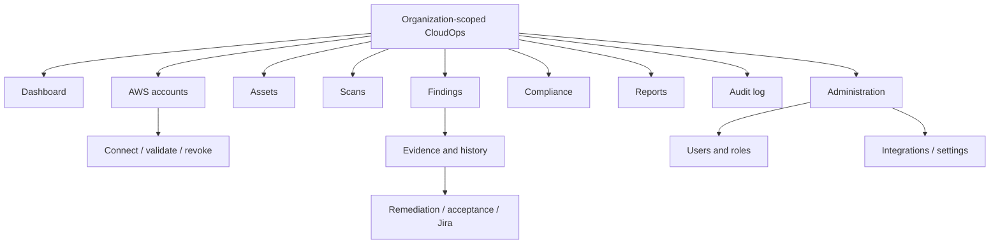

# Information Architecture

## Purpose and audience

Product, design, and frontend teams use this proposed navigation model to keep organization context and security workflows understandable.

## Navigation rules

The active organization is persistent and explicit; switching it clears tenant-specific cache and asks confirmation if work is unsaved. Global navigation contains dashboard, AWS accounts, assets, scans, findings, compliance, reports, and audit. Administration appears only with permissions, but the backend remains authoritative.

Finding detail prioritizes deterministic rule/evidence/resource and freshness, followed by status history, remediation options, compliance context, and optional labeled AI explanation. Sensitive actions use dedicated confirmation/approval flows rather than quick table actions.

## Search, filters, and URLs

Shareable routes encode safe filters, not secrets. Lists preserve filter/sort/page state and expose active scope. Search is organization-scoped and limited to indexed identifiers/metadata. Deep links reauthorize every resource and must not reveal cross-tenant existence.

## Open questions

Validate terminology, navigation depth, organization switching, auditor export placement, mobile priority, and whether integrations belong under settings or dedicated administration.
