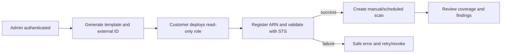

# User Flows

## Purpose and audience

Product, design, security, and QA use these planned flows to align screens, permissions, state transitions, and audit points.

## Connect and scan

## Finding response

Analyst reviews current deterministic evidence and may assign/manual-remediate, create Jira, request AI explanation, request a supported playbook, or create a time-bound risk acceptance. AI text is editable advice. A remediation requester supplies target, evidence version, playbook/version, and rationale; an authorized independent approver confirms or rejects. Execution checks current state and idempotency, records outcome, then starts verification. Only deterministic verification supports resolution.

## Exception and revocation

Risk acceptance requires permission, owner, justification, expiry, and review; expiry reopens/escalates according to approved policy. Revoking an AWS connection disables schedules and new scans while preserving historical tenant records under retention policy.

## Audit points and open questions

Record login/security changes, membership/role changes, connection lifecycle, scan requests/cancellation, finding transitions, AI/integration requests, approvals, execution, verification, exports, and risk decisions. Approval quorum, reassignment, cancellation, expired-acceptance behavior, and notification destinations need approval.
