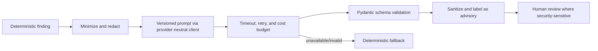

# AI Usage and Safety Boundary

## Purpose and audience

Product, engineering, security, and reviewers use this policy for every CloudOps AI feature. AI is optional, advisory, and never the deterministic source of a finding.

## Permitted assistance

AI may explain deterministic findings, create concise technical/executive summaries, suggest remediation options, draft Jira content, translate technical risk into business impact, summarize reviewed compliance implications, and recommend which approved playbook might apply. Humans remain responsible for contextual review.

## Prohibited behavior

AI must not independently decide vulnerability, replace the rule engine, receive AWS access keys/session tokens/unredacted secrets, execute Boto3, assume roles, approve or execute remediation, alter compliance mappings without review, close findings without deterministic verification, or present unverifiable claims as fact. Complete IAM policies and customer-sensitive metadata are not submitted externally unless explicitly approved and safely minimized/redacted; default is not to send them.

## Mandatory control pipeline

Prompts separate instructions from untrusted cloud metadata to limit prompt injection. Enforce output allowlists/sanitization, retry limits, timeouts, configurable token/cost ceilings, provider abstraction, and no tools/action capabilities. Log only audit metadata: purpose, provider/model, prompt-template version, input hash, redaction and output status, token/cost where available, related record, and time. Never log raw secrets.

Stage 7 canonicalizes and redacts persisted evidence before hashing and provider
use. Unicode direction/zero-width controls, dangerous Markdown protocols,
scriptable markup, fake policy/tool instructions, credential assignments,
database URLs, bearer/JWT values, private keys, and signed URL secrets are
removed or neutralized within strict depth, collection, string, and output
bounds. This is defense in depth, not a guarantee that prompt injection is
impossible. Provider output remains untrusted, non-authoritative draft text.

## Provider governance and open questions

Before Stage 8 approve provider terms, training/retention, residency, permitted data classes, redaction tests, human-review UX, budget, fallback copy, and deletion/retention of prompts/outputs. A provider outage must not block deterministic scan, finding, remediation, or verification workflows.
