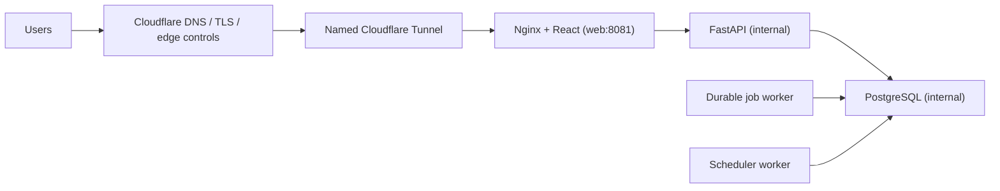

# Self-hosted Cloudflare deployment

Status: **Implemented; local and CI validation in progress.** A real named
Cloudflare Tunnel and a clean-machine installation are external validation
gates until evidence is recorded.

This path runs CloudOps on one organization-managed Docker host and exposes only
Nginx through a stable named Cloudflare Tunnel. It is distinct from the
Terraform-managed AWS staging and production architecture.

## Architecture and security boundary



- PostgreSQL, FastAPI, migration, workers, and scheduler publish no host ports.
- `cloudflared` joins only `cloudops_tunnel`; only `web` bridges that network.
- PostgreSQL is on the internal `cloudops_backend` network.
- API and workers also join `cloudops_egress` for workload-identity and provider
  calls; no inbound host ports are created.
- The frontend uses same-origin `/api/` requests. CORS and trusted hosts are
  exact, never wildcard.
- Synthetic discovery, forwarded demo trust, and live AWS remediation are
  disabled in organization mode.

### Required outbound network access

The connector dials the Cloudflare edge outbound; no public inbound
application port is required on the host.

| Direction | Protocol | Port | Purpose |
| --- | --- | --- | --- |
| Outbound | UDP | 7844 | Cloudflare Tunnel QUIC transport (preferred) |
| Outbound | TCP | 7844 | Cloudflare Tunnel HTTP/2 fallback |
| Outbound | TCP | 443 | Registration, updates, and provider APIs |

When UDP 7844 is blocked, `cloudflared` reports
`failed to dial to edge with quic: timeout: no recent network activity`
and retries until the transport is reachable. Opening TCP 7844 alone
permits the HTTP/2 fallback but not QUIC.

The connector reaches the application only through the internal Docker
service `web:8081`; ports 80, 443, 8000, 8080, and 8081 stay unpublished.

### cloudflared Linux capabilities

The service keeps `cap_drop: ALL`, `no-new-privileges:true`, and
`read_only: true`, and adds exactly three capabilities:

- `DAC_OVERRIDE` - the root-stage entrypoint reads the 0600 Docker secret
  holding the tunnel token.
- `SETGID` and `SETUID` - `su-exec` calls `setgroups(2)`, `setgid(2)`, and
  `setuid(2)` to drop from root to the non-root `cloudops` user (UID 10001).
  Without them the container fails with
  `su-exec: setgroups: Operation not permitted` and restarts continuously.

The final `cloudflared` process runs non-root. Privileged mode is not used,
and no other capability is granted.

## Supported hosts and prerequisites

Supported targets are a Linux Docker host, cloud/on-premises VM, or Windows
Docker Desktop host. macOS may use the Bash wrapper subject to Docker Desktop
limitations. Recommended capacity is 4 CPU cores, 8 GiB available RAM, and
30 GiB free disk.

Required software is Git, Docker with Compose v2, Python 3.12 or later, and
PowerShell on Windows or Bash on Unix-like hosts. Capacity recommendations
produce warnings; missing tools, invalid repository context, or an unavailable
Docker daemon fail the preflight.

## Create the named tunnel

In Cloudflare Zero Trust:

1. Create a **named** remotely managed tunnel.
2. Add the public hostname, for example `cloudops.example.com`.
3. Route it to `http://web:8081`. Port 8081 is internal to the tunnel network
   and tells Nginx the browser-facing scheme is HTTPS.
4. Copy the tunnel token once to the host configuration.

Do not commit, paste into issue trackers, or include the token in screenshots.
CloudOps does not create or delete the external tunnel or DNS record.

## Configure and install

Copy `.env.selfhost.example` to `.env.selfhost` and set:

```dotenv
CLOUDOPS_DOMAIN=cloudops.example.com
CLOUDFLARE_TUNNEL_TOKEN=<tunnel-token>
AWS_REGION=us-east-1
```

Keep optional providers disabled or mocked until their separate identity and
provider prerequisites are met. Then run `.\cloudops.ps1 up` on Windows or
`./cloudops.sh up` on Linux/macOS.

On first initialization the controller creates strong PostgreSQL, JWT, and Jira
encryption secrets in `.cloudops/runtime/`. Both `.env.selfhost` and runtime
state are Git-ignored. File permissions are restricted where supported.
Secrets are mounted as Docker file secrets, not rendered as environment values.
After first initialization, `CLOUDOPS_INITIALIZED=true` is recorded in the ignored
configuration. A missing internal secret then fails closed instead of silently
rotating database or signing material.

On Linux, Compose file secrets retain restrictive host ownership. API and
cloudflared entrypoints therefore start only long enough to read their `0600`
secret files, then immediately `exec` the workload through `su-exec` as fixed
UID 10001. The long-running application/tunnel processes remain non-root; host
secret permissions are not weakened.

`up` validates configuration, builds images, starts PostgreSQL, gates startup
on `alembic upgrade head`, verifies `0019_live_remediation_data_model`, starts the API and
workers, checks heartbeats/readiness, starts the tunnel, and checks the public
HTTPS health endpoint. Critical failures return a stable code and non-zero
status.

## Lifecycle commands

| Command | Behavior |
| --- | --- |
| `verify` | Checks containers, migration, heartbeats, tunnel, and public HTTPS. |
| `status` | Shows container/image state, domain, migration, and persistent volume. |
| `logs [target]` | Shows the last 200 redacted lines for a supported service. |
| `restart` | Restarts application/tunnel services without regenerating data or secrets. |
| `down` | Stops containers while preserving volume, configuration, and backups. |
| `backup` | Creates a timestamped PostgreSQL custom dump plus integrity metadata. |
| `restore <dump> --confirm RESTORE-CLOUDOPS-DATA` | Validates/restores a bounded backup, migrates, and verifies. |
| `update` | Requires clean local `main`; backs up, fast-forwards `origin/main`, rebuilds, migrates, and verifies. |
| `destroy --confirm DESTROY-CLOUDOPS-DATA` | Deletes local containers, database volume, configuration, and runtime secrets. |

`destroy` never deletes Cloudflare resources or `.cloudops/backups`. `down`,
`restart`, and `update` never delete the PostgreSQL volume.

Backups are local V1 recovery artifacts. They do not prove disaster recovery
until copied off-host securely and restored on the target platform.

## Demo mode

`cloudops demo-up` reuses the synthetic local demo and Cloudflare Quick Tunnel.
It is temporary, rejects `APP_ENV=production`, exposes only the web proxy, and
does not expose Mailpit. Its random URL changes on restart. Quick Tunnel is not
an organization deployment or availability mechanism.

## Stable diagnostics

Representative codes include:

- `PRECHECK_DOCKER_DAEMON_UNAVAILABLE`
- `CONFIG_CLOUDFLARE_DOMAIN_INVALID`
- `CONFIG_CLOUDFLARE_TOKEN_MISSING`
- `CONFIG_GENERATED_SECRET_EMPTY`
- `CONFIG_SECRET_IN_COMPOSE_OUTPUT`
- `HEALTH_MIGRATION_HEAD_MISMATCH`
- `HEALTH_WORKER_HEARTBEAT_STALE`
- `HEALTH_SCHEDULER_HEARTBEAT_STALE`
- `HEALTH_CLOUDFLARE_TUNNEL_DOWN`
- `HEALTH_PUBLIC_URL_UNREACHABLE`
- `BACKUP_DATABASE_DUMP_FAILED`
- `RESTORE_BACKUP_CORRUPTED`
- `UPDATE_GIT_WORKTREE_DIRTY`

Each error includes a cause and corrective action. Use `logs <service>` without
copying unredacted Docker configuration into support channels.

## Claims and limitations

- Implemented: orchestration, secret generation/preservation, migration gate,
  health checks, lifecycle commands, local backup/restore, and CI gates.
- Locally verified: recorded in `memory.md` only after the validation run.
- CI verified: pending the pull-request workflow result.
- Live Cloudflare validated: pending a real named-tunnel opt-in test. The
  capability and outbound-7844 corrections are source changes only; they do
  not by themselves prove the connector registers or that public HTTPS
  serves traffic. Public HTTPS must still be verified operationally after a
  separately reviewed Terraform plan and an authorized apply.
- Clean-machine validated: pending a separate supported-host acceptance run.
- Operators remain responsible for host patching, Docker security, monitoring,
  off-host backups, Cloudflare policy/DNS lifecycle, and provider identity.
