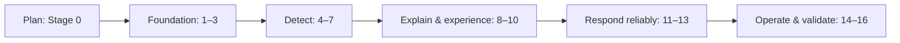

# Product Roadmap

## Purpose and audience

Stakeholders use this outcome-oriented view alongside the detailed [phases](phases.md). It intentionally contains no fixed dates.

Planning produces approved boundaries and governance. Foundation establishes the app, identity/tenancy, and secure AWS connection. Detect produces normalized EC2/S3/IAM evidence and deterministic findings/compliance context. Explain and experience adds advisory AI, usable dashboards/reports, and external coordination. Respond reliably introduces controlled remediation, scheduling, audit, and hardening. Operate and validate creates infrastructure, UAT evidence, and durable guidance.

## Release gates

An internal foundation demonstration follows Stage 3; a read-only detection alpha follows Stage 7; a workflow beta follows Stage 10; a controlled sandbox remediation candidate follows Stage 13; MVP release candidacy follows Stage 15. Names are planning markers, not release commitments.

## Current status by category (updated for the Stage 9-12 effort)

**Implemented and verified, committed on `feature/v1-demo-completion` (not yet merged into
`main`):** Stage 9 notifications, Stage 10 remediation, Stage 11 scheduler, and Stage 12 audit
query/export — backend and frontend, with targeted verification complete (Ruff, Mypy, targeted
Pytest, migration lifecycle where applicable, TypeScript, ESLint, Vitest, production build).

**Immediate tomorrow-demo priority:** add real local Mailpit-backed SMTP notification delivery
while preserving the mock provider, build the local demo stack, add deterministic demo
seed/reset, and run a black-box V1 acceptance flow.

**Current local-demo caveat:** the read-side workflows for notifications, remediation,
scheduling, and audit export are functionally complete, but notification delivery is still the
deterministic mock provider until the Mailpit path is implemented.

**Remaining P0/P1 work, roughly in order:** Mailpit-backed demo email and local demo stack (P0)
-> Stage 13 security hardening (P0: JWT edge cases, tenant-boundary/IDOR checks, RBAC coverage
for every Stage 9-12 endpoint, safe error/metadata handling) -> Stage 14 local DevOps/demo stack
(P1: `compose.verify.yml`
today is a disposable PostgreSQL verification database only; API/web/worker Dockerfiles, a root
`.dockerignore`, and a full `compose.yml` do not exist yet) -> deterministic demo seed/reset
(P1) -> full regression and the black-box V1 acceptance flow (P0) -> deployment preparation and
final documentation (P1) -> pull request merging `feature/v1-demo-completion` into `main` (P0).

**Future production work, not Version 1:** real notification delivery (e.g. AWS SES), real
remediation execution against customer AWS accounts, a distributed-queue/cron-daemon scheduler,
raw CloudTrail/CloudWatch event ingestion, other cloud providers/services, Kubernetes,
runtime/source/image security, and local AI. These require new scope, threat modeling, and ADRs
before implementation.

## Future, not Version 1

Other cloud providers/services, Kubernetes, runtime/source/image security, expanded remediation, and local AI remain future discovery and require new scope, threat modeling, and ADRs.
