# Product Roadmap

## Purpose and audience

Stakeholders use this outcome-oriented view alongside the detailed [phases](phases.md). It intentionally contains no fixed dates.

```mermaid
flowchart LR
  P["Plan: Stage 0"] --> F["Foundation: 1–3"]
  F --> D["Detect: 4–7"]
  D --> E["Explain & experience: 8–10"]
  E --> R["Respond reliably: 11–13"]
  R --> O["Operate & validate: 14–16"]
```

Planning produces approved boundaries and governance. Foundation establishes the app, identity/tenancy, and secure AWS connection. Detect produces normalized EC2/S3/IAM evidence and deterministic findings/compliance context. Explain and experience adds advisory AI, usable dashboards/reports, and external coordination. Respond reliably introduces controlled remediation, scheduling, audit, and hardening. Operate and validate creates infrastructure, UAT evidence, and durable guidance.

## Release gates

An internal foundation demonstration follows Stage 3; a read-only detection alpha follows Stage 7; a workflow beta follows Stage 10; a controlled sandbox remediation candidate follows Stage 13; MVP release candidacy follows Stage 15. Names are planning markers, not release commitments.

## Future, not Version 1

Other cloud providers/services, Kubernetes, runtime/source/image security, expanded remediation, and local AI remain future discovery and require new scope, threat modeling, and ADRs.
