# Product roadmap

The maintained evidence-labelled stage map is [phases.md](../../phases.md). The current capability
matrix is [current status](../product/current-status.md). This roadmap records only remaining
outcomes; it is not implementation evidence and contains no fixed dates.

```mermaid
flowchart LR
  Identity["Verify non-production identity"] --> Plan["Review saved plan and cost"]
  Plan --> Deploy["Authorized sandbox apply and EC2 deployment"]
  Deploy --> ReadOnly["Workload identity and read-only discovery"]
  ReadOnly --> Controlled["Separately approved S3 and EC2 tests"]
  Controlled --> Recovery["Rollback, restore, failure recovery"]
  Recovery --> Staging["Managed staging UAT and canary"]
  Staging --> Production["Explicitly authorized production release"]
```

Other clouds, arbitrary remediation, automatic rollback, and broader service/compliance catalogs
require new scope, threat modeling, and architecture decisions.
